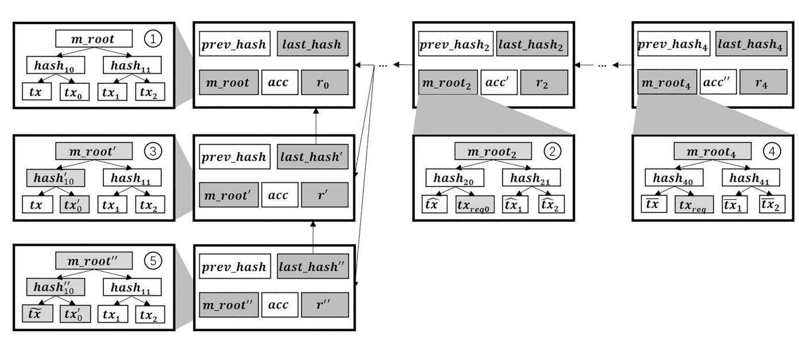
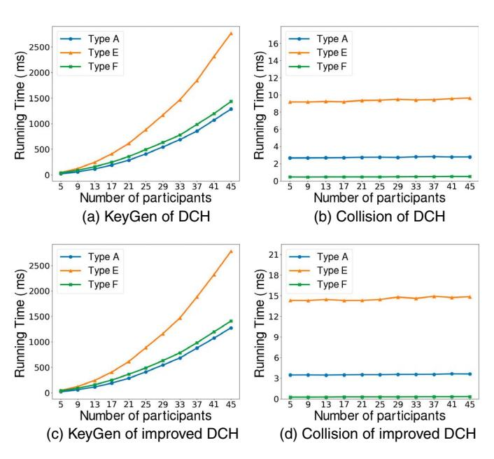

# Redactable Blockchain From Decentralized Chameleon Hash Functions, Revisited

Cong Li [,](https://orcid.org/0000-0001-6604-0708) Qingni Shen [,](https://orcid.org/0000-0002-0605-6043) *Senior Member, IEEE*, and Zhonghai Wu

*Abstract* **—Recently, redactable blockchains have attracted attention owing to enabling the contents of blocks to be re-written. The existing redactable blockchain solutions can be classified as two categories, the centralized one and decentralized one. In centralized solutions, a single blockchain node possessing the trapdoor conducts redaction operations. However, they suffer from the issue of single point of failure. In decentralized solutions, redaction operations are performed by numerous blockchain nodes cooperatively. But there also exists the issue of inefficiency or requiring a trusted party in these solutions. Subsequently, Jia et al. proposed a redactable blockchain solution from a decentralized chameleon hash function (DCH) they designed, which supports the threshold redaction, traceability and consistency check. Nevertheless, after carefully analyzing their solution, we find that it fails to achieve the security they claimed by presenting a concrete attack. To resolve this security issue, we propose a novel chameleon hash function scheme that achieves strong collision-resistant security while maintaining simple and efficient as the building block. Based on it, we then present an improved DCH scheme with sufficient security, so that the redactable blockchain from it can resist the presented attack. Theoretical and experimental analyses demonstrate that improved DCH achieves efficiency comparable to DCH.**

*Index Terms* **—Cryptanalysis, redactable blockchain, decentralization, Chameleon hash function.**

## I. INTRODUCTION

**B** LOCKCHAIN is a promising technology allowing applications and services to be fully decentralized without relying on any trusted third party. It has the feature of

Received 6 August 2024; revised 7 February 2025; accepted 12 February 2025. Date of publication 21 February 2025; date of current version 12 May 2025. This work was supported by National Key R&D Program of China under Grant 2022YFB2703301 and Beijing Natural Science Foundation under Grant 4254081. Recommended for acceptance by X. Jia. *(Corresponding authors: Zhonghai Wu; Qingni Shen.)*

Cong Li is with the School of Software and Microelectronics, Peking University, Beijing 100871, China, also with the National Engineering Research Center for Software Engineering, Peking University, Beijing 100871, China, also with the Key Laboratory of High Confidence Software Technologies, Ministry of Education, Peking University, Beijing 100871, China, and also with PKU-OCTA Laboratory for Blockchain and Privacy Computing, Peking University, Beijing 100871, China (e-mail: [li.cong@pku.edu.cn\)](mailto:li.cong@pku.edu.cn).

Qingni Shen and Zhonghai Wu are with the School of Software and Microelectronics, Peking University, Beijing 102600, China, also with the National Engineering Research Center for Software Engineering, Peking University, Beijing 100871, China, also with the Key Laboratory of High Confidence Software Technologies, Ministry of Education, Peking University, Beijing 100871, China, and also with PKU-OCTA Laboratory for Blockchain and Privacy Computing, Peking University, Beijing 100871, China (e-mail: [qingnishen@ss.pku.edu.cn;](mailto:qingnishen@ss.pku.edu.cn) [wuzh@pku.edu.cn\)](mailto:wuzh@pku.edu.cn).

Digital Object Identifier 10.1109/TC.2025.3544878

immutability, which means that once transactions are recorded on the blockchain after reaching the consensus, they cannot be tampered with. But in the meantime, this feature also results in some issues, for instance, not supporting to remove inappropriate content and being incompatible with legislations in numerous countries and organizations. To make the blockchain redactable, Ateniese et al. [1] proposed the notion of redactable blockchain based on the chameleon hash function. Subsequently, redactable blockchains can be divided into two types, the centralized one and the decentralized one. In centralized solutions (e.g. [1], [2], [3]), a single blockchain node possessing the trapdoor can perform the redaction operation. But they suffer from the issue of single point of failure. By contrast, in decentralized solutions (e.g. [4], [5], [6]), a certain number of blockchain nodes cooperatively redact the blocks. However, they also have their own flaws. For the solution [4], the voting process is time-consuming. For the solution [5], it is inflexible due to merely supporting $(n, n)$ -threshold, and insecure owing to suffering from an attack presented in the literature [7]. And for the solution [6], requiring a trusted party in the trapdoor generation actually breaks the decentralized architecture of the system, and meanwhile it lacks the capability of traceability. To cope with the above problems, Jia et al. [8] firstly proposed a new decentralized chameleon hash function (DCH), in which the trapdoor is generated in a distributed manner. Then they presented a redactable blockchain based on DCH, achieving the threshold redaction, traceability and consistency check. Nonetheless, we find that there exists a severe security flaw in their redactable blockchain. In this paper, to resolve the aforementioned security issue, we focus on designing a novel DCH with sufficient security to build a secure redactable blockchain.

### A. Contribution

The contributions of our work can be summarized as follows. • We identify a security vulnerability in Jia et al.'s redactable blockchain solution [8] and then present a concrete attack on it. The attack reveals that in their solution, the malicious full node can redact blocks that have not been redacted before without permissions from a sufficient number of other full nodes, provided that the original bloc k1 by redaction. at the same height has ever been redacted.

1The original block denotes the block created by generation, rather than generated.

- We design a novel chameleon hash function that achieves strong collision-resistant security while maintaining simple and efficient as the building block. Then based on it, we propose an improved DCH with sufficient security, so that the redactable blockchain from it can resist the attack we present. Additionally, we also provide security analyses for our basic chameleon hash function and improved DCH.
- We firstly give the detailed theoretical analysis of DCH [8] and improved DCH. We then implement them and conduct a series of experiments. Both results demonstrate that improved DCH has efficiency comparable to DCH, and more compact randomness with reducing the size by 50% compared to DCH.

### B. Organization

In the remainder of this paper, Section II introduces main literatures about redactable blockchains. Then Section III describes the background knowledge of this work, including notations, bilinear pairings and the core parts of Jia et al.'s redactable blockchain solution [8]. Subsequently, Section IV presents a concrete attack on their solution and discusses the major reason causing the security flaw. Next, Section V proposes an improved DCH scheme with a stronger collision-resistant security, which can be leveraged to build the redactable blockchain against the presented attack. Afterward, Section VI provides performance evaluations for improved DCH. Eventually, Section VII summarizes our work.

## II. RELATED WORK

*Redactable blockchain in the centralized setting.* Ateniese et al. [1] proposed the notion of redactable blockchain, which leverages chameleon hash functions to replace traditional cryptographic hash functions used in the blockchain. They defined the enhanced collision-resistance (E-CollRes) notion. They also designed a generic construction of E-CollRes secure chameleon hash function and gave two instantiations. Derler et al. [2] rigorously studied relations among the existing collision-resistance notions and defined a stronger notion, dubbed full collision-resistance (F-CollRes). They then presented a generic construction of F-CollRes secure chameleon hash function and provided an instantiation. Besides, they built a redactable blockchain based on their chameleon hash function. Astrizi et al. [9] put forward a redactable blockchain based on the preimage chameleon hash function they designed. Compared with chameleon hash functions in the literatures [1], [2], theirs relies on neither public-key encryption schemes nor non-interactive zero-knowledge proofs, but employs a subset of chameleon hash functions, where one can find first preimages, not only second-preimages when holding the trapdoor. Huang et al. [10] brought forward a redactable blockchain with scalability, update and anonymity. To build their solution, they designed two cryptographic schemes, namely the time updatable chameleon hash function (TUCH) and linkable-and-redactable ring signature (LRRS). In TUCH, the randomness is merely valid in some specific time interval (e.g. an hour or a minute) and needs to be updated periodically. In LRRS, signatures can

be redacted to fresh messages by the designated trapdoor holder and linked if they were signed by the same user. Jia et al. [11] proposed a redactable blockchain achieving self-management of personal data and supervision of improper content. They designed a stateful chameleon hash function with revocable subkey (sCHRS) as the underlying building block to prevent the redaction power from being abused by the malicious data owner. In sCHRS, the master private key can revoke the collision finding capability of the subordinate private key. Furthermore, they also used the witness transaction to record modifications and related status. Xu et al. [12] presented a redactable blockchain with $k$ -time modification and a monetary penalty. Concretely, it leverages a 1-degree polynomial with $k$ instantiations to limit the number of redacting operations, utilizes a digital signature to realize efficient privilege delegation, and signs the attribute set and public key of the modifier to enable fine-grained redacting control.

Derler et al. [13] brought forward a transaction-level redactable blockchain with fine-grained rewriting control mechanism. They introduced the notion of policy-based chameleon hash function (PCH). In PCH, an expressive access policy is employed to substitute the public key in generating a chameleon hash value, and any trapdoor holder whose attribute set satisfies the policy can find collisions. After that, redactable blockchains based on accountable PCH [14], [15], revocable PCH [16], [17], revocable and traceable PCH [18], PCH with online/offline and outsourced computation [19] were put forward successively.

Recently, Shen et al. [20] designed a redactable blockchain that supports fully editing operations and blockchain state verification. Li et al. [21] built a redactable blockchain offering transaction consistency and public accountability by introducing the notion of non-interactive chameleon hash function. Dai et al. [22] presented a practical redactable blockchain, which solves the issues of auditable editing and trapdoor management simultaneously, based on a smart contract voting protocol, new block structure and chameleon hash function. In addition, several literatures [23], [24], [25] studied non-chameleon-hashbased redactable blockchains.

*Redactable blockchain in the decentralized setting.* Ateniese et al. [1] introduced a framework to build redactable blockchains in the decentralized setting. In their solution, the chameleon hash function is extended to DCH, where the trapdoor key is shared employing a $t$ -out-of- $n$ secret sharing scheme during the key generation phase and is reconstructed if the number $t'$ of input shares exceeds the threshold value $t$ during the collision finding phase. However, the generic construction with E-CollRes they brought forward cannot be applied in the decentralized solution, since it requires to decrypt the randomness from the ciphertext, which may lead to the collision exposure issue when working in the distributed manner. Deuber et al. [4] proposed a redactable blockchain solution in the permissionless setting by employing a consensus-based voting. It is fully decentralized and does not rely on any heavy cryptographic primitives. Nonetheless, owing to voting for redaction and traversing blocks to check whether the consensus reaches or not, its performance decreases with the number of

transactions growth. Huang et al. [5] built a redactable consortium blockchain for Internet-of-Things (IoT), dubbed RCB, without a trusted authority. To realize their solution, they presented a DCH and an accountable-and-sanitizable chameleon signature. Nevertheless, Gao et al. [7] gave an attack on Huang et al.’s RCB [5] and pointed it out to be insecure. Zhang et al. [6] put forward a reusable and redactable blockchain with a fixed size in space, dubbed Re-chain. They also proposed a DCH to offer the redactable capability. However, it is not completely decentralized as it requires a trusted entity to participate in the trapdoor generation process. Jia et al. [8] presented a redactable blockchain based on a DCH and a new structure they designed, which stores the redaction history. It supports the threshold redacting and proactive updating features. They also utilized an RSA accumulator to realize an efficient consistency check. Wu et al. [26] brought forward a redactable consortium blockchain. To conform to characteristics of consortium blockchain, they firstly proposed a verifiable DCH (VDCH) to let multiple nodes determine the redaction operation cooperatively and check the correctness of shares. They then designed a new consensus protocol based on verifiable threshold signatures to speed up the redaction process and prevent malicious nodes from recovering and abusing the trapdoor of VDCH. Zhang et al. [27] proposed a transaction-level redactable blockchain supporting multiple authorities and enriching fine-grained redaction control. They designed a multi-authority PCH (MAPCH) based on a multi-authority attribute-based encryption (MA-ABE) [28] and CHET [29]. Moreover, they also provided a formal security proof of MAPCH. Ma et al. [30] further presented a new transaction-level redactable blockchain that supports to be rewritten in a fine-grained way and does not require the fully trusted central authority. They introduced the notion of decentralized PCH (DPCH) and put forward a DPCH instantiation using an MA-ABE [28], a CHET [29] and a digital signature [31]. Additionally, they also proved their DPCH secure and practical. Zhang et al. [32] brought forward a redactable blockchain achieving dynamic support and decentralized redaction. They proposed a dynamic and decentralized attribute-based chameleon hash function (DACH) with delegation, which provides the capability of dynamic redaction committee changing for their solution. DACH was constructed by leveraging a decentralized attribute-based encryption [33] and CHET [29].

## III. PRELIMINARIES

### A. Notation

For an algorithm $A(\cdot)$, we use $y \leftarrow A(x)$ or $A(x) \rightarrow y$ to denote a call of $A$ on input $x$ with $y$ as output and write $y = A(x; r)$ to emphasize that it is a deterministic algorithm with an internal randomness $r$ as the auxiliary input. For a private algorithm $A(\kappa, \cdot)$ with some secret information $\kappa$, such as the secret key, we use $\mathcal{O}_\kappa^A(\cdot)$ to denote the corresponding query oracle. For $n \in \mathbb{N}$, we define $[n] \stackrel{def}{=} \{1, 2, \dots, n\}$. For $a, b \in \mathbb{N}$ and $a \leq b$, we define $[a, b] \stackrel{def}{=} \{a, a+1, \dots, b\}$.

### B. Bilinear Pairings

Let $\mathbb{G}, \mathbb{G}_T$ be two multiplicative cyclic groups of prime order $p$, $g$ be a generator of $\mathbb{G}$ and $e$ be a bilinear map such that $e: \mathbb{G} \times \mathbb{G} \rightarrow \mathbb{G}_T$ with the following properties:

- • **Bilinearity:** $\forall u, v \in \mathbb{G}$ and $a, b \in \mathbb{Z}_p, e(u^a, v^b) = e(u, v)^{ab}$.
- *Non-degeneracy*: $e(g, g) \neq 1$.
- • *Computable*: $\forall u, v \in \mathbb{G}, e(u, v)$ can be computed efficiently.

The bilinear pairing used in this paper is symmetric, i.e. $e(u, v) = e(v, u)$, $\forall u, v \in \mathbb{G}$.

### C. Review of Jia et al.'s Redactable Blockchain

We briefly review the core parts of Jia et al.'s redactable blockchain [8]. Concretely, they are DCH, the block generation, block redaction and consistency check phases. For more details, please refer to the literature [8].

- 1) Decentralized Chameleon Hash Function: Let $\mathbb{G}$ be a GDH group of prime order $p$, $g$ is a generator of $\mathbb{G}$ and $\text{ID}: \{0, 1\}^* \rightarrow \mathbb{Z}_p$.
- • KeyGen({1 λ, 1 t } i=1 t) → {pk, sk i λ t i=1. Take a security parameter and the number t of participants as inputs, the participant P i (i ∈ [t]) executes as follows.
- • **Hash** $(pk, m) \rightarrow (h, r)$. Take a public key $g^s$ and a message $m \in \{0, 1\}^*$ as inputs, the algorithm calculates $u \leftarrow H(g^s, m)$, where $H: \mathbb{G} \times \{0, 1\}^* \rightarrow \mathbb{G}$ is a cryptographic hash function, and picks a random exponent $e \in \mathbb{Z}_p^*$. It returns the hash value
- and picks a random exponent $e \in \mathbb{Z}_p^*$. It returns the hash value $h \leftarrow g^e u^m$ and the randomness $r = (g^e, g^{se})$.
- ReHash($pk, (m, r)$) $\rightarrow$ $h$. Take a public key $g^s$ and an original message/randomness pair $(m, r = (g^e, g^{se}))$ as inputs. It computes $u \leftarrow H(g^s, m)$ and returns the hash value $h \leftarrow g^e u^m$.
- • **Verify** ($pk, (m, r), (m', r')$) $\rightarrow 0/1$. Take a public key $g^s$, an original message/randomness pair $(m, r = (g^e, g^{se}))$ and an another message/randomness pair $(m', r' = (g^{e'}, g^{se'}))$ as inputs, and compute $u \leftarrow H(g^s, m)$. Finally, it returns 1 if $g^e u^m = g^{e'} u^{m'}$ and $(g, g^s, g^{e'}, g^{se'})$ is a Diffie-Hellman tuple simultaneously; otherwise, it returns 0.
- Collision ($\{sk_i, pk, (m, r), m'\}_{i=1}^t \rightarrow \{r'\}_{i=1}^t$). Take a trapdoor key $s_i$, a public key $g^s$, an original message/randomness pair $(m, r = (g^s, g^{se}))$ and a fresh message $m' \in \{0, 1\}^*$ as inputs, the participant $P_i$ ($i \in [t]$) executes as follows.

#### **Algorithm 1:** Block Generation

| 1 | <b>        procedure       </b> $\text{GenReQ}(B, tx, g^s, g)$ |
| ---- | --------------------------------------------------------------------------------------------------------------------- |
| 2 | <b>        begin       </b> |
| 3 | $\text{header}', r', \text{acc}' \leftarrow \text{GetHR}(B)$ |
| 4 | $\text{prev\_hash} \leftarrow$ $\text{DCH.ReHash}(g^s, (\text{header}' - r', r'))$ |
| 5 | <b>        if       </b> $\text{DH}(g, g^s, r')$ <b>        then       </b> |
| 6 | <b>        for       </b> item in $tx$ <b>        do       </b> |
| 7 | <b>        if       </b> $\text{RedactTx}(\text{item})$ <b>        then       </b> |
| 8 | $\text{last\_hash}' \leftarrow \text{GetSH}(\text{item})$ |
| 9 | $\text{acc}' \leftarrow \text{ACC.Insert}(\text{acc}', \text{last\_hash}')$ |
| 10 | <b>        end       </b> |
| 11 | <b>        end       </b> |
| 12 | $\text{acc} \leftarrow \text{acc}'$ |
| 13 | $\text{m\_root} \leftarrow \text{MHT}(tx)$ |
| 14 | $e \xleftarrow{R} \mathbb{Z}_p^*$ |
| 15 | $r \leftarrow (g^e, g^{se})$ |
| 16 | $\text{header} \leftarrow \text{Con}(\text{prev\_hash}, \perp, \text{m\_root}, \text{acc}, r)$ |
| 17 | <b>        return       </b> ( $\text{header}, tx$ ) |
| 18 | <b>        end       </b> |
| 19 |  |

– Compute $g^{e'} \leftarrow g^e u^{m-m'}$, where $u \leftarrow H(g^s, m)$.

– Calculate $\eta_i \leftarrow (g^{e'})^{\lambda_i \cdot s_i}$, where $\lambda_i = \prod_{j=1, j \neq i}^t$

– $\frac{|D(P_j)|}{|D(P_j) - |D(P_i)|} \text{ mod } p$, and send $\eta_i$ to $P_j$, where $j \in [t] \setminus \{i\}$.

– When obtaining $(\eta_1, \dots, \eta_{i-1}, \eta_{i+1}, \dots, \eta_t)$, compute $g^{s^{e'}} \leftarrow \prod_{j=1}^t \eta_j$ and return a new randomness $r' = (g^{e'}, g^{s^{e'}})$.

2) *Block Generation:* Any of blockchain nodes can generate a transaction and broadcast it to all full nodes. Assume the height of current block on-chain is $h - 1$. Then a full node $P$ runs **Algorithm 1** to create a new block, which includes the valid transactions $tx$, as the original block at height $h$.

*3) Block Redaction:* The full nodes have the capability of redacting transactions in blocks that have not been redacted. Assume a full node $P$ needs to redact the transactions $tx$ in a block $B$ of height $h$, it firstly checks whether $B$ has been redacted through the RSA accumulator $acc$. If so, the redaction operation fails; otherwise, it continues to run the following protocol.

- 1) The full node $P$ and the blockchain nodes generate new transactions $tx' = (tx'_1, \dots, tx'_\gamma)$ to replace the transactions $tx = (tx_1, \dots, tx_\gamma)$, whose addresses are $addr_{tx} = (addr_{tx_1}, \dots, addr_{tx_\gamma})$. Then $P$ checks the signatures of $tx_i$ and $tx'_i$, for each $i \in [\gamma]$.
- 2) $P$ generates a redaction request $tx$ with addresses $addr_{tx}$ in $B$ are substituted with $tx'$, and the new root $m_{\text{root}}'$ of Merkle hash tree is created. Then the hash value $last\_hash'$ of the redacted block header $header = (prev\_hash, last\_hash, m\_root, acc, r)$ is computed. Eventually, a redaction request $req = (last\_hash', addr_{tx}, tx', m\_root')$ is generated and sent to other full nodes by $P$.

- 3) After receiving the redaction request *req*, full nodes $\{P_1, \dots, P_n\} \setminus \{P\}$ find the block $B$ via *last\_hash'*. Subsequently, they judge whether $B$ has been redacted using the same method as $P$ does, and verify the signatures of $tx_i$ and $tx'_i$, for each $i \in [\gamma]$. Suppose $t'$ of
- 4) $P$ assembles a part of the redaction request $reg$ (i.e. $addr_{tx}, m_{root'}, last_{hash'}$), the corresponding hash values $hash_{tx'}$ of $tx'$ and the randomness $r'$ into $data = (addr_{tx}, hash_{tx'}, m_{root'}, last_{hash'}, r')$, and then packages $data$ into a transaction $tx_{reg}$. Subsequently, it broadcasts $tx_{reg}$ in the network. The request $data$ can be verified by running $\mathcal{DCH.Verify}(g^s, (header - r, r), ((prev\_hash, last\_hash', m_{root'}, acc), r'))$. If this algorithm returns 1, it is valid; otherwise, it is invalid.

5) Some full node packages $tx_{req}$ in a block. Next, all blockchain nodes redact the original block header *header* to a new header *header'* = (*prev\_hash*, *last\_hash'*, *m\_root'*, *acc*, *r'*) successively, after $tx_{req}$ is recorded on the blockchain.

4) *Consistency Check:* The consistency check works as follows.

- 1) The client submits a query ($h_i, hash_B$) to a blockchair node, where $hash_B$ is the hash value of the block $B$ 's header.
- 2) Subsequently, the blockchain node finds the block $B$ and the proof locally using this query. If $B$ has been redacted, it gets the membership proof locally or by running the GenMem algorithm of the RSA accumulator $\mathcal{ACC}$. Otherwise, it obtains the non-membership proof locally or by running the GenNonMem algorithm of $\mathcal{ACC}$. Finally, it sends $B$ along with the proof to the client.
- 3) After obtaining the requested block and proof, the client carries out an integrity check on this block. If the block passes this check, it continues to check the consistency of the block by running the **CheckMem** or **CheckNon-Mem** algorithm of *ACC* locally, or with the aid of a blockchain node.

## IV. CRYPTANALYSIS OF JIA ET AL.'S REDACTABLE BLOCKCHAIN

According to the threat model of literature [8], the adversary 1) cannot compute the randomness without the trapdoor key of DCH, and 2) cannot redact the block when the number of compromised full nodes does not exceed the threshold value. Nonetheless, in this section, we will show Jia et al.’s solution [8] does not meet the above two security requirements.

Fig. 1. An attack on Jia et al.’s redactable blockchain.

### A. Cryptanalysis of DCH

For DCH in Section III-C1, once given a collision $(m, r = (g^e, g^{se}), m', r' = (g^{e'}, g^{se'}), h)$, any user $\mathcal{U}$ can find more collisions (for the message $m$) without employing the trapdoor key. We assume that a new message/randomness pair is $(m'', r'' = (g^{e''}, g^{se''}))$, and display how $\mathcal{U}$ calculates the randomness $r''$ below.

Firstly, $\mathcal{U}$ has the equation that $h = g^e u^m = g^{e'} u^{m'}$, and then computes Eq. (1), (2), (3) as

$$g^{se} u^{sm} = g^{se'} u^{sm'}, \quad (1)$$

$$u^{sm-sm'} = g^{se'}/g^{se}, \quad (2)$$

$$u^s = (g^{se'}/g^{se}) \frac{1}{m-m'}. \quad (3)$$

After obtaining $u^s, \mathcal{U}$ further calculates Eq. (4), (5) as

$$g^{e''} = g^e u^{m-m''}, \quad (4)$$

$$g^{se''} = g^{se}(u^s)^{m-m''} = g^{se}(g^{se'}/g^{se})^{\frac{m-m''}{m-m'}}. \quad (5)$$

By now the randomness $r''$ is generated. Subsequently, the validity of the pair $(m'', r'' = (g^{e''}, g^{se''}))$ can be checked by running the **Verify** algorithm (i.e. $g^{e''}u^{m''} = g^eu^{m-m'} \cdot u^{m''} = g^eu^m = h = g^{e'}u^{m'}$ and $(g, g^s, g^{e''}, g^{se''})$ is a Diffie-Hellman tuple).

Thus, in DCH, once some message/hash value pair has ever been found a collision, it can be found more collisions without using the trapdoor key.

### B. A Concrete Attack

Based on the issue of DCH mentioned above, we give a concrete attack on Jia et al.'s redactable blockchain [8]. The detailed process of the attack is shown in Fig. 1.

1. In the original state, there is an original block at height $h$ (i.e. the block $\oplus$), whose header is $header_0 = (prev\_hash, last\_hash, m\_root, acc, r_0)$. Then some honest

full node $P_{honest}$ intends to redact the transactions $tx_0$ in the block $\textcircled{1}$ to the new transactions $tx'_0$. The steps are:

- 1) $P_{honest}$ replaces the transactions $tx_0$ with $tx'_0$, where the address of $tx_0$ is $addr_{tx_0}$.
- 2) $P_{honest}$ calculates the new root $m_{root}$ of Merkle hash tree and the hash value $last_{hash}$ of the redacted block header $header_0$. Then $P_{honest}$ generates a redaction request $req_0 = (last_{hash}, addr_{t_0}, tx'_0, m_{root})$ and sends it to the other full nodes.
- 3) Once the number of full nodes that approve $re_{00}$ (including $P_{honest}$ itself) is more than the threshold value, these full nodes can run the **Collision** algorithm of the underlying DCH to generate a new randomness $r'$ cooperatively.
- (4) $P_{honest}$ calculates the hash values $hash_{tx'_0}$ of $tx'_0$.
- 5) Some full node (e.g. the miner) verifies $tx_{re_0}$ and packages it in the block ②. Then after $tx_{re_0}$ is recorded on the blockchain, all blockchain nodes redact $header_0$ to a new block header $header' = (prev\_hash, last\_hash', m\_root', acc, r')$ and the block ③ (at height h) is generated.
- 2. Henceforth, there are two blocks at height $h$. Under this circumstance, a malicious full node $P$ attempts to redact the transactions $tx$ in the block ③ to the new transactions $\tilde{tx}$ without approvals from other full nodes. The specific steps are:
- $P$ generates the new root $m_{\text{root}''}$ of Merkle hash tree. Then it computes the hash value $last\_hash''$ of the
- ## 'g'se'
- to calculate a fresh randomness $r'' = (g^{e''}, g^{se''})$ for $(prev\_hash, last\_hash'', m\_root'', acc)$ by taking
- ", *acc*) by taking

---

*header* 0 and *r* 0 as inputs without the involvement of other full nodes.

---

- 4) $P$ calculates the hash values $hash_{\widetilde{t}x}$ of transactions $\widetilde{t}x$ and packages the request $data = (add_{tx}, hash_{\widetilde{t}x}, m_{root''}, last_{hash''}, r'')$ into a transaction
- ## التاريخ
- *hash tx*, *m\_root''*, *last\_hash''*, *r''*) into a transaction *tx req*. Subsequently, *P* broadcasts *tx req* in the blockchain network. Apparently, the request *data* can pass the validity check since *DCH.Verify* (*g* s, (*header'* → *r'*, *r'*)), ((*prev\_hash*, *last\_hash''*, *m\_root''*, *acc*), *r''*)) = 1.
- ", *acc*), *r''*
- $$('')) = 1.$$
- 5) Some full node verifies $tx_{req}$ and packages it in the block ⑤. Then after $tx_{req}$ is recorded on the blockchain, all blockchain nodes redact $header'$ to $header''$.
- ", acc, r'"
- (*prev\_hash*, *last\_hash''*, *m\_root''*, *acc*, *r''*) and the block ⑤ is generated.

3. For the consistency check, according to **Algorithm 1** in Section III-C2, when the full node packages a redaction transaction in the block, it will add the hash value of redacted block header from the redaction transaction to the digest of all redacted blocks. So when $tx_{req_0}$ from $P_{honest}$ is packaged in the block ②, $acc' \leftarrow ACC.Insert(acc, last_hash')$ is run. Similarly, when $tx_{req}$ from the malicious full node $P$ is packaged in the block ④, $acc'' \leftarrow ACC.Insert(acc', last_hash'')$ is also executed. Apparently, this invalid redaction can pass the consistency check.

Consequently, the attack is launched on Jia et al.’s solution [8] successfully.

### C. Revisiting the Reason

The reason of causing the security flaw of Jia et al.’s solution [8] is that the collision-resistant security of DCH is not sufficient for the redactable blockchain application. For simplicity, setting the number of parties in DCH to 1, it degrades into a chameleon hash function working in the centralized manner, which achieves the key exposure freeness (KEF) [34], [35]. In this way, one can better observe the underlying reason from the security model level. Specifically, KEF can guarantee that the adversary cannot find collisions for the label (i.e. $u = H(g^s, m)$ in DCH) that has never been submitted to the collision oracle. Nevertheless, it cannot prevent the adversary from finding collisions for the label that has ever been submitted. Unfortunately, to maintain the same hash value, the blocks at the same height in Jia et al.’s solution [8] need to share the same label, rather than leverage new and different labels. Informally, an original block at some height being redacted means that the corresponding label has been submitted to the collision oracle. As a result, the adversary is potential to find more collisions for this label. Hence, the (decentralized) chameleon hash function with KEF (or the analogous security level) is not suitable for building redactable blockchains, which fails to provide the sufficient collision-resistance and may lead to security flaws.

## V. IMPROVED DCH

Our construction of improved DCH proceeds in two steps. Firstly, we present a chameleon hash function construction as

the underlying building block, which provides a sufficient security while maintaining simple and efficient. We then propose an improved DCH construction based on the proposed chameleon hash function, which has a stronger collision-resistant security compared with Jia et al.’s DCH [8]. Moreover, we conduct correctness and security analyses for improved DCH.

### A. Proposed Chameleon Hash Function Construction

In this part, we give a concrete construction of our proposed chameleon hash function. The key differences between the state-of-art chameleon hash function proposed by Chan et al. [36] and ours are outlined below. Firstly, their design idea is hashing without the public key of chameleon hash function. From this idea, they designed the hash structure without using the public key and the randomness as a non-interactive zero knowledge (NIZK) proof. Their scheme can resist the key replacement attack they proposed and naturally achieve full indistinguishability. By contrast, our design idea is reducing the collision-resistance of chameleon hash function to the EU-CMA security of signature. Based on this, we firstly leveraged the equation $r' = r \cdot \sigma / \sigma'$ to establish a link between our scheme and the underlying signature, and instantiated it with the BLS signature. Then we designed the hash and randomness structures to render the verification of validity of the hash/randomness pair $(h, r)$ feasible. Secondly, Chan et al.'s scheme [36] achieves full security, namely full collision-resistance and full indistinguishability. The strong security is their major concern. By comparison, ours achieves standard collision-resistance and indistinguishability, which provides good efficiency and sufficient security for redactable blockchains. Balancing the performance and security is our design goal. Thirdly, Chan et al.'s chameleon hash function construction [36] is a generic construction from a one-way function and a simulation-sound extractable NIZK (SSE NIZK) proof, which is general and has more application scenarios. The ECC-based construction is only an instantiation. In contrast, ours is a direct construction without relying on SSE NIZK (a relatively heavy cryptographic primitive), which is more practical and efficient.

The construction is described as follows.

- $PGen(1^\lambda) \rightarrow pp$: Output the public parameters $pp = (\mathbb{D}, H)$, where $\mathbb{D} = (\mathbb{G}, \mathbb{G}_T, g, p, e)$ is the description of pairing group and $H: \{0, 1\}^* \rightarrow \mathbb{G}$ is a collision-resistant hash function.
- • **KeyGen** ($pp$) $\rightarrow$ $(pk, sk)$. Output the public key/secret key pair $(pk, sk) = (y, x)$, where $x \in \mathbb{Z}_p$ is a random exponent and $y = g^x$.
- $\text{Hash}(pk, m) \rightarrow (h, r)$: Parse $pk$ as $y$ and $m \in \{0, 1\}^*$, choose a random exponent $\xi \in \mathbb{Z}_p$, calculate $h \leftarrow H(m)g^\xi$ and $r \leftarrow y^\xi$. Return the hash value/randomness pair $(h, r)$.
- • $\text{Verify}(pk, m, r, h) \rightarrow 0/1$: Parse $pk$ as $y$ and $m \in \{0, 1\}^*$. Return 1 if $e(h/H(m), y) = e(g, r)$; otherwise, return 0.
- • Collision($pk, sk, m, m', r, h$) $\rightarrow r'$. Parse $pk$ as $y, sk$ as $x$ and $m, m' \in \{0, 1\}^*$. Verify whether Verify($y, m, r, h$) = 1. If not, return $\perp$; otherwise, calculate $r' \leftarrow r \cdot (H(m)/H(m'))^x$. Return the fresh randomness $r'$.

### B. Improved DCH Construction

The construction of improved DCH is described below.

- • $\text{PGen}(1^\lambda) \rightarrow pp$: Output the public parameters $pp = (\mathbb{D}, H)$, where $\mathbb{D} = (\mathbb{G}, \mathbb{G}_T, g, p, e)$ is the description of pairing group and $H: \{0, 1\}^* \rightarrow \mathbb{G}$, $\text{ID}: \{0, 1\}^* \rightarrow \mathbb{Z}_p^*$ are collision-resistant hash functions.
- • **KeyGen** ($pp$, $\{1^t\}_{i=1}^t$) $\rightarrow \{pk, sk_i\}_{i=1}^t$. The participant $F_i(i \in [t])$ executes the following protocol, where $t$ is the number of participants.
- $\text{Hash}(pk, m) \rightarrow (h, r)$: Parse $pk$ as $y$ and $m \in \{0, 1\}^*$, choose a random exponent $\xi \in \mathbb{Z}_p$, calculate $h \leftarrow H(m)g^\xi$ and $r \leftarrow y^\xi$. Return the hash value/randomness pair $(h, r)$.
- • $\text{Verify}(pk, m, r, h) \rightarrow 0/1$: Parse $pk$ as $y$ and $m \in \{0, 1\}^*$. Return 1 if $e(h/H(m), y) = e(g, r)$; otherwise, return 0.
- • Collision $(\{pk, sk, m, m', r, h\}_{i=1}^t) \rightarrow \{r'\}_{i=1}^t$. The participant $P_i$ ($i \in [t]$) parses $pk$ as $y$, $sk_i$ as $x_i$ and $m, m' \in \{0, 1\}^*$. Then $P_i$ executes the following protocol.
- - After getting $\eta_j$ from all $I_j$, where $j \in [t] \setminus \{i\}$, calculate $r' \leftarrow r \cdot \prod_{j=1}^t \eta_j$ and return the fresh randomness $r'$. Unlike Jia et al.'s DCH [8], the actual random exponent $\xi$ employed in generating the hash value $h$ is hidden behind the randomness $r$ in the improved DCH construction, such that the hash value cannot be recalculated leveraging the public key $pk$ and the original message-randomness pair $(m, r)$ any more. Hence, a small modification needs to be made to the redactable blockchain structure (refer to Section III-A in the literature [8]), which is that the `rand` field needs to be extended to store the hash value of current block as well as the randomness. We rename this extended field as `curr_hash&rand`.

### C. Correctness and security analyses

In this section, we demonstrate improved DCH achieving correctness, collision-resistance and indistinguishability.

*Correctness.* The correctness analysis of improved DCH is described below.

- For the hash value/randomness pair $(h, r)$ generated by the Hash algorithm with the message $m$ as input, we have

---

$$\begin{aligned} e(h/H(m), y) &= e(H(m)g^\xi/H(m), y) \\ &= e(g^\xi, y) \end{aligned}$$

$$\begin{aligned} &= e(g, y^\xi) \\ &= e(g, r). \end{aligned}$$

- For the hash value/randomness pair $(h, r')$ generated by the **Collision** algorithm with the tuple $(m, m', r, h)$ as input, we have

$$\begin{aligned} e(h/H(m'), y) &= e(H(m)g^\xi/H(m'), g^x) \\ &= e(g^\xi \cdot H(m)/H(m'), g^x) \\ &= e((g^x)^\xi \cdot (H(m)/H(m'))^x, g) \\ &= e(r \cdot (H(m)/H(m'))^x, g) \\ &= e(r', g) \\ &= e(g, r'). \end{aligned}$$

Hence, the correctness of improved DCH is proven.

*Collision-resistance.* There are generally two approaches to calculate a collision, namely, through the existing collisions and a trapdoor. For the first approach, the collision-resistance of improved DCH can be reduced to that of the underlying chameleon hash function. According to the definition of its collision-resistance (refer to Appendix A2), there does not exist a PPT adversary $\mathcal{A}$ who can find a collision for a fresh message $m'$ even if $\mathcal{A}$ is allowed to access to the collision oracle polynomial times. Therefore, improved DCH is secure enough to resist the attack presented in Section IV-B. For the second approach, since employing the Share and Reconstruct algorithms of the secret sharing scheme in the trapdoor generation and collision finding phases respectively, there is no PPT adversary $\mathcal{A}$ who can reconstruct the trapdoor key $x$ or compute the term $((H(m)/H(m'))^x)$, if $\mathcal{A}$ acquires at most $t - 1$ shares. Hence, the malicious full node also cannot bypass the decentralization mechanism to redact any block. In a nutshell, even though the original block at some height has been redacted, the malicious full node still cannot redact blocks at this height.

*Indistinguishability.* The proof for the indistinguishability of improved DCH is analogous to that of the proposed chameleon hash function (refer to Appendix B3). The detailed proof is therefore omitted here.

## VI. PERFORMANCE ANALYSIS

In this section, we evaluate performance of DCH [8] and improved DCH.

### A. Theoretical Analysis

In Table I, we give the theoretical analysis of Jia et al.’s DCH [8] (shortened to DCH in the rest of the paper) and improved DCH from the aspects of computation and storage costs, respectively. For the computation cost aspect, we mainly consider the exponentiation operation in $\mathbb{G}$ (i.e. $E$), the hash calculation operation with $\mathbb{G}$ as the output space (i.e. $H_{\mathbb{G}}$), the pairing operation (i.e. $P$) and the Diffie-Hellman tuple check operation in GDH group (i.e. $V$), since they are time-intensive. In terms of the **KeyGen** and **Collision** algorithms, we count the number of aforementioned operations one participant executes.

**TABLE I**

**COMPARISON BETWEEN DCH AND IMPROVED DCH ON THE THEORETICAL COMPUTATION AND STORAGE COSTS**

| Algo./Compo. | DCH [8] | Improved DCH |
| ----------------------- | ------------------------------- | ----------------------------- |
| KeyGen | $(t^2 + t)E$ | $(t^2 + t)E$ |
| Hash | $3E + H_G$ | $2E + H_G$ |
| Verify | $2E + V + H_G$ | $2P + H_G$ |
| Collision | $2E + H_G$ | $E + 2H_G$ |
| $\lvert pk\rvert$ | $\lvert\mathbb{G}\rvert$ | $\lvert\mathbb{G}\rvert$ |
| $\lvert sk\rvert$ | $\lvert\mathbb{Z}_p\rvert$ | $\lvert\mathbb{Z}_p\rvert$ |
| $\lvert h\rvert$ | $\lvert\mathbb{G}\rvert$ | $\lvert\mathbb{G}\rvert$ |
| $\lvert r\rvert$ | $2\lvert\mathbb{G}\rvert$ | $\lvert\mathbb{G}\rvert$ |

Algo./Compo.: algorithm or component, $t$: the number of involved participants, $E$: the exponentiation operation in $\mathbb{G}$, $H_{\mathbb{G}}$: the hash calculation operation with $\mathbb{G}$ as the output space, $V$: the Diffie-Hellman tuple check operation in the GDH group, $P$: the pairing operation, $|pk|$: the size of a public key $pk$, $|sk|$: the size of a secret key $sk$, $|h|$: the size of a chameleon hash value $h$, $|r|$: the size of a randomness $r$, $|G|$: the element length in $\mathbb{G}$, $|\mathbb{Z}_p|$: the element length in $\mathbb{Z}_p$.

For the storage cost aspect, we take the element length in $\mathbb{G}$ (i.e. $|\mathbb{G}|$) and the element length in $\mathbb{Z}_p$ (i.e. $|\mathbb{Z}_p|$) into consideration.

For the **KeyGen** algorithm, DCH and improved DCH basically have the same efficiency. For the **Hash** algorithm, improved DCH is superior to DCH, which costs 1 less $E$. For the **Verify** algorithm, provided that the GDH group is implemented with pairing, $V$ is equal to $2P$. In this situation, improved DCH is also prior to DCH with costing 2 less $E$. For the **Collision** algorithm, due to the difference between the chameleon hash value's structures, improved DCH costs approximately 1 more $H_{\mathbb{C}}$ (in regard to computational overhead, $H_{\mathbb{C}} \gg E$) than DCH does.

In the meantime, for the sizes of a public key, a secret key and a chameleon hash value, improved DCH costs the same bit lengths with DCH. For the size of a randomness, improved DCH requires $|G|$ less bit lengths than DCH does, since the randomness of improved DCH consists of merely one term (i.e. $y^{\delta}$). In summary, although improved DCH enhances the security in comparison with DCH, it still has efficiency comparable to DCH.

### B. Experimental Analysis

We implement DCH [8] and improved DCH in Pairing Based Cryptography Library (PBC) (version 0.5.14) [37] and and C++ 17. We employ the default Type A, Type E and Type F pairings from PBC, where the Type A pairings are constructed on the elliptic curve $y^2 = x^3 + x$ over the field $\mathbb{F}_q$ ($|q| = 512$ bits and the bit length of order $r$ is 160 bits), the Type E pairings 2 are constructed on elliptic curve $y^2 = x^3 + ax + b$ over the field $\mathbb{F}_q$ ($|q| = 1024$ bits and the bit length of prime $r$ is 160 bits), and the Type F pairings are constructed on the elliptic curve $y^2 = x^3 + b$ over the field $\mathbb{F}_q$ (the bit length of order $r$ is

TABLE II

COMPARISON BETWEEN DCH AND IMPROVED DCH ON EXECUTION

TIME OF VARIOUS ALGORITHMS BASED ON DIFFERENT TYPES

OF PAIRINGS

| Pairing | Scheme | KeyGen | Hash | Verify | Collision |
| :-- | :-- | --: | --: | --: | --: |
| Type A | DCH [8] | 19.48 | 3.52 | 3.40 | 2.66 |
| Type A | Improved DCH | 19.11 | 3.49 | 2.14 | 3.45 |
| Type E | DCH [8] | 41.28 | 10.47 | 11.93 | 9.19 |
| Type E | Improved DCH | 41.18 | 10.35 | 9.22 | 14.32 |
| Type F | DCH [8] | 37.19 | 0.64 | 14.14 | 0.44 |
| Type F | Improved DCH | 37.18 | 0.46 | 13.72 | 0.23 |

The unit of execution time for each algorithm is millisecond (ms).

160 bits). Subsequently, numerous experiments are carried out on a desktop PC with Intel Core(TM) i5-13600KF (3.5GHz \* 14) and 4GB RAM 3 running Ubuntu (22.04.3 LTS) in WSL 4. Besides, we sample 1000 times and take the average execution time for each experiment.

Table II displays the execution time of all algorithms in DCH and improved DCH for one participant based on different types of pairings, where the total number of participants is set to 5. For the KeyGen algorithm, improved DCH nearly has the same execution time as DCH, regardless of the underlying pairing varying. It has the best performance on the Type A pairings, spending about 19.1 ms, and the worst performance on the Type E pairings, costing approximately 41.2 ms. For the Hash algorithm, improved DCH merely has a very slight advantage over DCH on the Type A and Type E pairings. But on the Type F pairings, the advantage is obvious, with reducing execution time by 28.13%. For the Verify algorithm, improved DCH achieves better performance than DCH in all types of pairings, where the gaps are 1.26 ms, 2.71 ms and 0.42 ms on the Type A, Type E and Type F pairings, respectively. In contrast, for the Collision algorithm, DCH is more efficient than improved DCH on the Type A and Type E pairings, costing 0.79 ms and 5.13 ms less respectively. Nonetheless, on the Type F pairings, improved DCH spends 0.21 ms less. The reason is that in this type of pairings, $H_G$ is relatively efficient, thus not dominating the execution time of algorithm.

Considering that both of the KeyGen and Collision algorithms are affected by the number $t$ of participants, we further evaluate the relationship between the execution time and $t$ through several experiments, where the results are shown in Fig. 2. Fig 2(a) and Fig 2(c) display the changing of KeyGen's execution time in DCH and improved DCH along with $t$ varying from 5 to 45 with 4 as the step size, respectively. Apparently, regardless in Fig. 2(a) or Fig. 2(c), the execution time increases quadratically with the growth of $t$, reaching around 1280ms, 2770ms, 1420ms on the Type A, Type E and Type F pairings when $t = 45$. Fig. 2(b) and Fig. 2(d) show the changing of Collision's execution time in DCH and improved

3 Note that, the total memory size of PC is 32GB, but the memory size allocated by WSL for running Linux is 4GB.

4 WSL is the abbreviation of Windows Subsystem for Linux, which allows Linux environment to run on the Windows machine directly without a separate virtual machine.

Fig. 2. Execution time analysis on the KeyGen and Collision algorithms of DCH and improved DCH under different numbers of participants based on different types of pairings.

DCH along with $t$ increasing from 5 to 45 with 4 as the step size, respectively. By contrast, the execution time in Fig. 2(b) and Fig. 2(d) is insensitive to the growth of $l$. Specifically, in Fig. 2(b), the gaps between the maximum and minimum execution time are only 0.15 ms, 0.45 ms and 0.08 ms on the Type A, Type E and Type F pairings. And in Fig. 2(d), the gaps in the same condition are merely 0.18 ms, 0.6 ms and 0.08 ms on the corresponding pairings.

In a nutshell, the result of the above experimental analysis on DCH and improved DCH is basically consistent with that of theoretical analysis in Section VI-A, demonstrating that improved DCH is comparably efficient as DCH.

## VII. CONCLUSION

In this work, we identified a security flaw in Jia et al.'s redactable blockchain solution [8] and brought forward a concrete attack on it. To build a secure redactable blockchain, we firstly presented a novel chameleon hash function scheme with balancing the security and performance as the underlying building block. Then based on the basic scheme, we proposed an improved DCH scheme that achieves a stronger security than Jia et al.'s DCH does [8], where the redactable blockchain from it can resist the attack we brought forward. Subsequently, we provided security analyses for both of our schemes. Finally, we conducted the theoretical analysis and experimental evaluation for DCH [8] and improved DCH. Both results reveal that improved DCH offers efficiency comparable to DCH [8].

## ACKNOWLEDGMENT

We appreciate the anonymous reviewers for their constructive suggestions.

## REFERENCES

- [1] G. Ateniese, B. Magri, D. Venturi, and E. R. Andrade, "Redactable blockchain - or - rewriting history in bitcoin and friends," in *Proc. IEEE Eur. Symp. Secur. Privacy (EuroS&P),* Paris, France. Piscataway, NJ, USA: IEEE Press, Apr. 2017, pp. 111–126. [2] D. Derler, K. Samelin, and D. Slamanig, "Bringing order to chaos: The case of collision-resistant chameleon-hashes," in *Proc. 23rd IACR Int. Conf. Pract. Theory Public-Key Cryptography (PKC),* Edinburgh, U.K. Cham, Switzerland: Springer, May 2020, pp. 462–492. [3] Y. Li and S. Liu, "Tagged chameleon hash from lattices and application to redactable blockchain," in *Proc. 27th IACR Int. Conf. Pract. Theory Public-Key Cryptography (PKC)*, Sydney, NSW, Australia. Cham, Switzerland: Springer, Apr. 2024, pp. 288–320. [4] D. Deuber, B. Magri, and S. A. K. Thyagarajan, "Redactable blockchain in the permissionless setting," in *Proc. IEEE Symp. Secur. Privacy (SP),* San Francisco, CA, USA. Piscataway, NJ, USA: IEEE Press, May 2019, pp. 124–138. [5] K. Huang et al., "Building redactable consortium blockchain for industrial Internet-of-Things," *IEEE Trans. Ind. Inform.*, vol. 15, no. 6, pp. 3670–3679, Jun. 2019. [6] J. Zhang et al., "Serving at the edge: A redactable blockchain with fixed storage," in *Proc. 17th Int. Conf. Web Inf. Syst. Appl. (WISA),* Guangzhou, China. Cham, Switzerland: Springer, Sep. 2020, pp. 654–667. [7] W. Gao, L. Chen, C. Rong, K. Liang, X. Zheng, and J. Yu, "Security analysis and improvement of a redactable consortium blockchain for industrial Internet-of-Things," *Comput. J.*, vol. 65, no. 9, pp. 2430–2438, 2022. [8] M. Jia et al., "Redactable blockchain from decentralized chameleon hash functions," *IEEE Trans. Inf. Forensics Secur.*, vol. 17, pp. 2771–2783, 2022. [9] T. L. Astrizi and R. Custódio, "Redacting blockchain without exposing chameleon hash collisions," in *Proc. 21st Int. Conf. Cryptol. Netw. Secur. (CANS),* Dubai, United Arab Emirates. Cham, Switzerland: Springer, Nov. 2022, pp. 339–358. [10] K. Huang, X. Zhang, Y. Mu, F. Rezaeibagha, and X. Du, "Scalable and redactable blockchain with update and anonymity," *Inf. Sci.*, vol. 546, pp. 25–41, 2021. [11] Y. Jia, S. Sun, Y. Zhang, Z. Liu, and D. Gu, "Redactable blockchain supporting supervision and self-management," in *Proc. ACM Asia Conf. Comput. Commun. Secur. (AsiaCCS),* Virtual Event, Hong Kong. New York, NY, USA: ACM, Jun. 2021, pp. 844–858. [12] S. Xu, J. Ning, J. Ma, X. Huang, and R. H. Deng, "K-time modifiable and epoch-based redactable blockchain," *IEEE Trans. Inf. Forensics Secur.*, vol. 16, pp. 4507–4520, 2021. [13] D. Derler, K. Samelin, D. Slamanig, and C. Striecks, "Fine-grained and controlled rewriting in blockchains: Chameleon-hashing gone attributebased," in *Proc. 26th Annu. Netw. Distrib. Syst. Secur. Symp. (NDSS),* San Diego, California, USA. Rosten, VA, USA: The Internet Society, Feb. 2019. [14] Y. Tian, N. Li, Y. Li, P. Szalachowski, and J. Zhou, "Policy-based chameleon hash for blockchain rewriting with black-box accountability," in *Proc. Annu. Comput. Secur. Appl. Conf. (ACSAC),* Virtual Event/Austin, TX, USA. New York, NY, USA: ACM, Dec. 2020, pp. 813–828. [15] S. Xu, X. Huang, J. Yuan, Y. Li, and R. H. Deng, "Accountable and fine-grained controllable rewriting in blockchains," *IEEE Trans. Inf. Forensics Secur.*, vol. 18, pp. 101–116, 2023. [16] S. Xu, J. Ning, J. Ma, G. Xu, J. Yuan, and R. H. Deng, "Revocable policy-based chameleon hash," in *Proc. 26th Eur. Symp. Res. Comput. Secur. (ESORICS),* Darmstadt, Germany. Cham, Switzerland: Springer, Oct. 2021, pp. 327–347. [17] Y. Tian, A. Miyaji, K. Matsubara, H. Cui, and N. Li, "Revocable policybased chameleon hash for blockchain rewriting," *Comput. J.*, vol. 66, no. 10, pp. 2365–2378, 2023. [18] G. Panwar, R. Vishwanathan, and S. Misra, "Retrace: Revocable and traceable blockchain rewrites using attribute-based cryptosystems," in *Proc. 26th ACM Symp. Access Control Models Technol. (SACMAT),* Virtual Event, Spain. New York, NY, USA: ACM, Jun. 2021, pp. 103–
- 114. [19] L. Guo, Q. Wang, and W.-C. Yau, "Online/offline rewritable blockchain with auditable outsourced computation," *IEEE Trans. Cloud Comput.*, vol. 11, no. 1, pp. 499–514, Jan./Mar. 2023.

- [20] J. Shen, X. Chen, Z. Liu, and W. Susilo, "Verifiable and redactable blockchains with fully editing operations," *IEEE Trans. Inf. Forensics Secur.*, vol. 18, pp. 3787–3802, 2023. [21] J. Li, H. Ma, J. Wang, Z. Song, W. Xu, and R. Zhang, "Wolverine: A scalable and transaction-consistent redactable permissionless blockchain," *IEEE Trans. Inf. Forensics Secur.*, vol. 18, pp. 1653–1666, 2023. [22] W. Dai et al., "PRBFPT: A practical redactable blockchain framework with a public trapdoor," *IEEE Trans. Inf. Forensics Secur.*, vol. 19, pp. 2425–2437, 2024. [23] M. Florian, S. A. Henningsen, S. Beaucamp, and B. Scheuermann, "Erasing data from blockchain nodes," in *Proc. IEEE Eur. Symp. Secur. Privacy Workshops (EuroS & P Workshops),* Stockholm, Sweden. Piscataway, NJ, USA: IEEE Press, Jun. 2019, pp. 367–376. [24] C. K. Pyoung and S. J. Baek, "Blockchain of finite-lifetime blocks with applications to edge-based IoT," *IEEE Internet Things J.*, vol. 7, no. 3, pp. 2102–2116, Mar. 2020. [25] R. Matzutt, B. Kalde, J. Pennekamp, A. Drichel, M. Henze, and K. Wehrle, "How to securely prune bitcoin's blockchain," in *Proc. IFIP Netw. Conf. (Netw.),* Paris, France. Piscataway, NJ, USA: IEEE Press, Jun. 2020, pp. 298–306. [26] X. Wu, X. Du, Q. Yang, N. Wang, and W. Wang, "Redactable consortium blockchain based on verifiable distributed chameleon hash functions,"
- *J. Parallel Distrib. Comput.*, vol. 183, 2024, Art. no. 104777. [27] Z. Zhang, T. Li, Z. Wang, and J. Liu, "Redactable transactions in consortium blockchain: Controlled by multi-authority CP-ABE," in *Proc. 26th Australas. Conf. Inf. Secur. Privacy (ACISP),* Virtual Event. Cham, Switzerland: Springer, Dec. 2021, pp. 408–429. [28] Y. Rouselakis and B. Waters, "Efficient statically-secure large-universe multi-authority attribute-based encryption," in *Proc. 19th Int. Conf. Financial Cryptogr. Data Secur. (FC),* San Juan, Puerto Rico. Berlin, Heidelberg, Germany: Springer, Jan. 2015, pp. 315–332. [29] J. Camenisch, D. Derler, S. Krenn, H. C. Pöhls, K. Samelin, and D. Slamanig, "Chameleon-hashes with ephemeral trapdoors - and applications to invisible sanitizable signatures," in *Proc. 20th IACR Int. Conf. Pract. Theory Public-Key Cryptogr. (PKC),* Amsterdam, The Netherlands. Berlin, Heidelberg, Germany: Springer, Mar. 2017, pp. 152–182. [30] J. Ma, S. Xu, J. Ning, X. Huang, and R. H. Deng, "Redactable blockchain in decentralized setting," *IEEE Trans. Inf. Forensics Secur.*, vol. 17, pp. 1227–1242, 2022. [31] D. Boneh, B. Lynn, and H. Shacham, "Short signatures from the weil pairing," *J. Cryptol.*, vol. 17, no. 4, pp. 297–319, 2004. [32] D. Zhang, J. Le, X. Lei, T. Xiang, and X. Liao, "Secure redactable blockchain with dynamic support," *IEEE Trans. Dependable Secur. Comput.*, vol. 21, no. 2, pp. 717–731, Mar./Apr. 2024. [33] A. B. Lewko and B. Waters, "Decentralizing attribute-based encryption," in *Proc. 30th Annu. Int. Conf. Theory Appl. Cryptogr. Techn. (EU-ROCRYPT),* Tallinn, Estonia. Berlin, Heidelberg, Germany: Springer, May 2011, pp. 568–588. [34] X. Chen, F. Zhang, and K. Kim, "Chameleon hashing without key exposure," in *Proc. 7th Int. Conf. Inf. Secur. (ISC),* Palo Alto, CA, USA. Berlin, Heidelberg, Germany: Springer, Sep. 2004, pp. 87–98. [35] X. Chen, F. Zhang, H. Tian, B. Wei, and K. Kim, "Discrete logarithm based chameleon hashing and signatures without key exposure," *Comput. Electr. Eng.*, vol. 37, no. 4, pp. 614–623, 2011.

[36] K. Y. Chan, L. Chen, Y. Tian, and T. H. Yuen, "Reconstructing chameleon hash: Full security and the multi-party setting," in *Proc. 19th ACM Asia Conf. Comput. Commun. Secur. (ASIA CCS),* Singapore. New York, NY, USA: ACM, Jul. 2024, pp. 1076–1091. [37] B. Lynn. The pairing-based crytography library. Accessed: Aug. 7, 2024. [Online]. Available: <http://crypto.stanford.edu/pbc/>

**Cong Li** received the Ph.D. degree from Peking University, Beijing, China, in 2022. Previously, he worked as a Postdoctoral Fellow with the School of Computer Science, Peking University, Beijing, China. Currently, he is an Assistant Professor with the School of Software and Microelectronics, Peking University. His research interests include applied cryptography, blockchain, cloud security, and privacy-preserving computing.

**Qingni Shen** (Senior Member, IEEE) received the Ph.D. degree from the Institute of Software Chinese Academy of Sciences, Beijing, China, in 2006. Currently, she is a Professor with the School of Software and Microelectronics, Peking University, Beijing, China. Her research interests include operating system and virtualization security, privacy preserving in cloud and big data, trusted computing. She is a Senior Member of ACM and CCF Member. She is now serving for many international conferences, including TrustCom, SecureComm and ever as the Chair of Publicity Committee or the member of Program Committee of ICICS in 2017, 2015, 2013, 2011, 2009, and 2007.

**Zhonghai Wu** received the Ph.D. degree from Zhejiang University, Hangzhou, China, in 1997. Previously, he worked as a Postdoctoral and Senior Research Fellow with the Institute of Computer Science and Technology, Peking University, Beijing, China. He has been involved both in research and application development of distributed system and multimedia applications. Currently, he is the Executive President of the School of Software and Microelectronics, Peking University, Beijing, China. His research interests include context-aware services, embedded software and system, cloud services and security, and open

innovation.
