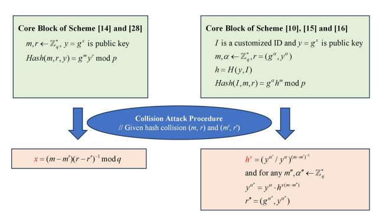
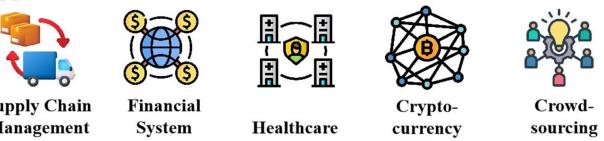
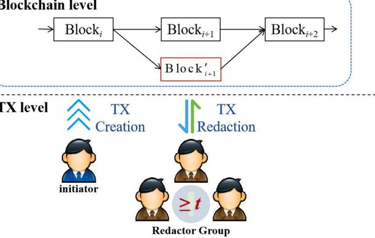
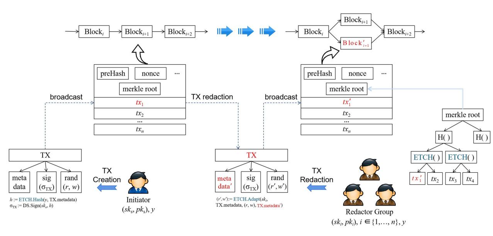
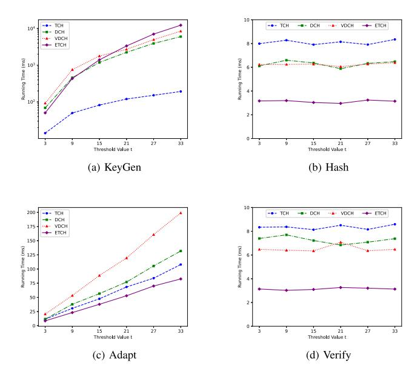
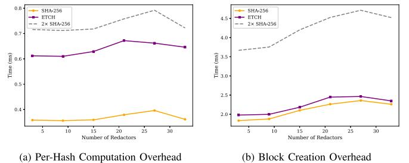
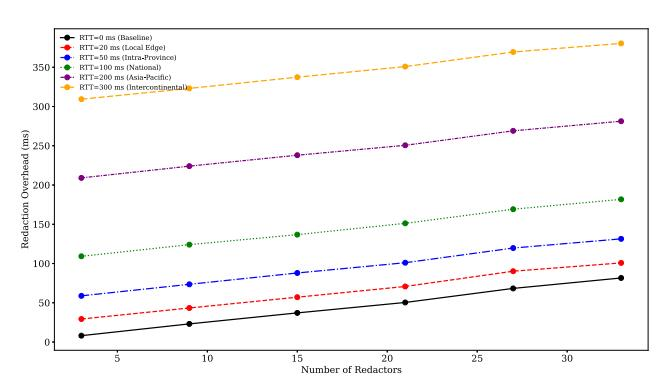
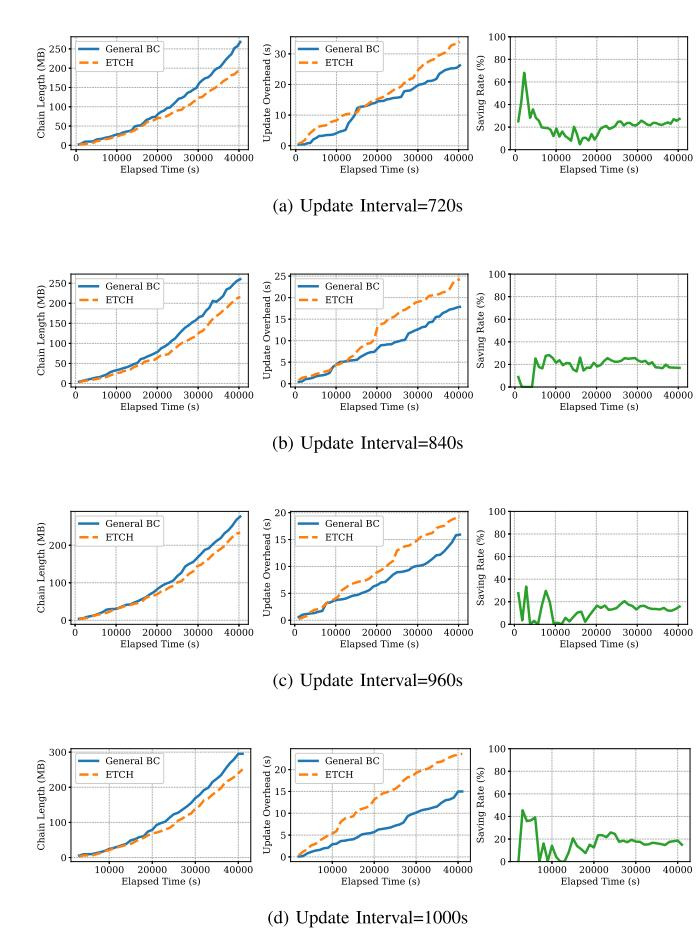

# Enhancing Redactable Blockchain With Robust and Efficient Threshold Redaction

Zhaoman Liu [,](https://orcid.org/0000-0003-1931-5259) Biming Zhou [,](https://orcid.org/0009-0008-4972-0531) and Yunlei Zhao

*Abstract* **—Blockchain technology, known for its decentralized and tamper-resistant nature, offers strong auditing guarantees across a wide range of applications. However, its inherent immutability presents challenges when correcting erroneous transactions or removing sensitive information is necessary. To address this, the concept of redactable blockchain has emerged, aiming to improve adaptability to real-world regulatory and operational needs. Yet, existing designs often suffer from limitations in decentralization, security, or efficiency. This paper introduces an Enhanced Threshold Chameleon Hash (ETCH) scheme as a foundational building block for redactable blockchains. ETCH enables redactions only when a predefined threshold of nodes collaborates to generate trapdoor shares, preserving decentralization. It also enhances collision resistance, overcoming key security flaws in prior schemes, and incorporates a periodic trapdoor refresh mechanism to improve long-term robustness. Experimental results show that ETCH reduces computational overhead by 50% in Hash and Verify phases and by 22.26% in the Adapt phase. The prototype implementation of the ETCH-based redactable blockchain further confirms ETCH's effectiveness in supporting low-latency redactions and mitigating blockchain state growth. Overall, ETCH improves both the security and efficiency of redactable blockchains, broadening their applicability in privacy-sensitive and regulated scenarios.**

*Index Terms* **—Redactable blockchain, threshold chameleon hash, enhanced collision resistance, robust, key update.**

## I. INTRODUCTION

**B** LOCKCHAIN technology has revolutionized data storage and management owing to its unique features of decentralization, security and transparency. This technology ensures that data remains tamper-proof, providing novel solutions in areas such as finance, supply chain management and healthcare, etc [1], [2], [3]. However, its immutability poses challenges, particularly when data needs to be updated or corrected once it has been recorded on blockchain. For example, financial transactions may involve inaccuracies, such as the transfer of incorrect amounts to recipients. Supply chain management may require product recalls or updates due to quality issues, and healthcare information may need modifications due to changes in patient details or treatment plans. Furthermore, immutability conflicts

Received 31 July 2024; revised 25 July 2025; accepted 8 November 2025. Date of publication 19 November 2025; date of current version 12 March 2026. This work was supported in part by the Special Fund for Key Technologies in Blockchain of Shanghai Scientific and Technological Committee under Grant 23511100300 and in part by Shanghai Collaborative Innovation Fund under Grant XTCX-KJ-2023-54. *(Corresponding author: Yunlei Zhao.)*

The authors are with the College of Computer Science and Artificial Intelligence, Fudan University, Shanghai 200000, China (e-mail: [liuzm@m.](mailto:liuzm@m.fudan.edu.cn) [fudan.edu.cn;](mailto:liuzm@m.fudan.edu.cn) [bmzhou22@m.fudan.edu.cn;](mailto:bmzhou22@m.fudan.edu.cn) [ylzhao@fudan.edu.cn\)](mailto:ylzhao@fudan.edu.cn). Digital Object Identifier 10.1109/TDSC.2025.3634512

with legal requirements such as the General Data Protection Regulation (GDPR) [4], which grants individuals the right to have their personal data erased. These highlight the need for redactable blockchain framework that allows controlled data redaction while maintaining the linkability and consistency of the blockchain system [5].

From a technical perspective, redactable blockchain research can be divided into two primary categories: consensus voting mechanism-based [6], [7], [8], [9] and chameleon hashbased [5], [10], [11] approaches. The former is predominantly utilized in permissionless blockchain environments, where any node has the capability to request modifications to a block or transaction. Once a modification is proposed, it requires a specified number of blocks to be generated for voting to reach a consensus. However, this approach has a significant drawback: voting on the proposal and checking whether the redaction reaches consensus by traversing the block is timeconsuming. Later, Li et al. [12] proposed an instantly redactable blockchain protocol that separates the voting process from the consensus protocol, thereby enhancing the efficiency of redaction decisions. In contrast, chameleon hash-based constructions are mainly applied to permissioned blockchain, where specific nodes are granted the ability to perform redactions. Ateniese et al. [5] first proposed to construct redactable blockchain using chameleon hash, which is a centralized redaction method. After that, Derler et al. [10] introduced a policy-based chameleon hash that allows users to redact blocks if their attributes align with the access policy, realizing fine-grained and controlled rewriting on the blockchain. Although this policy-based chameleon hash enables a somewhat decentralized redaction, achieving accountability for malicious redaction remains challenging since multiple users may satisfy the access policy. Subsequent studies [13], [14], [15] have sought to enhance Derler's work by integrating an accountability feature. However, these improvements still face delays in their monitoring processes, unable to effectively prevent the occurrence of malicious redactions.

To further decentralize the redaction privilege, Huang et al. [11] first devised threshold chameleon hash to construct redactable blockchain. In threshold chameleon hash, each node holds a fragment of the trapdoor key, and block or transaction redactions can only be executed when a threshold number of nodes collaborate. This design avoids the time-consuming consensus process associated with voting mechanisms and significantly elevates the complexity of malicious redactions, thus demonstrating higher security and efficiency in redaction permission management.

1545-5971 © 2025 IEEE. All rights reserved, including rights for text and data mining, and training of artificial intelligence and similar technologies. Personal use is permitted, but republication/redistribution requires IEEE permission. See https://www.ieee.org/publications/rights/index.html for more information.

Fig. 1. An illustration of collision attacks in threshold chameleon hashes.

However, existing threshold chameleon hash solutions present several problems, as illustrated in Fig. 1. First, they exhibit significant security flaws in relation to collision resistance. Those solutions either leak the trapdoor key [16] or are able to compute collisions for new arbitrary messages after a single redaction [11], [17], [18]; Second, those solutions do not take into account the key fatigue issue. If the trapdoor shares remain unchanged over extended periods, they may gradually be compromised through various attack vectors (e.g., social engineering, phishing, or physical theft). Once an attacker obtains a sufficient number of trapdoor shares, the entire system's stability will be completely compromised.

To address the aforementioned issues, in this paper, we first propose an enhanced collision-resistant threshold chameleon hash scheme with key update feature as a theoretical tool. Then, we refine the transaction and block structures in existing permissioned blockchains and present a novel decentralized redactable blockchain framework. The main contributions of this paper are as follows:

- 1) To tackle the collision attack problem in existing solutions, inspired by the scheme proposed by Ateniese er al. [5], [19], we design a threshold chameleon hash scheme with enhanced collision resistance. The proposed scheme ensures that the adversary cannot compute new collisions, even with polynomial-time access to messages and their respective collisions. Moreover, nodes collaborate to compute their respective trapdoor shares through distributed key generation protocol, while the trapdoor key remains unknown to all nodes. This strategy not only shields against targeted attacks on individual nodes but also preserves the decentralization property of blockchain.
- 2) To strengthen the robustness and adaptability of the redactable blockchain, we incorporate a key update algorithm into our threshold chameleon hash design. This algorithm facilitates periodic updates of trapdoor shares among collaborating nodes without changing the trapdoor key. In this way, the system's enduring security remains uncompromised even in instances where a trapdoor share might be exposed at any given time. Moreover, by configuring the update process to leave the trapdoor key intact, we proactively circumvent the computational overhead typically associated with key updates, thereby enhancing the system's adaptability and efficiency.

- 3) We apply the proposed enhanced threshold chameleon hash to transaction and block structure. Specifically, we replace the conventional authentication on the transaction content (i.e., the signature of the transaction) with the authentication on the chameleon hash value. This modification ensures that the signature remains valid for transactions even after they have been redacted. Furthermore, we also replace the bottom hash function used to compute the Merkle root with our threshold chameleon hash. This substitution minimizes alterations to the existing block structure and the computational overhead caused by redaction.
- 4) We implement experiments to compare our threshold chameleon hash solution with other existing solutions. The experimental results show that our solution halves the computational overhead on average during the Hash and Verify phases, and reduces it by 22.26% on average during the Adapt phase. These findings compellingly demonstrate that applying our solution to construct redactable blockchain is significantly more efficient.

## II. RELATED WORK

In the exploration of redaction blockchain technologies, we broadly categorize existing work into two types: schemes based on consensus voting mechanism and schemes based on chameleon hash. Each of these two types has its own strengths and weaknesses. In the following, we provide an in-depth analysis of their specific details and summarize their characteristics in Table I.

### A. Consensus Voting Mechanism-Based Approaches

Puddu et al. [6] introduced a blockchain protocol enabling transaction modifications through encrypted backups. Their framework mandates updates to all transactions affected by a modification, which ensures consistency but potentially destabilizes confirmed transactions and presents scalability challenges, especially with large participant numbers.

Later, Deuber et al. [7] proposed a redactable blockchain scheme using a consensus voting mechanism. In this mechanism, edit requests initiated by a node for a specific block or transaction are adjudicated by other nodes through the incorporation of the hash of the request into newly generated blocks at predetermined intervals (e.g., every 1024 blocks). This method guarantees somewhat decentralization and transparency but suffers from significant efficiency issues, particularly when under high transaction volumes or numerous nodes.

To address compatibility issues with specific blockchain platforms and enhance system generality, Thyagarajan et al. [8] introduced Reparo, which employs a voting mechanism similar to that of [7], and maintains system consistency through a distributed database technology. This allows for the storage of both old and new blocks in the database for subsequent querying and verification. Currently, Marsalek et al. [9] proposed a dual-chain structure comprising an original chain and a modification chain running in parallel. The original chain stores the initial state of transactions, while the modification chain records modifications

TABLE I COMPARISON OF EXISTING REDACTION BLOCKCHAIN SCHEMES AND OURS

| Type | Scheme | Setting | Tools | Trapdoor Generation Mode | Redactor | Redaction Level | AxisUpdate | Collection Resistance |
| ------------------------ | -------- | ------------------- | ------------------------------- | --------------------------- | ------------------------------------------------------------------------------------ | --------------------------------- | ------------ | ----------------------- |
| Consensus Voting-based | [6] | Permissionless | Voting, MPC | N/A | All users | Transaction level | x | N/A |
|  | [7] | Permissionless | Voting | N/A | All users | Transaction level (delete only) | x | N/A |
|  | [8] | Permissioned/less | Voting | N/A | All users | Transaction level (delete only) | x | N/A |
|  | [9] | Permissionless | Voting | N/A | All users | Block level | x | N/A |
| Chameleon Hash-based | [5] | Permissioned/less | CH,MPC | Centralized Decentralized | Centeral authority ( <i>        t       </i> , <i>        n       </i> )-threshold | Block level | x | Enhanced CR |
|  | [10] | Permissioned/less | CH, CP-ABE | Centralized | Authorized Users | Transaction level | x | Insider CR |
|  | [20] | Permissioned | CHET, CP-ABE, Group Signature | Centralized | Authorized Users | Transaction level | x | Revocation CR |
|  | [13] | Permissioned | CHET, CP-ABE, Signature | Centralized | Authorized Users | Transaction level | x | Insider CR |
|  | [14] | Permissioned | CHET, CP-ABE, Signature | Centralized | Authorized Users | Transaction level | x | Insider CR |
|  | [15] | Permissionless | DPSS, KP-ABE, Signature | Centralized | Authorized Users | Transaction level | x | Adaptive CR |
|  | [21] | Permissioned | CHET, CP-ABE | Centralized | Authorized Users | Transaction level | x | Insider CR |
|  | [22] | Permissioned | CHET, CP-ABE, Signature | Centralized | Authorized Users | Transaction level | x | Insider CR |
|  | [23] | Permissioned | CHET, CP-ABE, LSSS | Centralized | Authorized Users | Transaction level | x | Insider CR |
|  | [11] | Permissioned | CH, Signature | Distributed | ( <i>        n       </i> , <i>        n       </i> )-threshold | Transaction level | x | Weak CR |
|  | [24] | Permissioned | CH | Distributed | ( <i>        t       </i> , <i>        n       </i> )-threshold | Block level | x | Weak CR |
|  | [17] | Permissionless | CH, MPC | Distributed | ( <i>        t       </i> , <i>        n       </i> )-threshold | Transaction level | x | Weak CR |
|  | [18] | Permissioned | CH, Voting, MPC | Distributed | ( <i>        t       </i> , <i>        n       </i> )-threshold | Transaction level | x | Weak CR |
|  | Ours | Permissioned | CH, Signature | Distributed | ( <i>        t       </i> , <i>        n       </i> )-threshold | Transaction level | x | Enhanced CR |

to the original transaction states. In this architecture, nodes in the system vote to decide whether a specific edit block should be added to the modification chain. However, similar to previous schemes, the use of consensus protocols introduces additional computational overhead in practice, particularly in scenarios requiring frequent updates to block content. This not only affects the overall performance of the system but also limits its application potential in consortium blockchain environments that prioritize high efficiency and economic benefits.

### B. Chameleon Hash-Based Approaches

The first redactable blockchain scheme based on chameleon hash was proposed by Ateniese et al. [5], which was also the first time redactable blockchain was proposed as a new concept. In their scheme, the standard hash function used to compute the hash of the entire block is replaced with a chameleon hash function.

To achieve more fine-grained and controlled block redaction, Derler et al. [10] further refined the concept of chameleon hash and proposed a policy-based chameleon hash function (PCH). They replaced the regular hash function used for leaf nodes of a Merkle tree with PCH and integrated Ciphertext Plicy Attribute-Based Encryption (CP-ABE) [25] and Chameleon Hash with Ephemeral Trapdoor (CHET) [26] to give a modular structure. In this design, the hash value is associated with access policies and an ephemeral trapdoor, and the latter one is distributed via CP-ABE. This ensures that only entities authorized by a central authority (CA) and whose attributes satisfy the access policies can obtain the ephemeral trapdoor and redact the block data. Further work based on PCH focuses on functionality and flexibility aspects, such as attribute update/revocation [20], [27], accountability [13], [14], [15], selfmanagement [28], multiple authorities [21],[22],[23], redaction version detection [29], and K-time modification operations [30], [31].

To further mitigate the centralization of block redaction permission, an effective solution is to share trapdoor among participants secretly. In this regard, Huang et al. [11] employed a $(n, n)$ -threshold key sharing mechanism, wherein each of the

$n$ participants selects their own trapdoor shares and collaboratively computes the trapdoor in a given sequence. This design mandates that each redaction operation must be approved by all $n$ predefined nodes, effectively preventing centralized control of redaction processes. However, the limitation lies in that it cannot tolerate any node's offline state, and once a node is unreachable, the whole redaction process will fail, causing potential inconvenience in practical applications. Later, Zhang et al. [24] adopted a $(t, n)$ -threshold setting to improve the trapdoor generation process, aiming to resolve issues in distributed data management within edge computing architectures and enable the system to operate normally even if some nodes are offline. Zhang and Ni et al. [16], leveraging the chameleon hash proposed by Krawczyk and Rabin [32], introduced a threshold chameleon hash scheme utilizing smart contracts for key verification and aggregation, thus effectively addressing industrial data security management concerns. Although [24] and [16] enhance the distributed redaction capabilities of redactable blockchain to some extent, they still rely on a trusted dealer or KGC for key distribution, so the risk of single point of failure still exists. After that, Jia et al. [17] designed a more flexible distributed chameleon hash and proposed using RSA accumulator to efficiently verify the blockchain consistency. Wu et al. [18] designed a verifiable distributed chameleon hash and proposed a new consensus protocol based on verifiable threshold signatures. Their work gives a comprehensive redactable consortium blockchain solution.

The above schemes [11], [24], [17], [18] are all based on the scheme proposed by Chen et al. [33] as the building tool, which is weakly collision-resistant and ensures security only if the adversary cannot find collisions for any pair of messages. Such a requirement is particularly limiting in scenarios where the transaction contents need to be publicly recorded on the blockchain, as it restricts the transparency and verifiability of transaction data. In contrast, our proposed threshold chameleon hash is based on the commitment scheme proposed by Ateniese et al. [19], which avoids the strong assumptions of the above schemes. In addition, our scheme not only adopts a fully decentralized key generation mechanism, but also supports trapdoor share update, making it more conducive to constructing robust redactable blockchain.

Fig. 2. System model of redactable blockchain.

## III. PRELIMINARIES

### A. Trapdoor Commitment Scheme

In this section, we propose a new trapdoor commitment scheme based on the construction in [19]. The scheme inherits from an extended version of the twin Nyberg-Rueppel signature scheme [34]. This trapdoor commitment scheme can be viewed as a chameleon hash, which is resistant to key leakage and satisfies enhanced collision resistance in the generic group model based on the Discrete Logarithm assumption [5]. In this paper, we utilize it as a prototype to construct threshold chameleon hash with adaptive update property. The trapdoor commitment scheme comprises four algorithms: Setup, HGen, Hash, and HCol. The specific algorithm descriptions are as follows:

- Setup($\kappa$) $\rightarrow (p, q, g, \mathcal{H})$. On input a security parameter $\kappa$ and specify a $\kappa$ bit-length security prime $p$ that satisfy $p = 2q + 1$. Let $g \in \mathbb{Z}_p$ is an element of order $q$. Define $\mathcal{H}: \{0, 1\}^* \rightarrow \mathbb{Z}_q$ as a collision-resistant hash function that maps bit strings of arbitrary length to a group value. Output $pp = \{p, q, g, \mathcal{H}\}$ as public parameters.
- $\text{HGen}(pp) \rightarrow (tk, hk)$. Choose $x \leftarrow \mathbb{Z}_q$ randomly as the trapdoor key $tk$, compute $y = g^x$ and use it as the hash key $hk$.
- $\text{Hash}(m, y; r, w) \rightarrow (h, r, w)$. Given a message $m$ and $y$ as inputs, select random numbers $(r, w) \leftarrow \mathbb{Z}_p \times \mathbb{Z}_q$, compute $e = \mathcal{H}(m, r)$, $h = ry^e g^w \bmod p$, and output $(h, r, w)$.
- • $H\text{Col}(x, m, r, w, h, m') \rightarrow (r', w')$. Given the trapdoor key $x$, the tuple $(m, r, w, h)$ and a new message $m'$ as inputs, choose a random number $k' \leftarrow \mathbb{Z}_q^*$, compute $r' = h/g^{k'} \bmod p$, $e' = \mathcal{H}(m', r')$, $w' = k' - e' \cdot x \bmod q$, and output $(r', w')$.

*Correctness:* It can be seen that $r'y^e^l g^{w'} \bmod p = h/g^{k'} \cdot g^{xe^l} \cdot g^{k'-e^l \cdot x} \bmod p = h$.

The above trapdoor commitment scheme satisfies the following security properties:

- • *Enhanced Collision Resistance:* Enhanced collision resistance means that for any probabilistic polynomial time (PPT) adversary without access to the trapdoor private key, it is infeasible to find a hash collision ($h^*, m^*, r^*, m'^*, r^*$) if no collision for this specific $h^*$ has ever been revealed to the adversary before. Formally, for all PPT adversaries $\mathcal{A}$, we have: $Pr[(h, m, (r, \omega), m', (r', \omega')) \leftarrow \mathcal{A}^{\mathcal{O}_{H^* Col}}(1^k)]$ $=$ $\text{Hash}(m, y; r, \omega) = \text{Hash}(m', y; r', \omega') \wedge (m \neq m') \wedge (h \notin \mathcal{Q})] \leq \varepsilon(k)$, where $\varepsilon(k)$ represents a probability that is negligible as the security parameter grows.
- • *Semantic Security:* Semantic Security means that the chameleon hash value $h$ does not reveal anything about the possible message $m$ that was hashed. In other words, let $\mathbf{H}[X]$ denote the entropy of the random variable $X$, and $\mathbf{H}[Y|X]$ denote the conditional entropy of the random variable $Y$ subject to $X$. Given the hash value $h$, the conditional entropy $\mathbf{H}[m|h]$ of the message $m$ should be equal to the overall entropy of the message space $\mathbf{H}[m]$.

### B. Proactive Secret Sharing

The proactive secret sharing scheme [35] comprises two main protocols: the share renewal protocol and the share recovery protocol. The former is designed to refresh the shares periodically to maintain the secrecy of the shared secret even if some nodes are compromised over time, and the latter is used when a node has lost its share or when the last resharing did not work correctly for it.

- *Share renewal protocol:* Initially, each node $i \in [1, n]$ holds a share $s_i$ of the secret $s$, encoded in a polynomial $P(x)$ such that $P(0) = s$. Each node $i$ generates a $k$ -degree random polynomial $Q_i(x)$ with $Q_i(0) = 0$ and computes $Q_i(j)$ for every node $j \in [1, n] \setminus \{i\}$ in the group. Node $i$ then secretly sends $Q_i(j)$ to each node $j$ along with a commitment that allows node $j$ to verify $Q_i(j)$. The new polynomial $Q(x)$ is the sum of all $n$ polynomials, that is, $Q(x) = \sum_{i \in [1, n]} Q_i(x)$. Each node $i$ updates its share to $s'_i = s_i + Q(i)$. The new shares $\{s'_i\}$ encode the same secret $s$ in the polynomial $P(x) + Q(x)$, which remains a random polynomial with the same constant term $s$.
- # Share recovery protocol: When node $r \in [1, n]$ requires share recovery, each node $i \in [1, n]$ picks a random degree polynomial $R_i(x)$ over $\mathbb{Z}_q$ such that $R_i(r) = 0$, i.e., it picks random coefficients $\{R_{ij}\}_{j \in \{1, \dots, k\}} \subset \mathbb{Z}_q$ and then computes $R_{i0} = -\sum_{j \in \{1, \dots, k\}} R_{ij} r^j \bmod q$. Each node $i$ broadcasts $\{R_i(j)\}_{j \in [1, n]}$ in secret. Each node $i$ creates its new share of $s'_i$ such that $s'_i = s_i + \sum_{j \in [1, n]} R_j(i)$ and sends it to $P_r$ by broadcasting $s'_i$ in secret. The node $r$ decrypts these shares and interpolates them to recover $s_r$.

The correctness definition of Proactive Secret Sharing, along with its security definitions and proofs for semantic security and robustness, are elaborated in [35]. Due to space constraints, we do not discuss these aspects further here.

### C. Digital Signature

Let $DS = (\text{KeyGen}, \text{Sign}, \text{Verify})$ be a digital signature scheme [36].

- $(pk, sk) \leftarrow \text{KeyGen}(1^k)$. Given a security parameter $k$, this algorithm outputs a pair of public-private key pair $(pk, sk)$.
- $\sigma \leftarrow \text{Sign}(sk, m)$. Given a private key $sk$ and a message $m$, this algorithm outputs a signature $\sigma$.
- • $\delta \leftarrow \text{Verify}(pk, m, \sigma)$. Given a public key $pk$ and a message-signature pair $(m, \sigma)$, this algorithm outputs a bit $\delta$ indicating the validity (1) or invalidity (0) of the pair.

The correctness definition of digital signature, along with its security definitions and proofs, are elaborated in [36]. Due to space constraints, we do not discuss these aspects further here.

## IV. OVERVIEW

In this section, we provide an overview of redactable blockchain, including the system model, threat model, and main phases.

### A. System Model

As shown in Fig. 2, our redactable blockchain mainly consists of two types of entities: initiator and redactors. Among them, each new transaction is first published by the initiator. When the transaction content needs to be updated or revised, a group of redactors collaborate to revise it by executing our proposed threshold chameleon hash. The redaction process can be successfully executed only if the number of redactors exceeds the threshold value. Afterwards, following the broadcast and consensus process of the blockchain, the new transaction is stored on the blockchain, and the link consistency of blockchain can be ensured throughout the process. Our redactable blockchain construction imposes a threshold requirement for redaction operations, which provides a certain degree of flexibility and fault tolerance, and can find applications in distributed systems or trust-sharing models that require multi-party consensus and collective decision-making.

*Initiator:* In practical applications, the initiator often serves as an authority or delegator. Within our conceived framework for a redactable blockchain, the initiator is required only to be online during the transaction creation phase. Subsequent updates to the transaction can be entrusted to redactors. This design affords the initiator the opportunity to go offline after the transaction has been published, thereby mitigating the necessity for perpetual online presence. Crucially, even when transaction details are amended by redactors, these revised transactions continue to be issued under the initiator's name. This feature is especially apt for settings such as task crowdsourcing, where the task publisher might be dormant during execution but must uphold ultimate control over the task.

***Redactors:*** In the redactable blockchain framework, redactors act as trustees. Throughout the system initialization phase, they collaborate to distribute and obtain the corresponding trapdoor shares. This strategic key distribution mechanism guarantees that a transaction can only be updated when a predefined threshold of redactors achieves consensus, which markedly

enhances the system's overall security and effectively resists potential security threats and internal malicious actions. Furthermore, our model is designed to periodically renew the trapdoor shares held by the redactors, thereby reinforcing the security of the trapdoor keys.

### B. Threat Model

In our proposed model, the initiator is considered as a fully-trusted entity that is expected to faithfully create and disseminate transactions throughout the blockchain network. In contrast, the redactors and external users are viewed as semi-trusted entities. While redactors are expected to honestly engage in the redaction process, they might attempt to misuse their information advantage (i.e., their own trapdoor share, hash key shares of other redactors, transaction data and its collision information, etc.) to deduce the trapdoor key, thereby facilitating unauthorized transaction modifications. Moreover, we recognize the potential for collusion among redactors, and stipulate that such colluding group sizes do not surpass the system's predefined threshold. For the sake of analytical clarity, we do not delve into the potential attacks by external users, as these can be considered special cases within the capabilities of semi-trusted redactors.

### C. Main Phases

In the redactable blockchain framework proposed in this paper, we mainly define the following phases:

*Initialization Phase:* In this phase, the transaction initiator generates a pair of signing keys. Given the threshold parameter $(t, n)$ of ETCH, a group of redactors obtains their own trapdoor share, hash key share, hash key through a specific interactive protocol.

***Transaction Creation Phase:*** This phase is executed by the transaction initiator. The initiator creates a redactable transaction with the support of ETCH. Following this, the transaction is encapsulated in a novel block. This block is then broadcasted over the network and verified through a consensus mechanism, eventually attached to the redactable blockchain.

*Transaction Redaction Phase:* This phase is jointly executed by the redactors whenever modifications to the transaction content lodged within the block are necessitated. Once more than $t$ redactors reach a consensus on the new transaction content, they collaborate to compute the new randomness that corresponds to the updated transaction, so that the new transaction does not affect the linkage of the blocks.

*Key Update Phase:* To enhance the security of the redactable blockchain, the trapdoor shares held by redactors are periodically refreshed by executing the key update algorithm of the ETCH scheme.

## V. ENHANCED THRESHOLD CHAMELEON HASH

### A. Definition

An enhanced collision-resistant threshold chameleon hash scheme, characterized by a message space $\mathcal{M}$, consists of six distinct algorithms $\Pi_{\text{ETCH}} = (\text{Setup}, \text{KeyGen}, \text{Hash}, \text{Verify}, \text{Adapt}, \text{KeyUpt})$ such that:

- Setup($\lambda$) $\rightarrow$ *pp*. The Setup algorithm takes a security parameter $\lambda$ as input, and outputs the system's public parameters *pp*.
- KeyGen($pp, t, n$). The KeyGen algorithm operates as a distributed key generation protocol collaboratively executed by $n$ participants. Given the public parameter $pp$ and threshold parameters $(t, n)$, each participant $P_i$, after a round of interaction, independently generates their trapdoor share $s_i$, hash key share $y_i$, and the hash key $y$. Notably, although each participant can obtain the aforementioned elements, the trapdoor $s$ itself remains secret and is only recoverable when more than $t$ ($t < n$) participants combine their efforts.
- $\text{Hash}(y, m) \rightarrow (h, r, w)$. The Hash algorithm takes the hash key $y$ and a message $m$ as inputs, yielding a hash value $h$ along with a tuple of randomness $(r, w)$.
- Verify($y, m, r, w, h$) $\rightarrow \{0, 1\}$. The Verify algorithm takes the hash key $y$, the message $m$, the randomness pair ($r, w$) and the chameleon hash value $h$ as inputs, and it outputs a bit indicating whether the hash value $h$ is valid.
- • $\text{Adapt}(\{s_i\}_{i \in S}, m, r, w, m') \rightarrow (r', w')$. The Adapt algorithm is a collaborative protocol requiring at least $t$ participants. Let $S \subseteq \{1, \dots, n\}$ and $|S| \geq t$. Each participant $P_i (i \in S)$ uses their trapdoor share $s_i$, the message-randomness pair $(m, (r, w))$, and a new message $m'$ as inputs. They reach a consensus on the new randomness $r'$ after the first round of interaction, and then they reach a consensus on the new randomness $w'$ following the second round of interaction. Ultimately, each participant $P_i$ obtains the new randomness pair $(r', w')$.
- $\text{KeyUpt}(T-1, s_i^{(T-1)}) \rightarrow s_i^{(T-1)}$
- $\text{KeyUpt}(T-1, s_i^{(T-1)}) \rightarrow s_i^{(T)}$. Let $T-1$ denote the current period, and $s_i^{(T-1)}$ denote the threshold share held by participant $P_i$ ($i \in \{1, \dots, n\}$) in period $T-1$. The KeyUpt algorithm is a distributed key generation protocol that enables each participant $P_i$ to update their trapdoor share for the next period $T$ by performing steps similar to the KeyGen algorithm. During this process, although the trapdoor shares of the participants are updated, it is crucial that the trapdoor of the system remains unchanged throughout the update process.

*Correctness:* Correctness requires that for all security parameters $\lambda \in \mathbb{N}$, for all $pp \leftarrow \text{Setup}(\lambda)$, for all $(s_1, \dots, s_n, y_1, \dots, y_n, y) \leftarrow \text{KeyGen}(pp, t, n)$, where $t < n$, for all messages $m, m', m'' \in \mathcal{M}$, for all $(h, r, w) \leftarrow \text{Hash}(y, m)$, for all $S \subseteq \{1, \dots, n\}$ and $|S| \geq t$, for all $(r', w') \leftarrow \text{Adapt}(\{s_i\}_{i \in S}, m, r, w, m')$, it satisfies $\text{Verify}(y, m, r, w, h) = \text{Verify}(y, m', r', w', h) = 1$. Moreover, for all time slots $T$, for all $s_i^{(T)} \leftarrow \text{KeyUpt}(T - 1, s_i^{(T-1)})$ and for all $(r'', w'') \leftarrow \text{Adapt}(\{s_i^T\}_{i \in S}, m, r, w, m'')$, it satisfies $\text{Verify}(y, m, r, w, h) = \text{Verify}(y, m'', r'', w'', h) = 1$.

### B. Security Model

Our security model for ETCH is defined as follows through the game between the challenger and the attacker.

**Indistinguishability:** For a probabilistic polynomial-time (PPT) adversary $\mathcal{A}$, it is computationally infeasible to

distinguish whether a random value is derived from a Hash algorithm or obtained through an Adapt algorithm. In other words, the modified hash output is computationally indistinguishable from a freshly generated hash output. Therefore, if the adversary $\mathcal{A}$ wins the following experiment with only negligibly advantageous, that is,

$$\left| \Pr \left[ \text{Exp}_{A, \text{ETCH}}^{\text{IND}}(\lambda) = 1 \right] - \frac{1}{2} \right| \leq \varepsilon(\lambda),$$

where $\text{Exp}_{A, \text{ETCH}}^{\text{IND}}(\lambda)$ denotes adversary $\mathcal{A}$ succeeds in the IND game, $\lambda$ represents the security parameter, and $\epsilon(\lambda)$ is a negligible function. We can then assert that the ETCH function is computationally indistinguishable.

*Enhanced Collision Resistance:* The enhanced collision resistance property requires that for any PPT adversary with adaptive access to the Adapt oracle, if the adversary knows no more than $t$ shares at any given period (potentially a different set of shares in each period), it is infeasible to find a hash collision $(h^*, m^*, r^*, w^*, m'^*, r'^*, w'^*)$ unless a collision involving this specific $h^*$ has been revealed to the adversary before. That is, the ETCH is enhanced collision-resistant if the probability that the adversary $A$ wins the game is negligible, i.e.,

$$\left|\Pr \left[ \mathbf{Exp}_{A, \text{ETCH}}^{\text{ECR}}(\lambda) = 1 \right] \right| \leq \varepsilon(\lambda),$$

where $\text{Exp}_{A,\text{ETCH}}^{\text{ECR}}(\lambda)$ denotes adversary $\mathcal{A}$ succeeds in finding a collision, $\lambda$ represents the security parameter, and $\epsilon(\lambda)$ is a negligible function.

*Semantic Security:* Semantic security ensures that the chameleon hash value $h$ does not reveal any information about the potential message $m$ that was hashed. Formally, this can be expressed by stating that given the hash value $h$, the conditional entropy $\mathbf{H}[m|h]$ of the message $m$ should be equivalent to the overall entropy of the message space $\mathbf{H}[m]$.

### C. Construction

In this study, we propose a novel threshold chameleon hash construction, which comprises six algorithms: Setup, keyGen, Hash, Adapt, Verify and keyUpt. Notably, our keyGen algorithm innovatively incorporates Pedersen's Distributed Key Generation (DKG) scheme and Proactive Secret Sharing mechanism [35], achieving fully decentralized key generation and period trapdoor share updation. Such a design ensures that nodes within the network can collaboratively generate a shared trapdoor key in a secure manner, even in the absence of a central authority or trusted third party.

- Setup($\lambda$) $\rightarrow$ *pp*. Given a security parameter $\lambda$, choose a secure prime $p$ of bit length $\lambda$, where $p$ satisfies $p = 2q + 1$ and $q$ is also a prime. Let $g$ be a $q$ -order generator of the quadratic residues subgroup $\mathbb{Q}_p$ of $\mathbb{Z}_p^*$. Define $\mathcal{H}$:
- KeyGen($pp, t, n$) The KeyGen algorithm is an interactive protocol involving $n$ participants. Given threshold parameters $(t, n)$, it can be executed in the following three steps.

- 1) Each participant $P_i$ samples $t$ random values $(a_{i0}, \dots, a_{i(t-1)}) \leftarrow \mathbb{Z}_q^*$, and uses these values as coefficients to define a $t-1$ degree polynomial $f_i(x) = a_{i0} + a_{i1}x + \dots + a_{i(t-1)}x^{t-1}$. Then, every participant $P_i$ computes a public commitment list $C_i = (\varphi_{i0}, \dots, \varphi_{i(t-1)})$, where $\varphi_{ij} = g^{a_{ij}}$, $j \in [0, t-1]$.
- 2) $P_i$ computes secret share $(j, f_i(j))$ designated for each participant $P_j$, broadcasts $C_i$ and securely sends secret share $(j, f_i(j))$ to participant $P_j$. Subsequently, $P_i$ deletes $f_i$ and each share except for $(i, f_i(i))$, which they keep for themselves.

- 3) $P_i$ extracts $(\varphi_{j0}, \dots, \varphi_{j(t-1)})$ from $C_j$ and verifies whether $g^{f_j(i)} = \prod_{k=0}^{t-1} \varphi_{jk}^{i^k}$ holds. If it does not hold, the process is terminated. If all the information received from other participants satisfy the above equation, $P_i$ computes its trapdoor share $s_i = \sum_{j=1}^n f_j(i)$ and its public key share $y_i = g^{s_i}$, where $s_i$ is stored securely, and each $f_j(i)$ will be deleted later. It is worth noting that $P_i$ can compute the public key shares $y_{ij} = \prod_{i=1}^n \prod_{k=0}^{t-1} \varphi_{jk}^{j^k} \bmod q$ for other participants and the hash key $y = \prod_{j=1}^n \varphi_{j0}$.

- Hash($y, m$) $\rightarrow (h, r, w)$. The Hash algorithm can be independently executed by any participant within the system. Given a hash key $y$ and a message $m$, to commit to a message $m$, it is sufficient to choose random values $(r, w) \in \mathbb{Z}_p^* \times \mathbb{Z}_q^*$ and compute $e = \mathcal{H}(m, r)$ and Hash($m, r, w$) = $h = ry^e g^w \bmod p$. Ultimately, the algorithm outputs the hash value $h$ along with the randomness pair $(r, w)$.
- Verify($y, m, r, w, h$) $\rightarrow \{0, 1\}$. On input hash key $y$, message $m$, randomness pair $(r, w)$ and hash value $h$, compute $e = \mathcal{H}(m, r)$. If $h = ry^e g^w \bmod p$, then the algorithm outputs 1; otherwise, it outputs 0.
- Adapt($\{s_i\}_{i \in S}, m, r, w, m' \rightarrow (r', w')$). The Adapt algorithm is an interactive protocol that can be successfully executed when the number of participants exceeds a given threshold. To simplify the description, assume that there are exactly $t$ participants included in $S$, and an Commitment Aggregator called CA is responsible for aggregating collision shares from other parties.

confound shares from other parties. The introduction of a semi-trusted CA to instantiate ETCH significantly reduces the communication cost between participants and is more applicable to real-world application scenarios. Notably, ETCH can also be deployed in a fully decentralized manner without a CA. In this case, each participant only needs to broadcast once directly, without coordination through the CA. This design ensures that the system maintains its decentralized nature and efficiency even in the absence of a centralized coordinator.

The entire collision computation process can be divided into the following four steps.

- 1) $P_i(i \in S)$ selects $k_i \leftarrow Z_q^*$, computes and sends $K_i = g^{k_i}$ to CA.
- 2) Once receiving $t$ random commitments $K_i (i \in S)$, CA computes $K = \prod_{i \in S} K_i$ and sends $K$, a new message $m'$ to each $P_i (i \in S)$.

- 3) $P_i(i \in S)$ computes $r' = h/K$, $e' = \mathcal{H}(m', r')$, $w_i = k_i - e'\lambda_i s_i$, where $\lambda_i = \prod_{j \in S} \frac{j}{j-i}$ is the Lagrange coefficient of $P_i$. Then, $P_i$ sends $w'_i$ to CA.

- 4) Once CA receives $t$ new randomness shares $w'_i$, it computes $w' = \sum_{i \in S} w'_i$ and outputs $(r', w')$.

- $\text{KeyUpt}(T-1, s_i^{(T-1)}) \rightarrow s_i$
- $\text{KeyUpt}(T-1, s_i^{(T-1)}) \rightarrow s_i^{(T)}$. To enhance the robustness and security of the scheme, the trapdoor shares of the participants are periodically updated to prevent adversaries from launching long-term attacks on specific shares. Let $T=0$ at the initial time slot. During this time slot, the polynomial defined by $P_i$ is denoted as $f_i^{(0)}$ and its trapdoor share is denoted as $s_i^{(0)}$. The trapdoor key at this time is

- 1) Participant $P_i$ selects $t - 1$ random numbers $\delta_{ik} \leftarrow \mathbb{Z}_q^*$ ($k \in [1, t - 1]$) and defines a new polynomial $\delta_i(x) = \delta_{i1}x + \dots + \delta_{it}x^{t-1}$, which satisfies $\delta_i(0) = 0$. Then, it computes the values $g^{\delta_{i1}}, \dots, g^{\delta_{it}-1}$.
- 2) $P_i$ broadcasts $g^{\delta_{i1}}, \dots, g^{\delta_{it-1}}$ and secretly sends $z_{ij} = \delta_i(j)$ to $P_j$.
- 3) Upon receiving $g^{\delta_{j_1}}, \dots, g^{\delta_{j_i}}, z_{j_i}$ from participant $P_j$, $P_i$ verifies whether the equation $(g^{\delta_{j_1}})^i(g^{\delta_{j_2}})^{i^2} \dots (g^{\delta_{j_{i-1}}})^{i^{t-1}} = g^{z_{j_i}}$ holds. If the information sent by the other participants satisfies the equation, $P_i$ computes its trapdoor share $s_i^{(T)} = s_i^{(T-1)} + \sum_{j=1}^n \delta_j(i)$ and hash key share

a q

### D. Security Analysis

*Indistinguishability:* Consider the IND-game, where $H$ is modeled as a random oracle. The game proceeds as follows:

- When $b = 0$, the pair $(r', \omega')$ is selected uniformly at random from $\mathbb{Z}_p^* \times \mathbb{Z}_q^*$. The hash value $h'$ is computed
- When $b = 1$, $k'$ is chosen uniformly at random, which results in $r'$ also being uniformly distributed due to its dependency on $k'$. The hash parameter $e' =$

$H(m', r')$ is uniformly random as well, ensuring that $w'$, calculated from $k'$ and $e'$, is independent of $r'$ and uniformly random. Consequently, the hash value $h$ is formulated as $h = rye'g^w'$, with $e' = H(m', r')$ establishing the hash parameters for the new message $m'$.

Consequently, it can be observed that the distributions in both scenarios are identical except for a negligible probability, making it infeasible for an adversary to distinguish between them. It should be noted that other oracles do not assist the adversary in making such a distinction during the challenge phase.

*Enhanced Collision Resistance:* The underlying trapdoor commitment scheme can be regarded as a chameleon hash and demonstrates enhanced collision resistance in the generic group model based on the Discrete Logarithm assumption [5]. The proof here is similar to the proof in [19], Section IV. More precisely, it can be shown straightforwardly that if an adversary can find a collision in the game, then we can construct a reduction to successfully attack the underlying twin Nyberg-Rueppel signature scheme [34]. Therefore, this construction is ad-hoc and depends on the Nyberg-Rueppel signature scheme [34], whose security can be proven under the Discrete Logarithm assumption in the generic group model [37].

*Semantic Security:* Note that Semantic Security ensures that the chameleon hash value $h$ reveals no information about the underlying message $m$ that was hashed. It is evident that during the computation of $h$, the uniformly random selection of $\omega$ ensures its independence from both $m$ and $r$. Additionally, as $g$ is an element of order $q$, the term $g^\omega$ uniformly covers the entire subgroup, irrespective of the value of $ry^e$. Formally, for each random $r$ and message $m$, there exists a one-to-one correspondence between the hash value $h$ and the value $e$. Thus, we can conclude that the chameleon hash value $h$ reveals nothing about the underlying message $m$.

## VI. ETCH-BASED REDACTABLE BLOCKCHAIN

In this section, we illustrate how to apply our designed ETCH to blockchain to design a redactable blockchain framework, thereby supporting threshold-based transaction redaction and dynamic transaction updating. The proposed framework offers a flexible and adaptive solution to address the challenge where transaction initiators are unable to continuously maintain their transaction state online due to factors such as unstable network connections, hardware limitations, or simply unpredictable offline events.

The main procedures involved in a redactable blockchain encompass initialization, transaction creation, share update and transaction redaction phases. We specifically improve the transaction and block structures to accommodate the redaction characteristics. Notably, aside from the block proposal and validation mechanisms, other integral components of the redactable blockchain— such as the consensus protocol and block propagation mechanism—align with the foundational principles of conventional immutable blockchains. This implies that existing blockchain systems (i.e., Bitcoin and Ethereum), can be enhanced to support transaction redaction through relatively minimal modifications.

*Initialization:* In this phase, the transaction initiator first sets the threshold parameters $(t, n)$, where $t$ ($t \leq n$) denotes the minimum threshold value, and $n$ represents the total number of users granted redaction privileges. Subsequently, the transaction initiator designates a group of nodes as redactor nodes. These nodes are authorized to execute necessary modifications and updates of the transactions on the blockchain, effectively acting on behalf of the transaction initiator. This methodology conceptually resembles the traditional proxy authorization model.

- *Signature Key Generation:* The transaction initiator invokes the DS.KeyGen algorithm to generate a signature key pair, wherein the private key $sk_s$ is dedicated to signing transactions, and the corresponding public key $pk_s$ verifies the authenticity of these signatures. Following this, the public key $pk_s$ is disclosed publicly, while the private key $sk_s$ is securely kept by the transaction initiator.
- **Trapdoor Share Generation:** Consider $n$ redactor nodes denoted as $\{P_1, \dots, P_n\}$. Given the threshold parameters $(t, n)$, by collaboratively executing the ETCH. KeyGen protocol, each redactor $P_i$ ($i \in \{1, \dots, n\}$) can obtain its trapdoor share pair $(sk_i, pk_i)$ for the initial period. Moreover, each redactor can indirectly compute the hash key shares of other redactors and the whole system’s hash key $y$. Finally, the hash key $y$ is published, ensuring that all the participants possess access to it.

*Transaction Creation:* The conventional transaction in blockchain typically includes pertinent details such as sender, receiver, transaction amount, etc. These transactions are then signed by the initiators using their private key. Within the framework of a redactable blockchain, we modify the signature component to support the editing of the transaction content. Specifically, when a transaction initiator intends to create a new transaction $TX$, they forgo directly signing the transaction itself. Instead, it first executes ETCH.Hash($y, TX$) to derive the hash value $h$ and a randomness pair $(r, w)$. Subsequently, the initiator uses its signing key $sk_s$ to execute DS.Sign($sk_s, h$) to generate the signature $\sigma_{TX}$ for $h$. This step is crucial as it maintains the transaction initiator's continued authentication authority over the transaction content, which can be interpreted as although redactors perform actual updates of transaction content, the transaction still appears in the name of the transaction initiator for public disclosure and legal liability. Such a principle is reflected in various scenarios: in smart city applications, government agencies permit service providers to update city infrastructure data in real-time, yet all decisions pertaining to city infrastructure are publicly attributed to the government; in supply chain management, brands authorize a series of raw material processors to update product ingredient data, yet all related updates are published in the brand's name and subject to brand quality control and legal constraints; in financial service scenarios, investment companies grant fund managers the prerogative to adjust investment portfolios, yet all investment decisions are ultimately attributed to the investment company.

Finally, the randomness pair $(r, w)$ is embedded into the transaction for subsequent verification. The newly created transaction, as depicted in Fig. 3, is then propagated to all participating nodes, enabling them to execute the necessary verification and confirmation procedures.

Fig. 3. The structure of redactable blockchain.

Upon receiving the transaction $TX$, the node first extracts the random number and the hash key from $TX$ to compute the hash value. It then invokes the DS.Verify algorithm to authenticate the legitimacy of the signature. If this algorithm outputs 1, it indicates that $TX$ is valid and it will be packed into the block along with other transactions verified as valid.

*Transaction Redaction:* Suppose a redactor observes that the content of transaction $TX$ needs to be modified to $TX'$, it will invite other redactors to collaboratively execute the ETCH. Adapt algorithm. Only if the number of redactors involved in the redaction exceeds the threshold $t$, i.e., no less than $t$ redactors have reached a consensus on the update, the ETCH. Adapt algorithm can be successfully executed and outputs a new randomness pairs $(r', w')$. After that, the randomness pair will be embedded into the randomness segment of $TX'$, while its signature part remains consistent with $TX$ as the signature of $TX$ retains its validity for $TX'$. Notably, during block creation process, the bottom hash of the Merkle tree is replaced with ETCH, which ensures the link consistency between blocks even when on-chain transactions are modified.

The redacted transaction $TX'$ is then broadcast and verified. Upon receiving the transaction, the node in the blockchain invokes ETCH.Hash($y, TX', r', w'$) and DS.Verify($pk_s, h, \sigma_{TX}$) algorithms, where $h$ denotes the output of ETCH.Hash. If both algorithms output 1, the node updates its local chain state by replacing transaction $TX$ with $TX'$.

*Share Update:* As time progresses, adversaries might accumulate sufficient information to infer more than $t$ trapdoor shares, thereby compromising system security. To address this challenge, all participants must periodically update their trapdoor shares. Specifically, assuming the current time slot is $T$, at the onset of this interval, $P_i$ collaborates with others to execute the ETCH.KeyUpt protocol to obtain the trapdoor share key pair for this period. Notably, from the architectural perspective of ETCH, it is observed that although the trapdoor shares of the redactors are updated in each period, the system's hash key

remains invariant. This design avoids the transaction initiator to request the latest hash key from the redactors whenever a new transaction is created, thus further enhancing the flexibility and practicality of the redactable blockchain.

Overall, our ETCH-based redactable blockchain aligns with the conventional principles of block broadcasting and consensus protocols in existing blockchains. However, it introduces several key distinctions: (1) Beyond the conventional transaction fields, our system necessitates the inclusion of an additional element; the random pair $(r, w)$, which is crucial for the computation of the chameleon hash. (2) The signature portion of the transaction records the signature on the chameleon hash, rather than the transaction content itself. (3) During block creation, the bottom hash of the Merkle tree is adjusted as ETCH. (4) The verification process of a transaction mandates an additional hashing step for the ETCH value. While the integration of the random pair may lead to a marginal expansion in transaction size, the overall throughput of the blockchain system remains largely unaffected due to the compact nature of $(r, w)$ and the dominant influence of the consensus mechanism on system throughput.

## VII. PERFORMANCE EVALUATION

In this section, we begin with a comprehensive complexity analysis of ETCH and representative threshold chameleon hash schemes. We then present a detailed performance evaluation comparing their computational efficiency. Finally, we implement a prototype redactable blockchain system based on ETCH to assess its practical deployment overheads

### A. Complexity Analysis

We provide an in-depth comparison of ETCH with DCH [17], TCH [11] and VDCH [18], in terms of computational complexity and size overhead, as well as the type of algorithm execution. Tables IV and V show the detailed comparison results respectively.

TABLE II THE DIAGRAM OF INDISTINGUISHABILITY EXPERIMENT

TABLE III THE DIAGRAM OF ENHANCED COLLISION RESISTANCE EXPERIMENT

In terms of computational complexity, we mainly focus on group operations, including exponentiation, multiplication and inverse operations on groups, as well as hashing operations. These operations typically involve complex mathematical computations, resulting in substantial computational cost that significantly impacts on system performance. Regarding size overhead, we concentrate on the storage requirements of trapdoor share, hash value, and random numbers. The sizes of these variables are directly correlated with the storage and communication efficiency of redactable blockchain system, which is particularly important in resource-constrained environments such as embedded devices or low-power networks.

As shown in Table IV, TCH exhibits the lowest computational complexity during the key generation phase. However, it employs a sequential algorithm for key generation and collision computation, which may adversely affect the computational efficiency. Particularly in scenarios involving a large number of transactions that need to be edited, their algorithm might lead to the failure of the entire task if it encounters execution faults or interruptions, and thereby potentially degrading the overall blockchain performance. Additionally, from a security perspective, TCH omits the commitment to trapdoor shares during hash key computation, which increases the risk of key substitution attacks and perpetuates security risks inherent in centralized

Fig. 4. Performance comparison among threshold chameleon hash schemes.

configurations. Therefore, despite its excellent performance in terms of computational complexity, TCH is deficient in terms of algorithm design and security.

In contrast, DCH, VDCH, and our proposed scheme support concurrent execution in the key generation process. However, both DCH and TCH require a $(t, t)$ -threshold setting, implying that all participants must be concurrently online. This requirement deviates from traditional threshold setup and restricts system flexibility. VDCH adopts a more standard $(t, n)$ -threshold setting but, similar to DCH and other schemes, it only achieves weak collision-resistant security. Our proposed scheme not only adheres to the generalized threshold setting but also slightly outperforms the overall computational performance of threshold chameleon hash schemes with weakly collision-resistant security.

### B. Efficiency Evaluation

We conducted our experiments on a PC equipped with a 2.3 GHz AMD R5-5600 U processor, 6 GB of RAM, and a XiaoxinAir 14+ laptop. For implementation, we selected the secp256k1 curve with a 256-bit security level as the cyclic group and utilized Sha256 to instantiate the hash function in the chameleon hash scheme. To minimize experimental error, we repeated the experiments 1,000 times and averaged the results.

We assessed the time overhead of existing threshold chameleon hash schemes (TCH, DCH, VDCH) and our proposed scheme at various algorithm stages, with the results presented in Fig. 4. As illustrated in Fig. 4(a), the TCH scheme exhibits the lowest computational overhead in the KeyGen stage. This is because TCH calculates the hash key by sequentially relaying hash key shares among participants rather than employing a threshold approach. Moreover, TCH sacrifices security for computational efficiency by omitting the verification of the transmitted values during the trapdoor share generation process, which will lead to erroneous execution in subsequent

TABLE IV

COMPUTATIONAL COMPLEXITY COMPARISON BETWEEN EXISTING SCHEMES AND ETCH

| Scheme | KeyGen | Hash | Adapt | Verify |
| ----------- | -------------------------------------------------- | ------------------------------------ | ------------------------------------------------------ | ------------------------------------ |
| DCH [17] | $(t^2 + t + 1)T_E + (t - 1)^2T_M$ | $3T_E + T_M + T_H$ | $2T_E + tT_M + T_H$ | $T_E + T_M + T_H$ |
| TCH [11] | $2T_E$ | $3T_E + T_M + 2T_H$ | $3T_E + 2T_M + 3T_H$ | $T_E + T_M + 2T_H$ |
| VDCH [18] | $(nt + 2)T_E + (n - 1)(t - 1)T_M$ | $3T_E + T_M + 3T_H$ | $T_{INV} + 3T_E + (2t + 1)T_M + 2T_H$ | $2T_E + T_M + 3T_H$ |
| ETCH | $(nt + 1)T_E + (n - 1)(t - 1)T_M$ | $2T_E + 2T_M + T_H$ | $T_{INV} + 2T_E + T_M + T_H$ | $2T_E + 2T_M + T_H$ |

Denote. $t$: the threshold value; $n$: the total number of system users; $T_E$: time cost of a group exponentiation operation; $T_M$: time cost of a group multiplication operation; $T_H$: time cost of a Hash operation; $T_{INV}$: time cost of an inverse operation.

TABLE V

SIZE AND OTHER INDICES COMPARISON BETWEEN EXISTING SCHEMES AND ETCH

| Scheme | $sk$ | $h$ | random number | Execution Mode | Threshold Setting |
| ----------- | ----------------------------------- | ----------------------------------- | ------------------------------------------------------ | ---------------------- | ------------------------- |
| DCH [17] | $\mathbb{Z}_q^*$ | $\mathbb{G}$ | $2 \mathbb{G}$ | Parallel Execution | $(t, t)$ |
| TCH [11] | $\mathbb{Z}_q^*$ | $\mathbb{G}$ | $2 \mathbb{G}$ | Sequential Execution | $(t, t)$ |
| VDCH [18] | $\mathbb{Z}_q^*$ | $\mathbb{G}$ | $3 \mathbb{G}$ | Parallel Execution | $(t, n)$ |
| ETCH | $\mathbb{Z}_q^*$ | $\mathbb{Z}_p^*$ | $\mathbb{Z}_p^*  +  \mathbb{Z}_q^*$ | Parallel Execution | $(t, n)$ |

Denote. $|\mathbb{G}|$: the size of an element in group $\mathbb{G}$; $|\mathbb{Z}_q^*|$: the size of an element in group $\mathbb{Z}_q^*$; $|\mathbb{Z}_p^*|$: the size of an element in group $\mathbb{Z}_p^*$.

stages if malicious participants exists. Conversely, while DCH, VDCH and our scheme do not show significant advantages in the KeyGen stage, considering that the KeyGen algorithm can be pre-computed, it will not impact the redaction process of on-chain transactions when applied to the blockchain. Since TCH, DCH, and VDCH all use Chen’s scheme [33] as a base, their computational overhead in the Hash, Adapt, and Verify stages is highly consistent. In comparison, our approach reduces computational overhead by nearly 50% in the Hash stage, approximately 22.26% in the Adapt stage related to TCH, and about 51.78% in the Verify stage compared to VDCH. The above findings conclusively demonstrate that applying our scheme to construct a redactable blockchain offers enhanced efficacy in transaction generation, confirmation, and redaction.

### C. Prototype System Implementation

To examine the practical deployability of the ETCH scheme within real-world blockchain infrastructures, we implemented a prototype redactable blockchain system that incorporates ETCH as the redaction engine 1. The prototype is developed based on the publicly available redactable blockchain implementation by Karim Boubouh 2, with Bitcoin serving as the underlying architecture. Notably, the redaction mechanism is implemented as an auxiliary function, ensuring that redacted blocks remain verifiable by native consensus mechanisms (e.g., Proof-of-Work or PBFT). This is achieved through backward-compatible extensions to block and transaction formats, allowing ETCH to be integrated as a modular component without altering core consensus workflows.

For reproducibility, our experimental configuration, detailed in Table VI, aligns with standard blockchain deployment parameters. We also integrated a network model with configurable round-trip times (RTT) to simulate diverse operational environments, from local consortium chains to globally distributed

TABLE VI

SYSTEM PARAMETER CONFIGURATION

| Parameter | Value |
| --------------------------------- | -------------- |
| Block interval | 10 minutes |
| Average block propagation delay | 0.42 seconds |
| Transaction throughput | 5 TPS |
| Block size | 1 MB |
| Transaction size | 630 Bytes |
| Number of nodes | 100 |

Fig. 5. Computation overhead comparison between ETCH and SHA-256.

networks. Our empirical evaluation focused on three key performance aspects.

First, we measured the local computational overhead of ETCH in both standalone hash operations and full block construction scenarios. As shown in Fig. 5, while a single ETCH hash operation takes approximately $1.8 \times$ longer than SHA-256, it remains within the millisecond range. Furthermore, since hash computation constitutes only a minor portion of the block construction process—alongside transaction processing and Merkle tree generation—this modest increase has a negligible impact on the total block creation time. Consequently, ETCH does not introduce a computational bottleneck, as the block creation time remains well below typical block intervals (e.g., 10 minutes in Bitcoin).

Second, we evaluated the responsiveness of distributed redaction under varying network latency conditions. To simulate real-world deployment scenarios, we defined five representative network settings: local network (RTT = 20 ms), regional (RTT=50 ms), inter-provincial (RTT=100 ms), intercontinental (RTT=200 ms), and global (RTT=300 ms). The experimental results demonstrate (depicted in Fig. 6) that even under the most demanding setting—a 300 ms RTT with a redaction threshold of 33 nodes—the total redaction process completes in under 0.38 seconds. This latency is orders of magnitude lower than a standard block interval and thus does not impact system throughput or real-time performance.

1 <https://github.com/Water-Izm/ETCH-based-Redaction-Blockchain>

2 [https://github.com/karimboubouh/Redactable\\_blockchain\\_benchmarks/tree/main](https://github.com/karimboubouh/Redactable_blockchain_benchmarks/tree/main)

Fig. 6. Redaction overhead under varying network delays.

Lastly, we constructed end-to-end update simulations to compare the performance of ETCH-based redactable blockchains with conventional immutable chains in handling long-term data modification requests. In this experiment, updates were triggered at fixed intervals (720 s, 840 s, 960 s, 1000 s), and we assessed the impact on chain size growth and update load over time. In immutable blockchains, updates are implemented by issuing new transactions and waiting for them to be included in future blocks, whereas ETCH enables direct modification through redaction. Although redactions incur coordination costs, they avoid redundant record duplication, leading to a more compact chain structure. As illustrated in Fig. 7, ETCH significantly reduces chain size growth, achieving a 21.58% reduction under high-frequency update intervals (e.g., 720 seconds), and maintaining a substantial 11.91% reduction in moderately frequent update scenarios (e.g., 960 seconds). This advantage becomes more pronounced as update frequency increases, highlighting the storage efficiency of ETCH-based redactable blockchains, particularly in resource-constrained environments.

Taken together, these results confirm that ETCH delivers practical redactability without compromising core system performance. Given that consortium blockchains are typically operated by industry alliances or regulated organizations, redactable blockchain designs like ETCH naturally align with their governance and compliance requirements. Nevertheless, we believe that threshold-based redaction mechanisms can be extended to permissionless blockchains by decoupling redaction authority from mining or consensus roles and assigning it to a dedicated set of redacting nodes. These nodes, which may be elected or authorized through on-chain governance, are responsible for overseeing sensitive data and coordinating redaction proposals based on predefined policies. To enable such integration, additional system-level considerations are necessary—such as incorporating redaction logic into Layer-2 protocols, embedding threshold access control via smart contracts, or employing interoperability layers to coordinate redaction decisions off-chain, while the actual enforcement of redactions remains subject to confirmation by the underlying consensus protocol. Owing to ETCH's lightweight cryptographic core and modular design, these adaptations are technically feasible, opening pathways for

Fig. 7. Analysis of chain growth, update overhead, and storage savings for ETCH vs. conventional blockchains.

deploying redaction capabilities even in decentralized, trustless environments.

## VIII. CONCLUSION

In this work, we introduced an Enhanced Threshold Chameleon Hashing (ETCH) scheme specifically designed for a redactable blockchain system. This ETCH scheme employed a fully decentralized approach for trapdoor generation, where each node possessed only a trapdoor share, and a threshold number of shares was required for complete trapdoor reconstruction. This mechanism effectively prevented attackers from compromising the entire system by targeting individual nodes. Furthermore, the ETCH scheme diminished the security assumptions in existing threshold chameleon hash schemes and achieved enhanced collision resistance. This augmented robustness ensured the system's security even if attackers could observe arbitrary collisions, significantly improving its practicality. Additionally, the ETCH scheme introduced a periodic trapdoor share update mechanism, providing higher applicability and forward security for redactable blockchains. When evaluated from a performance standpoint, the ETCH scheme demonstrated a notable reduction in computational overhead—by half during the Hash and Verify phases, and by approximately 22.26% during the Adapt

phase—compared to existing schemes. These performance improvements made the ETCH scheme more attractive for practical applications.

In the future, we will focus on resolving the dynamic node problem; namely, the ramifications of nodes either joining or leaving the redactable blockchain. Our goal is to devise a secure and efficient dynamic threshold chameleon hash scheme to meet the needs of redactable blockchains in ever-changing network environments.

phase—compared to existing schemes. These performance improvements made the ETCH scheme more attractive for practical applications.

In the future, we will focus on resolving the dynamic node problem; namely, the ramifications of nodes either joining or leaving the redactable blockchain. Our goal is to devise a secure and efficient dynamic threshold chameleon hash scheme to meet the needs of redactable blockchains in ever-changing network environments.

## REFERENCES

[1] O. Ali, M. Ally, Y. Dwivedi, and P. Clutterbuck, “The state of play of blockchain technology in the financial services sector: A systematic literature review,” *Int. J. Inf. Manage.*, vol. 54, 2020, Art. no. 102199.

[2] B. Müßigmann, H. v. d. Gracht, and E. Hartmann, “Blockchain technology in logistics and supply chain management— A bibliometric literature review from 2016 to january 2020,” *IEEE Trans. Eng. Manag.*, vol. 67, no. 4, pp. 988–1007, 2020, doi: 10.1109/TEM.2020.2980733.

[3] S. Sai, V. Chamola, K.-K. R. Choo, B. Sikdar, and J. J. P. C. Rodrigues, “Confluence of blockchain and artificial intelligence technologies for secure and scalable healthcare solutions: A review,” *IEEE Internet Things J.*, vol. 10, no. 7, pp. 5873–5897, Apr. 2023, doi: 10.1109/JIOT.2022.3329793.

[4] L.-Y. Yeh, W.-H. Hsu, and C.-Y. Shen, “GDPR-compliant personal health record sharing mechanism with redactable blockchain and revocable IPFS,” *IEEE Trans. Dependable Secur. Comput.*, vol. 21, no. 4, pp. 3342–3356, Jul./Aug. 2024, doi: 10.1109/TDSC.2023.3325907.

[5] G. Ateniese, B. Magri, D. Venturi, and E. Andrade, “Redactable blockchain– or – rewriting history in bitcoin and friends,” in *Proc. IEEE Eur. Symp. Secur. Privacy*, Apr. 2017, pp. 111–126. [Online]. Available: <https://ieeexplore.ieee.org/document/7961975/>

[6] I. Puddu, A. Dmitrienko, and S. Capkun, “ $\mu$ chain: How to forget without hard forks,” Preprint. MINOR revision, 2017. [Online]. Available: <https://eprint.iacr.org/2017/106>

[7] D. Deuber, B. Magri, and S. A. K. Thyagarajan, “Redactable blockchain in the permissionle

**Zhaoman Liu** is currently working toward the PhD degree with the College of Computer Science and Artificial Intelligence, Fudan University. Her research interests include redactable blockchain, digital signature, and authenticated encryption.

**Biming Zhou** is currently working toward the PhD degree with the College of Computer Science and Artificial Intelligence, Fudan University. His research interests include post-quantum secure cryptography and real-world cryptographic protocols.

**Yunlei Zhao** received the PhD degree from Fudan University in 2004. He is currently a distinguished professor with Fudan university. His research interests include post-quantum cryptography, cryptographic protocols, and theory of computing.

