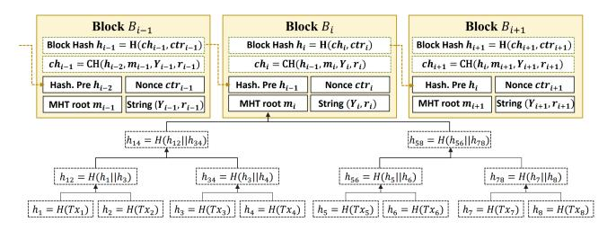
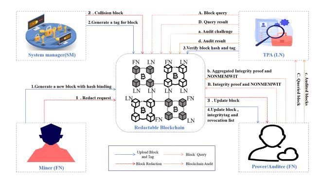
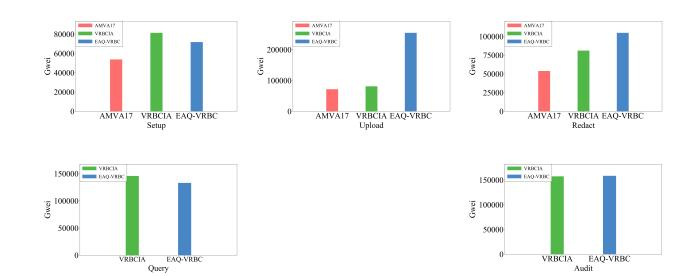
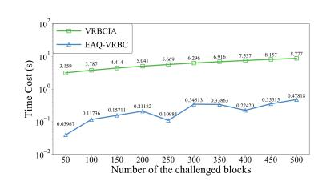
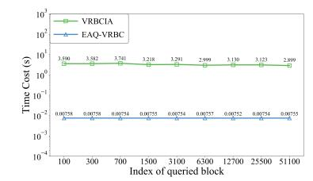
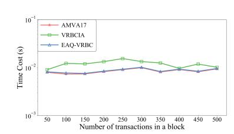
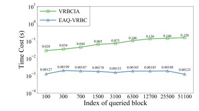
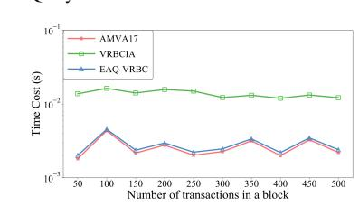
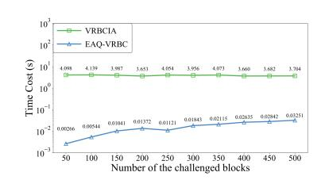

# Efficient Auditing and Querying in Verifiable Redactable Blockchain: A Lightweight VDS Protocol with Integrity Verification

Xiaoxu Zhang1,2,3, Zhipeng Cai1,2,3, Keyan Chen1,2,3, Guanxiong Ha1,2,3, Chunfu Jia1,2,3,\*

<sup>1</sup> The College of Cryptology and Cyber Science, Nankai University, Tianjin, 300350, China.

<sup>2</sup> Tianjin Key Laboratory of Network and Data Security Technology, Tianjin, 300350, China.

<sup>3</sup> Key Laboratory of Data and Intelligent System Security (DISSec), Tianjin, 300350, China.

*Abstract* —Driven by legal and service demands, redactable blockchains (RBC) have been proposed to balance the editability and immutability of blockchain technology. However, RBC may allow the same block to have multiple valid versions, which malicious nodes could exploit to deceive lightweight nodes, thereby compromising the consistency and integrity of the ledger. To address this issue, we propose an efficient auditing and querying scheme for verifiable redactable blockchain (EAQ-VRBC). It is an auditable verifiable data streaming (VDS) protocol that establishes the RSA accumulator-based revocation mechanism to invalidate outdated blocks in RBC. The trusted node maintains a revocation list stored in a dynamic RSA accumulator. The validity of new blocks is verified by non-membership proofs, ensuring that only the latest data version is considered valid, effectively preventing old data version deception. Compared with existing auditable VDS protocols tailored for RBC, the verification cost of EAQ-VRBC in the query and audit phases is reduced by approximately one order of magnitude. Additionally, EAQ-VRBC uses identity-based RSA signature auditing to ensure data integrity. Finally, security analysis and performance evaluation confirm the feasibility and efficiency of the proposed solution.

*Index Terms* —Verifiable redactable blockchain, Data auditing, RSA accumulator, Chameleon hash function, Verifiable data streaming.

## I. INTRODUCTION

With its unique features such as decentralization and immutability, blockchain technology has shown great potential in fields like finance, supply chain, and data sharing [1]– [4]. However, immutability also introduces critical challenges, particularly in privacy protection. For instance, the inability to remove illegal or outdated data conflicts with regulations such as the GDPR's "right to be forgotten" [5]. Balancing data security, compliance, and privacy thus remains a key challenge for blockchain development.

To address this issue, Ateniese et al. [6] proposed Redactable Blockchain (RBC), which leverages chameleon hashing to enable controlled modifications under specific conditions. While RBC enhances flexibility, it raises new concerns: how to ensure outdated versions are properly deprecated to prevent data inconsistency?

The version control of blocks in blockchains is analogous to that of streaming data. Verifiable Data Streaming (VDS) protocols are designed to ensure the integrity of outsourced streaming data [7], [8]. Most existing VDS schemes rely on the Chameleon authentication tree (CAT), incurring logarithmic computation and communication overhead (i.e., log(n), where n is the number of data items) and supporting only limited item verification [7]. To address these limitations, Schroder et ¨ al. [9] proposed a more efficient, unbounded VDS protocol by treating CAT as a black box, achieving overhead logarithmic in the number of verified items. However, these VDS schemes primarily target single-item queries. Under concurrent queries, their cost grows linearly with query size. Moreover, update operations remain costly, making them unsuitable for dynamic editing.

Beyond block redaction, node heterogeneity in blockchain networks further complicates the problem. Full nodes (FNs) store complete blockchain data and independently validate updates, whereas light nodes (LNs) only retain block headers and rely on FNs for verification [10]–[12]. This dependency makes LNs vulnerable to deception by malicious FNs, especially after block redactions. Malicious FNs can selectively provide old version blocks, while LNs lack effective verification methods. Therefore, ensuring efficient and reliable validation of modified blocks by LNs is thus crucial for maintaining ledger integrity [13].

Li et al. [13] proposed a blockchain-based BLIND auditing system that leverages cryptographic accumulator technology for transparent data integrity verification without a thirdparty auditor. Tian et al. [14] introduced a bi-directional shared auditing mechanism under a blockchain-based dualserver storage architecture, integrating data deduplication and auditing functions. Zhang et al. [15] designed a public auditing scheme supporting blockchain dual-replica storage, employing the HCE2 algorithm and an improved authenticator generation

algorithm to achieve both auditing and deduplication [16]. However, the above schemes generally rely on the Public Key Infrastructure (PKI) certificate system, which is primarily suited for verifying the data integrity of a single user and is dif-

<sup>\*</sup> Corresponding author: Chunfu Jia (E-mail: cfjia@nankai.edu.cn).



Fig. 1. Redactable Blockchain Structure.

ficult to scale for multi-user data auditing scenarios [17]–[19]. In the VRBC (Verifiable Redactable Blockchain) application, multiple miners typically maintain the blockchain ledger [20], making the PKI-based auditing schemes unsuitable.

To address the both challenges of block integrity and version control in redactable blockchains such as VRBC, VRBCIA [21] introduces a VDS protocol based on the Blockchain authentication tree (BAT), enabling integrity and consistency verification of modified blocks. Yet, it still requires commitment aggregation along block paths and retains a log(n) verify cost, which limits efficiency under high-frequency updates.

To address old data deception and integrity issues in RBC scenarios, we propose EAQ-VRBC (Identity-based VDS and Auditing for Editable and Verifiable Redactable Blockchain), an efficient VRBC mechanism that integrates lightweight VDS with identity-based integrity auditing.

### A. Contributions

We propose a dynamic RSA accumulator-based revocation mechanism for RBC, where a trusted node maintains a revocation list of old block versions. Before each redactions, old versions are added to the accumulator. During queries, Auditees must provide non-membership proofs to show that the current version is not revoked, thereby ensuring data freshness and preventing old-version deceptions in VRBC.

Compared to existing authentication tree-based VDS schemes, EAQ-VRBC leverages an efficient non-membership proof technique without hash-to-prime, enabling batch verification. Its generation and verification process has an operational complexity of only O(1) with lower computational cost.

To address the issue of auditing in VRBC that is incompatible with PKI-based auditing, EAQ-VRBC adopts identitybased RSA signature auditing, with verification costs during the query and audit phases being relatively low.

## II. PRELIMINARY

**Redactable Blockchain:** The VRBC blockchain, as shown in Fig. 1, consists of a sequence of redactable blocks $B_i$ ($h_{i-1}, ch_i, m_i, Y_i, r_i, ctr_i$), in which $h_{i-1}, r_i \in \mathbb{Z}_N^*$; $ch_i, Y_i \in QR_N$; $m_i \in \{0, 1\}$, and $ctr_i \in \mathbb{N}$. Take appending block $B_i$ as an example, Miner uses the root value $m_i$ of the Merkle hash tree (MHT) built upon transactions $\{Tx_1, \dots, Tx_8\}$ to generate the chameleon hash value $ch_i$ for the new block $B_i$; $ch_i = \text{CH}(h_{i-1}, m_i, Y_i, r_i)$, where $h_{i-1}$ is the hash value of



Fig. 2. System Model

the previous block, and $(Y_i, r_i)$ is the verification string of $(m_i, ch_i)$ in the CH function [6]. Then, the block hash $h_i$ is generated through a standard hash function $H(ch_i, ctr_i)$, where $ctr_i$ is the Nonce value of the block $B_i$.

**Strong RSA assumption [22]:** For all $\lambda \in \mathbb{N}$ and probabilistic polynomial-time (ppt) adversary $\mathcal{A}$, given $n = pq$, where $p$ and $q$ are poly($\lambda$)-bit safe primes, and $u \in \mathbb{Z}_n^*$, we have:

$$\Pr \left[ \begin{bmatrix} v, e \\ v^e \equiv u \end{bmatrix} \text{ mod } n \wedge e > 1 \right] \leq \text{negl}(\lambda)$$

**Shamir’s Trick [23]:** For all $n, x, y \in \mathbb{N}$, $v, u \in \mathbb{Z}_N^*$ such that $v^x \equiv u^y \pmod{n}$ and $\gcd(x, y) = 1$, there exists $w \in \mathbb{Z}_N^*$ such that $w^x \equiv u \pmod{n}$.

## III. SYSTEM MODEL

As shown in Fig. 2., EAQ-VRBC involves four entities, each with distinct responsibilities:

System Manager (SM): A fully trusted authority (e.g., committee) responsible for generating system public parameters and block tags, as well as editing on-chain data upon legal or user requests.

Miner: Maintains the blockchain ledger, updates versionbased revocation lists, uploads and updates blocks, and initiates audit requests.

Third-Party Auditor (TPA): A light node responsible for verifying data and returning audit results during query and audit processes.

Auditee (FN): A full node holding the complete ledger, responsible for verifying new blocks during redaction and generating proofs in response to TPA challenges during query and audit phases.

### A. Security model

**Soundness:** We define the EAQ-VRBC system security model, where the adversary $\mathcal{A}$ represents the SM, and the challenger $\mathcal{C}$ represents the Miner. The adversary $\mathcal{A}$ must possess all data blocks in the file or be able to guess all missing blocks; otherwise, it cannot respond to the challenge from the TPA and generate a valid proof. An adversary that does not store the data file cannot provide a storage proof

for the challenged data blocks. The soundness game of EAQ VRBC consists of the following phases:

*Setup:* The challenger $\mathcal{C}$ initializes the parameters and executes the algorithm Setup $\{(1^\lambda) \rightarrow PS, TK, pk, sk\}$ to generate the public system parameters $P$ and key pair $(pk, sk)$. The public system parameters $PS$ and public key $pk$ are sent to the adversary $\mathcal{A}$.

*Query*: The adversary $\mathcal{A}$ can adaptively query any verifiable tag $t_i$ for a given block $B_i$ based on $pk$. The challenger $\mathcal{C}$ executes the algorithm Setup $\{(1^\lambda) \rightarrow PS, TK, pk, sk\}$ to obtain $pk$, executes the algorithm *Upload* to generate tag $t_i$ for block $B_i$, and returns the set of tags $\{t_i\}_{i \in [1, n]}$ to the adversary $\mathcal{A}$.

*Challenge:* The challenger $\mathcal{C}$ generates the challenge $Chal.$

*ProofGen:* For the *Chal*, the adversary $A$ runs *ProofGen(Chal)* $\rightarrow P$ to generate the storage proof. Finally, the adversary $A$ can obtain the $P = \{AGGE, \mu\}$.

*Verify:* If the output result of the algorithm $\text{Verify}(P, \text{Chal}) \rightarrow T/F$ is T, adversary $A$ outputs the proof and wins the game.

**Controlled Redaction:** Given a collision $(m'_s, Y'_s, r'_s)$ for $(m_s, Y_s, r_s)$, no adversary can extract the trapdoor key. Only redactors holding the trapdoor can forge valid collisions.

**Forward Dynamic Accumulator Security:** Strong RSA assumption prevents FNs from misleading LNs with outdated blocks.

### B. Our Scheme

**Setup** $\{(1^\lambda) \rightarrow PS, TK, pk, sk\}$: The SM inputs the security parameter $1^\lambda$. The SM computes the RSA modulus $N = pq$, where $p = 2p' + 1$ and $q = 2q' + 1$ (both are large primes), where $2^\lambda < \varphi(N) < 2^{\lambda+1}$. Define a multiplicative cyclic group $QR_N$ of quadratic residues modulo $N$ with generator $g$. Define collision-resistant hash algorithms, where $H_0, H_1, H_2$, and $H_3$ are defined as: $H_0: \{0, 1\}^* \rightarrow \{0, 1\}^\lambda$, $H_1: \{0, 1\}^* \rightarrow Odds(2^{l-1}, 2^l - 1)$, $H_2: Z_N^* \times Z_N^* \rightarrow Z_N^*$, $H_3: \{0, 1\}^* \rightarrow Z_N^*$, $\Upsilon_1: \{1, 2, \dots, n\} \times \mathbb{Z}_N^* \rightarrow \{1, 2, \dots, n\}$, $\Upsilon_2: \{1, 2, \dots, n\} \times \mathbb{Z}_N^* \rightarrow \mathbb{Z}_N^*$, where $l = \text{poly}(\lambda)$ satisfies $\sqrt{l} \leq \tau \leq l^{3/4}$ for any $x \in \{0, 1\}^*$, $P^+(H_1(x)) > 2^\tau$ with overwhelming probability. $\tau$ is a tuning parameter. Set that each miner in the system has an identity identifier $ID_i$, where $ID_i \in \{0, 1\}^*$. The SM generates master public key $pk = (e, N)$ and master private key $sk = d$, such that $ed \equiv 1 \pmod{4p'q'}$. The SM generates private key $sk_i = H_3(ID_i) \pmod{N}$ and public key $pk_i = H_3(ID_i) \pmod{N}$. We define $u = QR_N \setminus \{1\}$. Let $PP = N$, and the initial value of the accumulator is set as $acc(\emptyset) = u$. Define a counter $Cnt$, where $i = Cnt$. The system maintains a revocation list of old labels $R$. At the same time, define $upmsg_i$ as the record of each addition operation, for example, Each tag $upmsg_i$ is a 3-tuple $(v, acc, acc')$, where: $v \in \mathbb{Z}_n^*$ denotes the element being added or deleted, $acc, acc'$ denote the accumulator value before and after the operation. Let file $M = m_1 \| m_2 \| \dots \| m_n$. The KGC generates trapdoor keys $TK = (x, y) \in \mathbb{Z}_N^*$, hash key $HK = (X, Y) = (g^x, g^y)$.

Therefore, the public system parameters can be obtained as $PS = \{g, N, e, H_0, H_1, H_2, H_3, u, upmsg_i, ID_{SM}, HK\}$.

**Upload** $\{(m_i, HK, TK, PS) \rightarrow B_i, t_i\}$: Miner first investigates the hash-binding process. Miner picks at random an element $r_i \in \mathbb{Z}_N$ and computes the chameleon hash value of $B_i$, $ch_i = (X \cdot Y)^{H_2(h_{i-1} \| m_i, Y)} \cdot g_1^{r_i} = g_1^{H_2(h_{i-1} \| m_i, Y)(x+y)+r_i}$, where $h_{i-1} = H_3(ch_{i-1}, ctr_{i-1})$. Miner appends block $B_i = (h_{i-1}, ch_i, m_i, Y, r_i)$ to the blockchain when he wins the current consensus process. The SM extracts the data block hash value $h_{s'}$ from the block $B_{s'}$ and generates a unique identifier in the tag as follows: $hh_{s'} = H_3(s' \| h_{s'} \| v)$, where $v \in \mathbb{Z}_N$. The SM then generates a tag for the block as: $S_{s'} = v^d \cdot \prod_{i=1}^n sk_i^{c_{s'}} \pmod{N}$, where $c_{s'} = H_0(s' \| h_{s'} \| v) \pmod{N}$ and $S_{s'} = v^d$. Block tag $t_{s'} = (S_{s'}, v)$ is uploaded to Auditee. The TPA first computes $v = S_{s'}^e \cdot \prod_{i=1}^n pk_i^{-c_{s'}} \pmod{N}$, Then it verifies the validity of the $(v, S_{s'})$ through $H_0(s' \| h_{s'} \| v) \pmod{N} \stackrel{?}{=} c_{s'} \pmod{N}$. Then the TPA verifies whether the following equation holds $ch_i \stackrel{?}{=} (X \cdot Y)^{H_2(h_{i-1} \| m_i, Y)} \cdot g^{r_i}$. If the verification passes, the Auditee stores the tag $t_{s'}$ for the block; otherwise, the request is rejected.

**Redaction** $\{(B_s, TK, HK, PS) \rightarrow B_{s'}\}$: The Miner initiates a redact request. The SM obtains the block $B_s$ ($h_{s-1}, ch_s, m_s, Y_s, r_s, ctr_s$), where the chameleon hash value is $ch_s$, $h_{s-1}$ is the hash value of the previous block, and $ctr_s$ is its Nonce value. When the message $m_s$ in the $s$ -th block needs to be updated to $m_{s'}$, the SM executes the following steps: Compute the long-term trapdoor key $k_s = H_2(h_{s-1} \| m_s, Y_s) \cdot (x + y) + r_s \bmod N$. Next, generate the temporary trapdoor $y_{s'}$ for the new message $m_{s'}$: $y_{s'} = H_3(x, m_{s'})$, $Y_{s'} = g_1^{y_{s'}}$. Then, compute the new verification value $r_{s'} = k_s - H_2(h_{s-1} \| m_s, Y_{s'}) \cdot (x + y_{s'}) \bmod N$. Finally, generate the collision block $B_{s'} = (ch_s, m_{s'}, Y_{s'}, r_{s'})$. The Auditee verifies whether the following equation holds $ch_s \stackrel{?}{=} (X \cdot Y_{s'})^{H_2(h_{s-1} \| m_{s'}, Y_{s'})} \cdot g_1^{r_{s'}}$. If the verification passes, the data $(m_s, Y_s, r_s)$ in the original block is replaced with the new data $(m_{s'}, Y_{s'}, r_{s'})$, and the chameleon hash value $ch_s$ remains unchanged.

**Query** $\{(s, \pi_q) \rightarrow T/F\}$: When the TPA wants to query whether the message $m'_s$ in the $s$ -th block is stored in the FN, it sends an index $s$ related to $m_{s'}$. The Auditee first retrieves the tuple $(s, B_{s'}, t_{s'}, hh_{s'})$ from the ledger. Then, the Auditee generates a non-membership proof for the new tag $t_{s'}$ using the latest accumulator $acc(R)$, to prove that the tag $t_{s'}$ has not been revoked. First, the Auditee computes $H_1(x) = H_1(s' \| hh_{s'})$, and retrieves the accumulator value $\theta' = \prod_{H_1(y) \in R} H_1(y) = \prod_{H_1(i \| hh_i) \in R} H_1(i \| hh_i)$. Next, generate the non-membership proof $\bar{w}_x$ for $x$. As shown in Algorithm 1, for this update message $upmsg_s$, we perform the following steps: First, parse $upmsg_s$ into $(H_1(x), u, u')$. Then, update the set $R \leftarrow R \cup \{H_1(x)\}$. Then, multiply the smooth factor $dd = 1$ with the elements in the accumulator for aggregation to get $\theta' \leftarrow \prod_{H_1(y) \in R} H_1(y) \cdot dd$. Next, set $x \leftarrow H_1(x)$, and initialize $s \leftarrow (1)$. When $\gcd(\theta', x) \neq 1$,

continue updating $x \leftarrow x/\gcd(\theta', x)$, and add $\gcd(\theta', x)$ to $s'$. This process involves repeatedly extracting non-coprime factors until $x$ and $\theta'$ become coprime. Compute $a, b \in \mathbb{Z}_N$, such that: $a\theta' + bx = 1$. Then, compute $B \leftarrow a^b \bmod N$. Finally, return the non-membership proof $\bar{w}_x = (a, B, s)$. Finally, Auditee sends the data item $m_s$ and the proof $\pi_q = \{t_s, hh_{s'}, \bar{w}_x\}$ to the TPA.

#### Algorithm 1 NonMemWitCreate

**Input:** $PS, \{upmsg_s\}$
**Output:** $\bar{w}_x$

```text
 1: Parse PS as (N, u); R ← ∅, dd ← (1)
 2: Parse upmsg_s as (H1(x), u, u')
 3: Set R ← R ∪ {H1(x)}
 4: θ' ← ∏_{H1(y) ∈ R} H1(y) · ∏_{i=1}^{|dd|} dd[i]
 5: x ← H1(x); s ← (1)
 6: while gcd(θ', x) ≠ 1 do
 7:     g ← gcd(θ', x); x ← x / g; s ← s ∥ g
 8: Find a, b ∈ Z s.t. a·θ' + b·x = 1
 9: B ← u^b mod n
10: return w̄_x = (a, B, s)
```

> Algorithm 1 was rebuilt from the PDF text layer; the OCR output for it was garbled.

TPA receives $\bar{w}_x = (a, B, s)$, where $s$ is a set of factors of $x$ that are not coprime with the set $R$, storing the factors of $k$ such that $s$ is less than or equal to $2^r$, i.e., $\prod_{i=1}^{|s|} s[i] = k$. TPA recalculates $H_1(x) = H_1(s \| hh_{s'})$, and then checks whether the equalities $u^{a \cdot \theta'} B \prod_{i=1}^{|s|} s[i] \stackrel{?}{=} u$ hold to determine if $x$ is a non-member. TPA verifies the completeness of the block and its appended label $t_i$ by calculating $v = S'_s \cdot \prod_{i=1}^n pk_i^{-c_{s'}}$, and then checks the following equality: $H_0(s' \| h_{s'} \| v) \pmod{N} \stackrel{?}{=} c_{s'} \pmod{N}$. If the above validations pass, further, the TPA checks the correctness of the chameleon hash value $ch_s$ to verify the legitimacy of the data block modification using the following equation: $ch_s \stackrel{?}{=} (X \cdot Y_s)^{H_2(h_{s-1} \| m_s, Y_s)} \cdot g_1^{r_s}$. If the equation is validated successfully, TPA will keep $B_s$ locally; otherwise, $B_s$ will be discarded.

**Audit** $\{(Chal, P) \rightarrow T/F\}$: The auditing process consists of three sub-processes: Challenge, ProofGen, and Verify.

Challenge: TPA generates the challenge $Chal = \{i', r_1, r_2\}$, where $r_1, r_2 \in Z_N^*$ and $i' \in [n]$. TPA sends the challenge $Chal$ to FN. TPA generates index $\alpha_i = \Upsilon_1(i, r_1)$ and coefficient $\beta_i = \Upsilon_2(i, r_2)$, where $i \in [1, i']$.

**ProofGen:** Then, the Auditee calculates the aggregated tags $AGGE = \left\{ \prod_{i=1}^{i'} v_i \beta_i, \prod_{i=1}^{i'} S_i \right\}$ according to $\alpha_i$ and $\beta_i$. Additionally, FN needs to aggregate the challenged block $\mu = \sum_{i=1}^{i'} \beta_i c_{\alpha_i}$. In addition, we also generate an aggregated non-membership proof $\bar{w}_{x_1, x_2, \dots, x_{i'}}$ as shown in Algorithm 1.

The process of aggregating non-membership proofs is implemented recursively, as shown in the figure (the aggregation process of three non-membership proofs). When $\text{isDone} = 0$, it indicates that the aggregation is complete. The final aggregated non-membership proof result is obtained by recursively applying the algorithm to aggregate two non-membership proofs. As shown in Algorithm 2, the first step is to aggregate non-membership proofs $\bar{w}_{x_1}$ and $\bar{w}_{x_2}$. First, normalize $x_1$ and

$x_2$, where $x_1 = \frac{H_1(x_1)}{\prod_{i=1}^{|S_1|} s_1[i]}$, $x_2 = \frac{H_1(x_2)}{\prod_{i=2}^{|S_2|} s_2[i]}$. Let $a, b \in \mathbb{Z}$ such that $ax_1 + bx_2 = \gcd(x_1, x_2) = dd$. Next, we further simplify to obtain $x_1' = \frac{x_1}{dd}$, $x_2' = \frac{x_2}{dd}$. Thus, we can obtain: $u = u^{x_1} B_1^{x_1} = u^{a_2} B_2^{x_2}$. Let $\gamma = a_1 b x_2' + a_2 a x_1'$. Thus, the above equation expands further to $u^{\gamma \bmod x_1 x_2'}$. Thus, the above equation expands further to $u^{\gamma \bmod x_1 x_2'}$. Let $a' = \gamma \bmod x_1 x_2'$, $B' = (u^{\lfloor \frac{\gamma}{x_1 x_2'} \rfloor} \cdot B_1^b B_2^a)^{x_1 x_2'}$. Let $a' = \gamma \bmod x_1 x_2'$, $B' = (u^{\lfloor \frac{\gamma}{x_1 x_2'} \rfloor} \cdot B_1^b B_2^a)^{x_1 x_2'}$ and $s'_2 = s_2 \parallel (dd)$. Clearly, the aggregated non-membership witness is: $\bar{w}_{x_1, x_2} = (a', B', s_1, s'_2)$. However, verifying $\bar{w}_{x_1, x_2}$ requires roughly the same number of group operations as verifying the non-membership of $x_1$ and $x_2$ separately.

#### Algorithm 2 Non-membership Witnesses Aggregation

**Input:** $PS, (x_j, \bar{w}_{x_j})_{j=1}^{i'}, isDone$
**Output:** $\bar{w}_{x_1, x_2, \dots, x_{i'}}$

```text
 1: if i' = 2 then
 2:     Parse PS ← (N, u); w̄_{x1} ← (a1, B1, s1); w̄_{x2} ← (a2, B2, s2)
 3:     x1 ← H1(x1) / ∏_i s1[i];  x2 ← H1(x2) / ∏_i s2[i]
 4:     Find a, b ∈ Z such that a·x1 + b·x2 = gcd(x1, x2)
 5:     x1' ← x1 / gcd(x1, x2);  x2' ← x2 / gcd(x1, x2)
 6:     s2' ← s2 ∥ gcd(x1, x2)
 7:     γ ← a1·b·x2' + a2·a·x1';  a' ← γ mod (x1·x2')
 8:     B' ← u^{⌊γ/(x1·x2')⌋} · B1^b · B2^a mod N
 9:     if isDone = 0 then
10:         return w̄_{x1,x2} = (a', B', s1, s2')
11:     else
12:         C ← u^{a'} mod N;  D ← B'^{x1·x2'} mod N
13:         π_C ← NI-SimPoE.Prove(u, C, a')
14:         π_D ← NI-SimPoE.Prove(x1·x2', D, B')
15:         return [C, a', s1, s2', D, B', π_C, π_D]
16: else if i' > 2 then
17:     w̄_{x1,x2} ← NonMemAgg(PS, u, (x1, w̄_{x1}), (x2, w̄_{x2}), 0)
18:     for j = 3 to i' − 1 do
19:         M ← NonMemAgg(PS, u, {(x_k)_{k=1}^{j−1}, w̄_{x1,…,x_{j−1}}, x_j, w̄_{x_j}}, 0)
20:         w̄_{x1,…,x_j} ← M
21:     return NonMemAgg(PS, u, {(x_j)_{j=1}^{i'−1}, w̄_{x1,…,x_{i'−1}}, x_{i'}, w̄_{x_{i'}}}, 1)
```

#### Algorithm 3 Verify Non-membership Witnesses Aggregation

**Input:** $PS, \{(x_j, \bar{w}_{x_j})\}_{j=1}^{i'}$
**Output:** valid/invalid

```text
 1: Parse PS ← (N, u)
 2: Parse w̄_{x1,…,x_{i'}} ← (a', B', s1, …, s_{i'}, π_C, π_D, C, D)
 3: for i = 1 to i' do
 4:     for j = 1 to |s_{x_i}| do
 5:         if s_{x_i}[j] > 2τ then
 6:             return invalid
 7:     x_i ← H(x_i) / ∏_{k=1}^{|s_{x_i}|} s_{x_i}[k]
 8: if NI-SimPoE.Verify(u, C, a', π_C) = 0 then
 9:     if NI-SimPoE.Verify(B', D, ∏_{i=1}^{i'} x_i, π_D) = 0 then
10:         if C·D ≡ u (mod N) then
11:             return valid
12: return invalid
```

> Algorithms 2–3 were transcribed by hand from the PDF (page 4); the OCR output for them was garbled. Line 8–9 conditions ("= 0") are reproduced exactly as printed.

To address this issue, we use NI-SimPoE (The detailed

process of generating the proof can be found in reference [24]) to compute the proofs $\pi_{C,(x_1,x_2)}$ and $\pi_{D,(x_1,x_2)}$ for the statements $(A, C, \gamma)$ and $(B', D, x_1x_2')$ respectively, where: $C = u^\gamma$, $D = B'^{x_1x_2'}$. Finally, we define the full witness as: $\bar{w}_{x_1, x_2} = (a', B', s_{x_1}, s'_{x_2}, \pi_{C,(x_1,x_2)}, \pi_{D,(x_1,x_2)}, C, D)$. Next, the aggregated non-membership proof $\bar{w}_{x_1, \dots, x_{i'}}$ is recursively computed using the method shown in the figure. Auditee sends the integrity proof $P = \{AGGE, \mu, \bar{w}_{x_1, \dots, x_{i'}}\}$ to PTA.

Verify: After receiving $P$, TPA determines whether the data blocks and their tags are complete by verifying the following equation:

| $\prod_{i=1}^{i'} S_{\alpha_i}^{\beta_i}$ | $(\text{mod } N) = \left( \prod_{i=1}^{i'} v_$ |
| ---------------------------------------------------------- | --------------------------------------------------------------- |
| ---------------------------------------------------------- | --------------------------------------------------------------- |

Next, TPA therefore $w_{D, y}$ according to 3. First, if checks whether there are any non-prime factors in the set $s$, if any are found, it directly returns "invalid." Then, each $x_i$ is normalized. Following that, TPA checks the correctness of the knowledge about $C$ and $D$ by verifying the PoE equation. If both are correct, it checks whether the non-membership proof equation: $CD \equiv u \pmod{N}$ holds. If it holds, TPA returns "valid," indicating the verification is successful.

**Update** $\{(PS, m_{ss'}, R) \rightarrow R', B_{ss'}\}$: To replace a previously outsourced data item $m'_s$ with a new one $m'_{ss'}$, the Miner first retrieves the current tuple $(s', B'_s, t'_s)$ from the Auditee, and then checks its validity through $H_0(s' \| h_{s'} \| v) \bmod N \stackrel{?}{=} c_{s'} \bmod N$. If it passes the verification, Miner creates $t_{ss'} = (S_{ss'}, v)$, and updates the current accumulator $acc(R) \leftarrow (acc(R))^{H(s' \| hh'_s)}$. Furthermore, Miner sends $(ss', m_{ss'}, t_{ss'})$ and $acc(R)$ to Auditee. After that, Auditee checks the validity of $t_{ss'}$ again and excutes the redaction algorithm to replace $(s', m_{s'}, t_{s'}, hh_{s'})$ with $(ss', m_{ss'}, t_{ss'}, hh_{ss'})$. If it passes the verification. Finally, Miner updates $R \leftarrow R \cup \{hh_{s'} = H_3(s' \| h_s \| m_{s'})\}$. In addition, SM uses the updated accumulator $acc(R)$ to update the public parameter $PS$.

## IV. SECURITY ANALYSIS

**Theorem 1.(Correctness):** EAQ-VRBC ensures correct verification during the block query and audit stages.

**Proof:** Based on similar concepts, the correctness of blockchain auditing can be inferred from the block query phase. Therefore, we will prove this by following two steps.

Step 1: We will prove the correctness of the block query in equation 2, including the non-membership proof and integrity tag verification.

$$u^{a, \theta'} \cdot B \frac{H(x)}{\prod_{i=1}^{|S|} s^{[i]}} = u^{a, \prod_{y \in R} H_1(y)} \cdot u^{b \frac{H(x)}{\prod_{i=1}^{|S|} s^{[i]}}} = u^{a, \theta' + bx} = u \quad (2)$$

$$\begin{aligned} t'_s \cdot \prod_{i=1}^n H(ID_i)^{-c_{s'}} &= v \cdot \prod_{i=1}^n H(ID_i)^{c_s} \cdot \prod_{i=1}^n H(ID_i)^{-c_{s'}} \\ &= v \\ H_0(s' || h'_s ||) &\equiv c_{s'} \pmod{N} \end{aligned} \tag{3}$$

The correctness of the integrity tag equation is shown in equation 3.

Step 2: We will prove the correctness of the block audit, including the non-membership proof and integrity tag verification equations 4 and 5.

**Theorem 2.(Soundness):** The security of the auditing process relies on the RSA assumption, especially for large public exponents. If the RSA assumption holds, no PPT adversary $\mathcal{A}$ can break the protocol with non-negligible probability.

$$\begin{aligned} u &= u^{ax_1+bx_2'} \\ &= (u^{a_1} B_1^{x_1})^{bx_2'} \cdot (u^{a_2} B_2^{x_2})^{ax_1'} \\ &= u^{a_1bx_2'+a_2ax_1'} \cdot (B_1^b B_2^a)^{x_1x_2'} \\ &= u^{\gamma \bmod x_1x_2'} \cdot (u^{\lfloor \gamma/(x_1x_2') \rfloor} B_1^b B_2^a)^{x_1x_2'} = CD \end{aligned} \tag{4}$$

**Proof:** The above theorem is proven through the interaction between the adversary $A$ and the simulator algorithm $\mathcal{B}$.

| Setup: | $\mathcal{B}$ | initializer | system | parameters | to |
| ------------------------------------------------------------------------------------------------------------------------------------------------------------------------------------------------------------------------------------------------------------------------------------------------------------------------------------------------------------------------------------------------------------------------------------------------------------------------------------------------------------------------------------------------------------------------------------------------------------------------------------------------------------------------------------------------------------------------------------------ | ------------------------------ | ------------- | ------------ | --------------------- | ---- |
| generate | public | system | parameters | $PS$ | = |
| $\{g, N, e, H_0, H_1, H_2, H_3, u, upmsg_i, ID_{SM}, HK\}$ |  |  |  |  |  |
| and public key $pk$ . Then, $\mathcal{B}$ generates hash value $hh_{s'} = H_3(s'\ h_{s'}\ v)$ based on the block hash value $h_{s'}$ and forges tags $t_i$ . $\mathcal{B}$ sends the tuples $W = \{t_i\}_{i \in [1, n]}$ to the adversary $\mathcal{A}$ . $\mathcal{B}$ and $\mathcal{A}$ perform the challenge-proof steps in the auditing process, where $\mathcal{B}$ acts as TPA and $\mathcal{A}$ acts as Auditee. $\mathcal{A}$ can obtain the auditing results after verification. Finally, $\mathcal{A}$ outpu |  |  |  |  |  |

$$\begin{aligned} \prod_{i=1}^{i'} S_{\alpha_i}^{e, \beta_i} \pmod{N} &= \prod_{i=1}^{i'} \left(v_i \cdot \prod_{i=1}^n H_3(ID_i)^{c_{\alpha_i}} \right)^{\beta_i} \\ &= \prod_{i=1}^{i'} v_i^{\beta_i} \cdot \prod_{i=1}^{i'} \prod_{i=1}^n H_3(ID_i)^{c_{\alpha_i} \cdot \beta_i} \\ &= \prod_{i=1}^{i'} v_i^{\beta_i} \cdot \prod_{i=1}^n H_3(ID_i)^{\sum_{i=1}^{i'} c_{\alpha_i} \cdot \beta_i} \\ &= \prod_{i=1}^{i'} v_i^{\beta_i} \cdot \prod_{i=1}^n H_3(ID_i)^{\mu} \pmod{N} \end{aligned} \tag{5}$$

$$\begin{aligned} \prod_{i=1}^{i'} S_{\alpha_i}^{e\beta_i} &= \prod_{i=1}^{i'} v_i^{\beta_i} \cdot \prod_{i=1}^n pk_i^\mu \pmod{N}, \\ \prod_{i=1}^{i'} S'_{\alpha_i}^{e\beta'_i} &= \prod_{i=1}^{i'} v'_i^{\beta'_i} \cdot \prod_{i=1}^n H(ID_i)^{\mu'} \pmod{N} \end{aligned} \quad (6)$$ Next, we provide a proof of the correctness of the auditing scheme. Assuming that the adversary $\mathcal{A}$ outputs a response $P' = \{AGGE', \mu'\}$. The record of Auditee's correct response is $P = \{AGGE, \mu\}$. The correct *proof* is composed of $AGGE = \left\{ \prod_{i=1}^{i'} v_i^{\beta_i}, \prod_{i=1}^{i'} S_i \right\}$ and $\mu = \sum_{i=1}^{i'} \beta_i c_{\alpha_i}$. The adversary $\mathcal{A}$ outputs $P' \neq P$. Based on the correctness of Theorem 1, the two equations in equation 6 will all pass verification.

Since $\mu' \neq \mu$, let's define $\Delta\mu = \mu - \mu'$. Next, divide the above two verification equations to obtain:

$$\begin{aligned} \left(\prod_{i=1}^{i'} S_{\alpha_i}^{e^{\cdot}\beta_i} \pmod{N} \right)^e / \left(\prod_{i=1}^{i'} S_{\alpha_i}^{e'.\beta'_i} \pmod{N} \right)^e \pmod{N} \\ = \frac{\prod_{i=1}^{i'} v_i^{\beta_i}}{\prod_{i=1}^{i'} v'_i^{\beta'_i}} \prod_{i=1}^n pk_i^{\Delta\mu} \pmod{N} \\ \left(\frac{\prod_{i=1}^{i'} S_{\alpha_i}^{\beta_i}}{\prod_{i=1}^{i'} S_{\alpha_i}^{\beta'_i}} \right)^e \pmod{N} = \frac{\prod_{i=1}^{i'} v_i^{\beta_i}}{\prod_{i=1}^{i'} v'_i^{\beta'_i}} \prod_{i=1}^n pk_i^{\Delta\mu} \pmod{N} \end{aligned}$$

Let $\prod_{i=1}^n pk_i = k^e \cdot y^d$ and $b^e = \frac{\prod_{i=1}^i v_i^{\beta_i}}{\prod_{i=1}^i v_i^{\beta_i}}$, where $k, b \in Z_N^*$, then we have:

$$\left(\frac{\prod_{i=1}^{i'} S_{\alpha_i}^{\beta_i}}{\prod_{i=1}^{i'} S_{\alpha_i}^{\beta'_i}} \right)^e \pmod{N} = b^e \cdot k^{e\Delta\mu} \cdot y^{d\Delta\mu} \\ \left(\frac{\prod_{i=1}^{i'} S_{\alpha_i}^{\beta_i}}{k^{\Delta\mu} \cdot b \cdot \prod_{i=1}^{i'} S_{\alpha_i}^{\beta'_i}} \right)^e \pmod{N} = y^{d\Delta\mu} \quad (8)$$

If $gcd(e, d\Delta\mu) = 1$, then we can find $x^*$ such that $(x^*)^e = y$. This means we can break the RSA hard problem. However, since $e$ is a large public prime number and $\Delta\mu = \mu' - \mu < e$, we can deduce that $gcd(e, \Delta\mu) = 1$. Therefore, we can get $d \cdot e \cdot \Delta\mu \equiv \Delta\mu \pmod{e}$ and $gcd(e, d\Delta\mu) \neq 1$, which implies $d\Delta\mu \equiv 0 \pmod{e}$. As the value of $d$ is chosen from the range $[1, 2^\lambda]$, the advantage of breaking the RSA hard problem is at most $2^{-\lambda}$, which is negligible.

Therefore, the adversary $A$ cannot forge a response $P' = \{AGGE', \mu'\}$ that passes the TPA verification to solve the RSA hard problem. In other words, they cannot forge a valid aggregated signature $AGGE'$ that makes $(x^*)^e = y$.

**(Controlled redaction):** The scheme enables controlled redaction via double-trappoor chameleon hashing, ensuring collision resistance and key security—adversaries cannot forge or steal keys.

**(Forward Dynamic Accumulator Security):** Under the random oracle model, the security of the RSA accumulator is guaranteed if the following conditions are satisfied: (1) the hash function $H_1$ is collision-resistant, and (2) the adaptive root assumption holds in the RSA group. The basic security of the RSA accumulator is further ensured by Shamir's Trick (via efficient computation of RSA inversion) and ultimately relies on the strong RSA assumption. Proof details are omitted due to space constraints.

## V. PERFORMANCE EVALUATION

### A. Experimental parameter configuration

We implement AMVA17 [6] and VRBCIA [21] in Python using Petlib and py\_ecc. On-chain gas costs are measured on Ethereum's Ropsten testnet, and off-chain computations

are run on a machine with a 12th Gen Intel Core i9-12900H (2.50 GHz), 16GB RAM, under Ubuntu 22.04.5 LTS. EAQ-VRBC uses a 2048-bit RSA modulus *N*, providing 112-bit security. Each block contains 16 bytes of data. Experiments are averaged over 30 runs. Parameters are listed in Table I.

### B. Theoretical Analysis

As shown in Tables II and III, during the setup phase, AMVA17 [6], VRBCIA [21], and EAQ-VRBC all publish system public parameters and incur a cost of $1M$ to generate the genesis block. The basic communication overhead for packaging and transmitting transactions is $1|BH| + m|T_x|$. In the upload phase, AMVA17 uploads only the block's basic information (e.g., hash index, MHT hash value), while VRBCIA additionally uploads the block's commitment values and incurs an overhead of $q|G|$ to pre-generate commitment values for child nodes. EAQ-VRBC, besides uploading basic information, requires an extra $2(ni + 1)\text{Exp} + 2(ni - 1)\text{Mul}$ for calculating and verifying the label based on the block's chameleon hash value. In the redact phase, AMVA17 performs chameleon hash verification, while VRBCIA incurs an additional cost of $L(h+\text{Exp})$ to update commitments on the node's path, where $L$ is the height of the redacted node in BAT. Since EAQ-VRBC generates block labels from the chameleon hash value, no update is needed.

In the Query phase, as AMVA17 lacks a challenge-proof phase, we compare VRBCIA and EAQ-VRBC. VRBCIA costs $qLH + (2N-1)Exp + 2(c-1)Mul$ to return commitment proofs for all parent and child nodes on the queried block's path, where $N$ is the family vector's dimension. EAQ-VRBC requires $(l+1)H + Inv + Mul + Exp$ to generate the non-membership proof. In the Audit phase, VRBCIA incurs costs for returning commitment proofs of all parent and child nodes along the challenged block paths, covering $cp$ nodes, where $p$ is the number of summary nodes on the path of the challenged node. EAQ-VRBC requires $(6c - 6)Exp + 2(c-1)Inv + 3(c-1)Mul + c \cdot 2^{l+1}H$ to generate the aggregated proof. The communication cost in the verify phase is $|\mathbb{Z}_N| + |QR_N|$.

### C. On-Chain Cost

As shown in Figure 3, we evaluated the on-chain (gas) costs across the Upload, Redact, Query, and Audit phases. In the *Setup* phase, gas consumption remained stable: AMVA17 required $0.53768 \times 10^5$ Gwei, VRBCIA $0.81311 \times 10^5$ Gwei (with BAT parameters: $q = 2$, level= 4, total nodes= 15), and EAQ-VRBC $0.71768 \times 10^5$ Gwei. In the *Upload* phase, uploading each block cost $0.71769 \times 10^5$ Gwei for AMVA17, $0.81025 \times 10^5$ Gwei for VRBCIA (including child node commitments), and $0.254526 \times 10^6$ Gwei for EAQ-VRBC, with 90.3% attributed to tag storage and verification.

In the Redact phase, costs were as follows: VRBCIA: $0.81037 \times 10^5$ Gwei, AMVA17: $0.53768 \times 10^5$ Gwei, EAQ-VRBC: $0.104788 \times 10^6$ Gwei, with costs for both adding and modifying blocks. In the Query phase, VRBCIA incurred $0.145671 \times 10^6$ Gwei due to the aggregation of commitments and labels, while EAQ-VRBC reduced the cost to $0.132913 \times$

TABLE I NOTATIONS

| Notation |  | Description |  |  |  |  |  |
| ------------- | -------------- | ------------- | ---------- | ------------------ | ---------- | ------------ | --------------------- |
| n | Number | of |  | blocks | in | the | blockchain |
| ni | Number | of |  | miners |  |  |  |
| m | Number | of |  | transactions |  | in | a standard block |
| q | Number | of | forks | in | the | q-ary | BAT |
| r | Number | of | nodes | in | the | path | union |
| l | Height | of | the | MHT | in | the | block |
| c | Number | of |  | challenged |  | blocks |  |
| H | Cost | of | running | a | hash |  | function |
| M | Cost | of | mining | a | standard |  | block |
| Inv | The | modular |  | inverse |  | operation |  |
| Exp | Cost | of |  | exponentiation |  |  | operation |
| Pair | Cost | of | bilinear |  | pairing |  | operation |
| QR N | /   G   Size | of | elements | in | QR | N | / G |
| Z p   /   Z | N   Size | of | elements | in | Z p | / Z | N |
| T x   ; | BH   Size | of a |  | transaction;Size |  |  | of the block header |
| index | Index | size | of | the |  | challenged | data block. |



Fig. 3. On-chain cost of steps: (a) Setup; (b) Upload; (c) Redact; (d) Query; (e) Audit.

10 <sup>6</sup> Gwei by using non-membership proof and label values. In the Audit phase, VRBCIA's cost was 0.157225 × 10 <sup>6</sup> Gwei for aggregation of node commitments, while EAQ-VRBC maintained a constant cost of 0.158336 × 10 <sup>6</sup> Gwei by aggregating non-membership proof and integrity tags.

### D. Off-chain cost

Since AMVA17 does not include the Query and Audit steps, we compared the off-chain computation costs of our scheme with VRBCIA during these phases. The experimental results are shown in Figures 4, 5, 6, 7, 8, and 9.

*a) Query phase:* In the Proof generation sub-stage, EAQ-VRBC leverages modular exponentiation and hashing to generate block tags and non-membership proofs, reducing computation by 99% compared to VRBCIA's aggregation of commitments and hashes along query paths. In the Proof verification sub-stage, EAQ-VRBC verifies block tags and nonmembership proofs, achieving 99.7% higher efficiency than VRBCIA, which requires costly exponentiation and pairing operations.

*b) Audit phase:* In the Proof generation sub-phase, EAQ-VRBC primarily incurs a cost of generating aggregated nonmembership proofs, with the former accounting for 93.75% of the total. VRBCIA's cost mainly stems from aggregating commitments and hashes along all challenge paths. EAQ-VRBC achieves a 94.3% efficiency improvement over VRBCIA. In

the Proof verification sub-phase, EAQ-VRBC verifies only one aggregated proof and partially delegates verification on-chain, while VRBCIA still performs complex pairing checks. EAQ-VRBC's verification cost is about 98.6% lower than VRBCIA.

### E. Conclusion

In conclusion, EAQ-VRBC resists old data deception in RBC by introducing a revocation mechanism based on dynamic RSA accumulators, ensuring only the latest data versions remain valid. It achieves a verification cost in querying and auditing (including non-membership proofs and identitybased RSA tags) that is approximately one order of magnitude lower than existing solutions. Experimental results show that EAQ-VRBC significantly lowers off-chain costs, offering a scalable and efficient solution for large-scale blockchain systems.

## ACKNOWLEDGMENT

This work was supported in part by the National Natural Science Foundation of China under Grants 62172238, and in part by the National Key R&D Program of China under Grant 2018YFA0704703.

## REFERENCES

- [1] G. Wood *et al.*, "Ethereum: A secure decentralised generalised transaction ledger," *Ethereum project yellow paper*, vol. 151, no. 2014, pp. 1–32, 2014. [2] M. Andrychowicz, S. Dziembowski, D. Malinowski, and Ł. Mazurek, "Secure multiparty computations on bitcoin," *Communications of the ACM*, vol. 59, no. 4, pp. 76–84, 2016. [3] V. P. Ranganthan, R. Dantu, A. Paul, P. Mears, and K. Morozov, "A decentralized marketplace application on the ethereum blockchain," in *2018 IEEE 4th International Conference on Collaboration and Internet Computing (CIC)*. IEEE, 2018, pp. 90–97. [4] M. Li, J. Weng, A. Yang, W. Lu, Y. Zhang, L. Hou, J.-N. Liu, Y. Xiang, and R. H. Deng, "Crowdbc: A blockchain-based decentralized framework for crowdsourcing," *IEEE transactions on parallel and distributed systems*, vol. 30, no. 6, pp. 1251–1266, 2018. [5] J. M. L. Alfons´ın, "Argentina: The right to be forgotten," in *The Right to Be Forgotten: A Comparative Study of the Emergent Right's Evolution and Application in Europe, the Americas, and Asia*. Springer, 2020, pp. 239–248. [6] G. Ateniese, B. Magri, D. Venturi, and E. Andrade, "Redactable blockchain–or–rewriting history in bitcoin and friends," in *2017 IEEE European symposium on security and privacy (EuroS&P)*. IEEE, 2017, pp. 111–126. [7] D. Schroder and H. Schr ¨ oder, "Verifiable data streaming," in ¨ *Proceedings of the 2012 ACM conference on Computer and communications security*, 2012, pp. 953–964. [8] J. Krupp, D. Schroder, M. Simkin, D. Fiore, G. Ateniese, and ¨
- S. Nurnberger, "Nearly optimal verifiable data streaming," in ¨ *Public-Key Cryptography–PKC 2016: 19th IACR International Conference on Practice and Theory in Public-Key Cryptography, Taipei, Taiwan, March 6-9, 2016, Proceedings, Part I*. Springer, 2016, pp. 417–445. [9] D. Schoder and M. Simkin, "Veristream–a framework for verifiable data ¨ streaming," in *International conference on financial cryptography and data security*. Springer, 2015, pp. 548–566. [10] A. Palai, M. Vora, and A. Shah, "Empowering light nodes in blockchains with block summarization," in *2018 9th IFIP international conference on new technologies, mobility and security (NTMS)*. IEEE, 2018, pp. 1–5. [11] S. Cao, S. Kadhe, and K. Ramchandran, "Cover: Collaborative lightnode-only verification and data availability for blockchains," in *2020 IEEE International Conference on Blockchain (Blockchain)*. IEEE, 2020, pp. 45–52.

**TABLE II. Comparisons of Communication and Storage Costs.**

| System | Setup | Upload | Redaction | Block query (Prove & Verify) | Audit (Prove & Verify) |
| :-- | :-- | :-- | :-- | :-- | :-- |
| AMVA17 [6] | $1\lvert BH\rvert + m\lvert T_x\rvert + 2(\lvert\mathbb{Z}_p\rvert + \lvert\mathbb{G}\rvert)$ | $1\lvert BH\rvert + m\lvert T_x\rvert + \lvert\mathbb{G}\rvert + 2\lvert\mathbb{Z}_p\rvert$ | $1\lvert BH\rvert + m\lvert T_x\rvert + 3\lvert\mathbb{Z}_p\rvert$ | – | – |
| VRBCIA [21] | $1\lvert BH\rvert + m\lvert T_x\rvert + 4(N+1)\lvert\mathbb{G}\rvert$ | $1\lvert BH\rvert + m\lvert T_x\rvert + (q+1)\lvert\mathbb{G}\rvert + 2\lvert\mathbb{Z}_p\rvert$ | $1\lvert BH\rvert + m\lvert T_x\rvert + 2\lvert\mathbb{G}\rvert + 2\lvert\mathbb{Z}_p\rvert$ | $1\lvert BH\rvert + m\lvert T_x\rvert + (L+4)\lvert\mathbb{G}\rvert + 4\lvert\mathbb{Z}_p\rvert + \lvert index\rvert$ | $\rho c(1\lvert BH\rvert + m\lvert T_x\rvert) + (3\rho+1)(\lvert\mathbb{G}\rvert + \lvert\mathbb{Z}_p\rvert)$ |
| EAQ-VRBC | $1\lvert BH\rvert + m\lvert T_x\rvert + n\lvert\mathbb{Z}_N\rvert + 2\lvert QR_N\rvert$ | $1\lvert BH\rvert + m\lvert T_x\rvert + 2\lvert\mathbb{Z}_N\rvert + 2\lvert QR_N\rvert$ | $1\lvert BH\rvert + m\lvert T_x\rvert + 3\lvert\mathbb{Z}_N\rvert$ | $1\lvert BH\rvert + m\lvert T_x\rvert + 2\lvert\mathbb{Z}_N\rvert + 2\lvert QR_N\rvert + \lvert index\rvert$ | $c(1\lvert BH\rvert + m\lvert T_x\rvert) + (c+4)\lvert\mathbb{Z}_N\rvert + 6\lvert QR_N\rvert$ |

**TABLE III. Comparisons of Computation Costs.**

| System | Setup | Upload | Redaction | Block query (Prove & Verify) | Audit (Prove & Verify) |
| :-- | :-- | :-- | :-- | :-- | :-- |
| AMVA17 [6] | $1M + 1H + 3Exp$ | $1M + (2^{l+1}+2)H + 4Exp$ | $(2^{l+1}+2)H + 3Exp$ | – | – |
| VRBCIA [21] | $1M + 2qH + 3N\,Exp$ | $1M + (2^{l+1}+3q+2)H + (N+q+1)Exp + 2Mul$ | $(2^{l+1}+2L+4)H + 2(L+1)Exp + 3Mul$ | $(qL+2^{l+1})H + (2N+1+L)Exp + (L+2)Pair + 2(c-1)Mul$ | $c\rho(q+1+2^{l+1})H + (2N+c\rho)Exp + (c\rho+1)Pair + 2(c-1)(\rho-1)Mul$ |
| EAQ-VRBC | $1M + (n+2)Exp + (6+ni)H$ | $1M + (2^{l+1}+4)H + 2(ni+3)Exp + 2(ni-1)Mul$ | $(2^{l+1}+5)H + 4Mul + 2Exp$ | $7Exp + (2^{l+1}+4+rl)H + Inv + 6Mul$ | $(8c-8)Exp + 2(c-1)Inv + (5c-4)Mul + c\cdot 2^{l+1}H$ |

> Tables II–III were transcribed by hand from the PDF (page 8); the OCR output for them was garbled.



Fig. 4. Computation of proof generation in Audit



Fig. 5. Computation of proof verification in Audit





Fig. 6. Computation of proof generation in Query



Fig. 7. Computation of proof verification in Query



Fig. 8. Computation of upload Fig. 9. Computation of redact

- [12] D. Derler, K. Samelin, D. Slamanig, and C. Striecks, "Fine-grained and controlled rewriting in blockchains: Chameleon-hashing gone attributebased," *Cryptology ePrint Archive*, 2019. [13] S. Li, C. Xu, Y. Zhang, Y. Du, and K. Chen, "Blockchain-based transparent integrity auditing and encrypted deduplication for cloud storage," *IEEE Transactions on Services Computing*, vol. 16, no. 1, pp. 134–146, 2022. [14] G. Tian, Y. Hu, J. Wei, Z. Liu, X. Huang, X. Chen, and W. Susilo, "Blockchain-based secure deduplication and shared auditing in decentralized storage," *IEEE Transactions on Dependable and Secure Computing*, vol. 19, no. 6, pp. 3941–3954, 2021. [15] Q. Zhang, D. Sui, J. Cui, C. Gu, and H. Zhong, "Efficient integrity auditing mechanism with secure deduplication for blockchain storage," *IEEE Transactions on Computers*, vol. 72, no. 8, pp. 2365–2376, 2023. [16] G. Ha, X. Ge, C. Jia, Y. Chen, and Z. Su, "Revisiting sgx-based encrypted deduplication via pow-before-encryption and eliminating redundant computations," *IEEE Transactions on Dependable and Secure Computing*, 2024. [17] W. Shen, J. Yu, M. Yang, and J. Hu, "Efficient identity-based data integrity auditing with key-exposure resistance for cloud storage," *IEEE Transactions on Dependable and Secure Computing*, vol. 20, no. 6, pp. 4593–4606, 2022. [18] F. Ullah, C.-M. Pun, M. I. Mohmand, R. K. Mahendran, A. A. Khan,
- S. M. Alhammad, J. J. Rodrigues, and A. Farouk, "Privacy-aware secure data auditing for cloud-based intelligence of things environment," *IEEE*

*Internet of Things Journal*, 2025. [19] T. Li, J. Chu, and L. Hu, "Cia: A collaborative integrity auditing scheme for cloud data with multi-replica on multi-cloud storage providers," *IEEE Transactions on Parallel and Distributed Systems*, vol. 34, no. 1, pp. 154–162, 2022. [20] J. Shen, X. Chen, Z. Liu, and W. Susilo, "Verifiable and redactable blockchains with fully editing operations," *IEEE Transactions on Information Forensics and Security*, vol. 18, pp. 3787–3802, 2023. [21] G. Tian, J. Wei, M. Kutyłowski, W. Susilo, X. Huang, and X. Chen, "Vrbc: A verifiable redactable blockchain with efficient query and integrity auditing," *IEEE Transactions on Computers*, vol. 72, no. 7, pp. 1928–1942, 2022. [22] N. Baric and B. Pfitzmann, "Collision-free accumulators and fail-stop ´ signature schemes without trees," in *International conference on the theory and applications of cryptographic techniques*. Springer, 1997, pp. 480–494. [23] A. Shamir, "On the generation of cryptographically strong pseudorandom sequences," *ACM Transactions on Computer Systems (TOCS)*, vol. 1, no. 1, pp. 38–44, 1983. [24] B. Wesolowski, "Efficient verifiable delay functions," *Journal of Cryptology*, vol. 33, no. 4, pp. 2113–2147, 2020.
