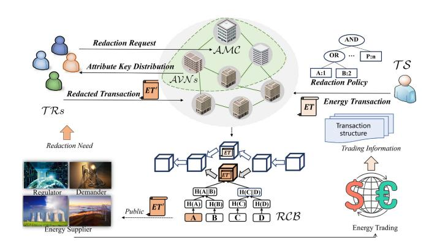
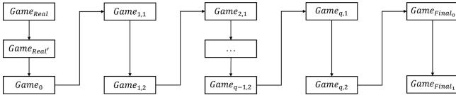
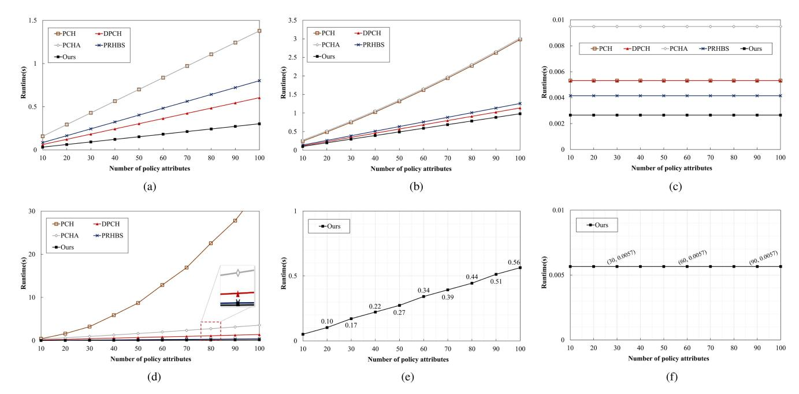
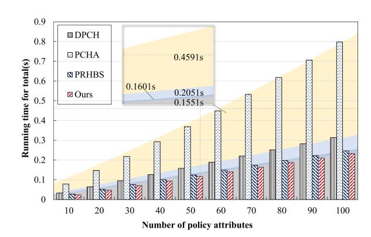
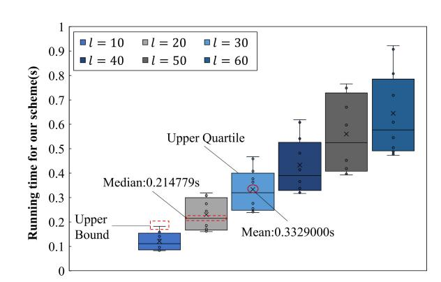
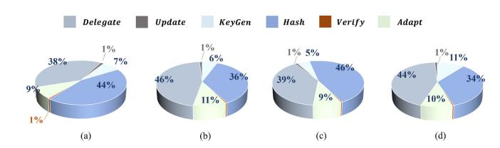
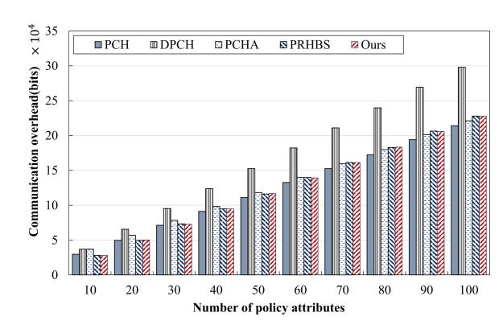
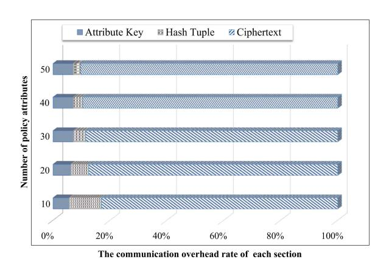

# Attribute-Based Policy-Hiding Redactable Blockchain With Authorizable Verification for Energy Internet

Jingting Xue [,](https://orcid.org/0000-0001-7531-5873) Liang Liu [,](https://orcid.org/0000-0002-3698-3059) Fagen Li [,](https://orcid.org/0000-0001-6289-1265) *M [em](https://orcid.org/0000-0003-3993-0478) ber, IEEE*, Ximin Jing, Wenzheng Zhan [g](https://orcid.org/0009-0002-3888-0229), Xiaojun Zhang, and Yu Zhou

*Abstract* **—The goal of the energy internet is to enable communication between distributed energy endpoints to facilitate information exchange and trading matching. Blockchain, which ensures content consistency, bridges the gaps between multiple energy stakeholders and satisfies the need for universal trust. However, applying blockchain directly in peer-to-peer trading can result in the permanent inclusion of illegal or outdated data in blockchain databases, hindering efficient interaction. Driven by emerging application requirements and legal regulations, redactable blockchain (EuroS&P 2017) was introduced, allowing the block history to be rewritten via collisions in chameleon hash functions (CHFs). Nevertheless, current solutions still face challenges, including trapdoor security risks, privacy leakage, and indefinite redactions. This article presents a redactable energy blockchain scheme (REBS) with partially attribute-based policy hiding, which enables controlled multiauthority key generation and redactor attribute verification. To prevent the abuse of redaction permission, REBS employs time-updatable CHFs for redaction. Additionally, we design a delegation algorithm that adds dynamic flexibility to attribute verification nodes, permitting them to delegate key share distribution authority to other nodes on demand. The detailed security proofs and performance evaluations demonstrate the feasibility of REBS.**

*Index Terms* **—Attribute-based policy hiding, authorizable verification, distributed energy trading, privacy protection, redactable blockchain.**

Received 1 October 2024; revised 24 December 2024; accepted 3 May 2025. Date of publication 13 May 2025; date of current version 25 July 2025. This work was supported in part by the Natural Science Foundation of Sichuan Province Under Grant 2023NSFSC1398, Grant 2022YFG0172, Grant 2022JDRC0061 and Grant 2025ZNSFSC0495; in part by the Natural Science Starting Project of SWPU Under Grant 2021QHZ017 and Grant 2023QHZ002; in part by the Foundation of Science and Technology of the Communication Security Laboratory of China Under Grant 61421030107012102; and in part by the National Natural Science Foundation of China Under Grant 61902327. *(Jingting Xue and Liang Liu are co-first authors.) (Corresponding authors: Jingting Xue; Fagen Li.)*

Jingting Xue, Liang Liu, Ximin Jing, and Xiaojun Zhang are with the School of Computer Science and Software Engineering, Engineering Research Center for Intelligent Oil and Gas Exploration, Southwest Petroleum University, Chengdu 610500, China (e-mail: jtxue@swpu.edu.cn; liuliang202401@163.com; cjhsjjxm12833@163.com; zhangxjdzkd2012@163.com).

Fagen Li is with the School of Computer Science and Engineering, University of Electronic Science and Technology of China, Chengdu 611731,

China (e-mail: fagenli@uestc.edu.cn). Wenzheng Zhang and Yu Zhou are with the Science and Technology on Communication Security Laboratory, Institute of Southwestern Communication, Chengdu 610041, China (e-mail: zwz85169038@sina.com;

zhouyu.zhy@tom.com). Digital Object Identifier 10.1109/JIOT.2025.3569699

## I. INTRODUCTION

**W** ITH the rapid growth of the energy internet, peerto-peer (P2P) energy trading has become a key model for ensuring the efficient bidirectional flow of distributed energy and data [1]. Consequently, blockchain applications in the energy sector have garnered significant attention from academia [2], [3], [4] and industry. For example, the TransActive microgrid project in Brooklyn, New York; the Share&Charge electric vehicle charging station project in Germany; and China's first blockchain-based clean energy project—Shekou Energy Blockchain. As it matures, blockchain is better able to provide secure data sharing for energy trading, whereas consensus mechanisms guarantee robust on-chain security and support transparent regulation. However, the immutability of blockchain also raises concerns about data validity and limits its flexibility in applications.

From a data disclosure perspective, blockchain immutability can mean that erroneous energy trading data or flawed contracts are not corrected [5] and that outdated information remains undeleted. For example, in the highly publicized DAO incident [6], a recursive call vulnerability in a smart contract led to theft of 3.6 million Ether. Similarly, in the Ethereum King incident [7], an attack rendered a contract nonfunctional. As of June 2024, the Bitcoin ledger had grown to 580.70 GB, imposing high storage overheads and performance limitations. Additionally, the read–write and interaction demands of emerging blockchain applications are constrained by immutability. In distributed energy trading, stakeholders need to continuously update shared energy data, authentication information, and smart contract conditions in real time to provide viable energy trading services. In response to these current situations and needs, governments have enacted data security laws promoting flexible redaction and data management. The European Union's general data protection regulation (GDPR) [8] grants users the "right to be forgotten," allowing them to delete or modify personal data at any time. China's personal information protection law (PIPL) [9], enacted in 2021, imposes similar requirements on data storage. Researching blockchain redaction is thus crucial for improving application compatibility and addressing new demands.

The concept of a redactable blockchain [10] emerged to allow the modification of on-chain data through trapdoor management. Current representative redactable blockchain solutions fall into two categories: noncryptography-based and cryptography-based approaches. The former approaches [11],

2327-4662 c 2025 IEEE. All rights reserved, including rights for text and data mining, and training of artificial intelligence and similar technologies. Personal use is permitted, but republication/redistribution requires IEEE permission.

See https://www.ieee.org/publications/rights/index.html for more information. Authorized licensed use limited to: Thammasat University. Downloaded on September 27,2026 at 14:32:48 UTC from IEEE Xplore. Restrictions apply.

[12], [13], [14], [15], [16] typically update transactions or blocks through voting, but they suffer from high redaction overheads and struggle with high-frequency redaction requests. and may allow the reconstruction of historical transactions. Cryptography-based solutions effectively mitigate these issues. Specifically, chameleon hash functions (CHFs) replace the traditional hash functions used for block consensus, enabling the trapdoor holder to modify the transaction content without altering the block's hash value, preserving the blockchain structure between blocks. To allow flexible control over redaction permission, Derler et al. [17] introduced the policy-based chameleon hash (PCH) primitive, which supports fine-grained redaction. Building on the PCH, subsequent research [18], [19], [20], [21], [22], [23], [24], [25], [26] improved trapdoor management, redaction authorization, and decentralized redaction, but challenges related to protecting redactor privacy and preventing the abuse of redaction permission remain unresolved. Thus, designing a transaction-level redundant blockchain solution that protects privacy and prevents redaction abuse without relying on a trusted central authority is the next challenge to address.

This article presents a redactable energy blockchain scheme (REBS) featuring time-limited redaction and authorizable verification; this scheme safeguards redactor privacy through partially attribute-based policy hiding. The specific contributions of this study are as follows.

- 1) A REBS is proposed for flexible management of distributed energy trading. It establishes attribute-based redaction policies, creates a mapping between node attributes and trapdoors, and employs CHFs with ephemeral trapdoors for transaction-level redaction. Distributed consensus among stakeholders ensures the consistency of redacted transactions.
- 2) Partially attribute-based policy hiding is implemented. REBS uses a linear secret sharing scheme to enforce attribute-based redaction permissions. A semiopen consortium blockchain supports node privacy by concealing attributes in the policy.
- 3) REBS is expanded to include time-limited redaction and authorizable verification. A time parameter enables time-sensitive transaction redaction and, by linking to predefined redaction permissions, prevents abuse resulting from attribute changes, even if the node previously held the attribute key. Drawing on re-encryption concepts, REBS implements authorizable attribute verification, allowing flexible joining/exiting of verification nodes. Multiauthority attribute-based encryption (MA-ABE) is used for decentralized redaction key distribution.
- 4) A rigorous security analysis is conducted, which demonstrates the robustness of REBS in terms of indistinguishability, public and private collision resistance, and partial policy hiding. Performance evaluations, backed by theoretical analysis and simulations, attest to the feasibility of REBS.

The remainder of this article is organized as follows. Section II reviews related work. Section III introduces a preliminary overview of REBS. Section IV presents a system

overview, including the system model, design goals, security models, and definition and explanation. Section V presents a concrete instantiation of REBS. Sections VI and VII discuss the security and performance of the proposed approach, respectively. Finally, Section VIII concludes this article and future work.

## II. RELATED WORK

In response to the need for "removing inappropriate content and ensuring the right to be forgotten," Ateniese et al. [10] first introduced the concept of a redactable blockchain. Research on redactable blockchains has since expanded, covering both noncryptography-based and cryptography-based solutions.

*Noncryptographic-Based Solutions:* Puddu et al. [11] developed the μ-chain, a blockchain structure supporting the redaction of on-chain transactions by releasing new transaction version numbers, although it does not ensure content consistency. To address this, Deuber et al. [12] proposed a permissionless redaction method in which voting is used to reach consensus on modified transactions. Ren et al. [13] introduced a privacypreserving solution for the Internet of Things. Notably, these early approaches are limited by high overhead and frequent interactions. Florian et al. [14] proposed a data erasing strategy that supports redaction on local blockchains, whereas Thyagarajan et al. [15] introduced the Reparo protocol, which is based on sidechain technology, as a publicly verifiable redaction layer. However, Reparo only modifies local blockchain content and does not affect the immutability of original transactions on other nodes. Li et al. [16] proposed a universal redactable blockchain protocol without permission settings, compatible with both proof-of-stake and proof-of-work mechanisms. Overall, existing noncryptographic solutions face issues, such as high redaction overheads, inability to handle frequent redaction requests, lack of transaction history security, and vulnerability to historical version reconstruction, rendering them impractical.

Ateniese et al. [10] introduced a coarse-grained redactable blockchain solution using a chameleon hash, which modifies data via hash collisions. Ashritha et al. [34] enhanced security by incorporating nonlinear secret sharing, whereas Li et al. [35] proposed a new CHF granting redaction rights to nodes in consortium blockchain networks. For fine-grained redaction, Derler et al. [17] combined CHFs with ephemeral trapdoors [36] and attribute-based encryption [37] to create a PCH function. This links transactions to access policies, granting redaction rights when nodes meet specific attribute requirements. Subsequent research [18], [19], [20], [21], [22], [23], [24] expanded functionality to include accountability [18], [19], revocability [20], [21], self-management [22], [23], and *k* -time modification operations [24]. Clearly, trapdoor management is central to PCH-based schemes. Unfortunately, the aforementioned schemes focus primarily on implementation, overlooking inefficiencies and centralization issues related to trapdoor management. Jia et al. [28] introduced a decentralized CHF and designed a distributed redactable blockchain structure. Xu et al. [33] applied redactable blockchains in healthcare, supporting user privacy protection. Li et al. [30]

TABLE I

FUNCTION COMPARISON OF SEVERAL REPRESENTATIVE REDACTABLE BLOCKCHAIN WORKS

| Schemes | Technology | Dynamicity | Transaction-level redaction | Scalability | Decentralized redaction permissions | User attributes hidden |
| --------------------- | --------------------- | ----------------------------- | ----------------------------- | ----------------------------- | ------------------------------------- | ----------------------------- |
| Ateniese(2017) [10] | CH | $\times$ | $\times$ | $\checkmark$ | $\times$ | $\bullet$ |
| Deuber(2019) [12] | Voting | $\times$ | $\times$ | $\checkmark$ | $\times$ | $\bullet$ |
| Derler(2019) [17] | CH, CP-ABE | $\times$ | $\checkmark$ | $\checkmark$ | $\times$ | $\times$ |
| Jia(2021) [22] | CH | $\times$ | $\checkmark$ | $\checkmark$ | $\times$ | $\times$ |
| Huang(2021) [27] | CH, Ring Signatures | $\times$ | $\times$ | $\checkmark$ | $\times$ | $\bullet$ |
| Xu(2021) [24] | CH, Signatures | $\checkmark$ | $\checkmark$ | $\checkmark$ | $\times$ | $\bullet$ |
| Jia(2022) [28] | CH, Accumulators | $\checkmark$ | $\times$ | $\checkmark$ | $\checkmark$ | $\bullet$ |
| Ma(2022) [25] | CHET, CP-ABE | $\times$ | $\checkmark$ | $\checkmark$ | $\checkmark$ | $\times$ |
| Zhang(2023) [26] | CHET, CP-ABE | $\times$ | $\checkmark$ | $\checkmark$ | $\checkmark$ | $\times$ |
| Shen(2023) [29] | CHET, Accumulators | $\times$ | $\times$ | $\times$ | $\checkmark$ | $\bullet$ |
| Li(2023) [16] | Voting | $\times$ | $\times$ | $\times$ | $\checkmark$ | $\bullet$ |
| Shao(2023) [23] | CH | $\times$ | $\checkmark$ | $\checkmark$ | $\checkmark$ | $\bullet$ |
| Xu(2023) [19] | CH, CP-ABE | $\times$ | $\checkmark$ | $\checkmark$ | $\checkmark$ | $\times$ |
| Li(2023) [30] | CH, MPC | $\checkmark$ | $\checkmark$ | $\checkmark$ | $\checkmark$ | $\bullet$ |
| Dai(2024) [31] | CH, Voting | $\times$ | $\times$ | $\times$ | $\checkmark$ | $\bullet$ |
| Zhang(2024) [32] | CH, DPSS | $\times$ | $\checkmark$ | $\checkmark$ | $\checkmark$ | $\bullet$ |
| Xu(2024) [33] | CH, ABE | $\times$ | $\checkmark$ | $\times$ | $\checkmark$ | $\times$ |
| Ours | CHET, CP-ABE | $\checkmark$ | $\checkmark$ | $\checkmark$ | $\checkmark$ | $\checkmark$ |

i. Dynamicity: the ability for nodes responsible for verifying node attributes to join or leave at any time, supporting validation of authorizations between nodes. ii. Scalability: the compatibility of the proposed redactable blockchain structure with the classical blockchain systems.

introduced a noninteractive CHF that dynamically distributes trapdoor keys within a group, implementing the permissionless Wolverine blockchain system. To improve redaction granularity, Ma et al. [25] proposed a decentralized chameleon hash (DPCH) function based on attribute policies but did not address issues with attribute verification institutions. Zhang et al. [26] combined re-encryption, ciphertext-policy attribute-based encryption, and CHFs to develop a decentralized attribute-based chameleon hash (DACH) function, which supports dynamic node joining. However, none of these schemes consider the risk of user attribute privacy leaks. Additionally, assigning redactors to modify blockchain content introduces security concerns, such as authority abuse and inappropriate or unnecessary modifications.

In summary, current cryptography-based redactable blockchain solutions focus on trapdoor management, redaction authorization, and decentralization, but they fail to address user attribute privacy protection or the abuse of redaction rights. Moreover, most solutions struggle to balance performance and security, making them unsuitable for regulatory P2P energy trading consortium blockchain systems. On the basis of these findings, we propose REBS. Table I compares several representative redactable blockchain solutions with our proposed scheme.

## III. PRELIMINARIES

### A. Access Structures and Linear Secret Sharing Scheme

**Definition 1 (Access Structure):** Let $\mathbb{U}$ be a set of attributes. A nonempty collection $\mathbb{A} \subseteq 2^{\mathbb{U}} \setminus \{\emptyset\}$ is called an access structure on $\mathbb{U}$. For any attribute sets $B$ and $C$, if $B \in \mathbb{A}$ and $B \subseteq C$ implies that $C \in \mathbb{A}$, then $\mathbb{A}$ is called a monotone access structure.

**Definition 2 (Linear Secret Sharing Scheme [38]):** Given a set of participants $\mathcal{P} = \{P_1, \dots, P_n\}$, a secret sharing scheme $\Pi$ is called a linear secret sharing scheme if it satisfies the following.

1. 1) The participants' secret shares form a vector over $\mathbb{Z}_p$. 2. 2) Given a secret $s \in \mathbb{Z}_p$, random numbers $r_2, \dots, r_m \in \mathbb{Z}_p$ are chosen to construct the column vector $\vec{v} = (s, r_2, \dots, r_m)^T$. On the basis of $\Pi$, $A_{\ell \times m} \cdot \vec{v}$ yields $\ell$ share vectors of $s$, with share $(A_{\ell \times m} \cdot \vec{v})_i$ distributed to participant $P(i)$. Here, $A_{\ell \times m}$ is the share generation matrix of $\Pi$, with elements in $\mathbb{Z}_p$.

Liu et al. proposed [39] to convert any threshold access structure into a corresponding LSSS matrix. 1 For an $(t, n)$ threshold access structure $((\text{attr}_1, t_1), (\text{attr}_2, t_2), \dots, (\text{attr}_n, t_n), t)$, the auxiliary matrix

$$M = \begin{pmatrix} 1 & 1 & 1 & \cdots & 1 \\ 1 & 2 & 2^2 & \cdots & 2^{t-1} \\ 1 & 3 & 3^2 & \cdots & 3^{t-1} \\ \vdots & \vdots & \vdots & \vdots & \vdots \\ 1 & n & n^2 & \cdots & n^{t-1} \end{pmatrix} \quad (1)$$

is used to construct the corresponding LSSS matrix $A_{\ell \times m}$, where each attribute $(\text{attr}_i, t_i)$ includes an attribute name $\text{attr}_i$ and an attribute value $t_i$. The mapping function $\rho(i) = \text{attr}_i$ can identify a participant's attribute name on the basis of matrix indices without revealing the attribute value. According to [38], every linear secret sharing scheme exhibits linear reconstruction properties. Let $\Pi$ be the LSSS corresponding to a monotone access structure $\mathbb{A}$, and let $S \in \mathbb{A}$ be any authorized set. 2 Define $I = \{i | \rho(i) \in S\}$, with $I \subseteq \{1, \dots, \ell\}$. If $\lambda_i$ is a valid share of secret $s$ for $\Pi$, then there exists a set of constants $\{\mu_i \in \mathbb{Z}_p\}_{i \in I}$ 3 such that $\sum_{i \in I} \mu_i A_i = (1, 0, \dots, 0)$, where $\mu_i$ satisfies $\sum_{i \in I} \mu_i \lambda_i = s$, and $A_i$ is the $i$ th row of the matrix $A_{\ell \times m}$.

1 Compared with the Lewko-Waters algorithm [39], [40] avoids converting a $(t, n)$ threshold string into an AND-OR access tree, reducing preprocessing overheads and producing a smaller, more efficient LSSS matrix.

2 A set in $\mathbb{A}$ is called authorized, whereas a set not in $\mathbb{A}$ is called unauthorized.

3 On the basis of matrix $A$, the set of constants $\{\mu_i\}_{i \in I}$ can be computed in polynomial time [38]. For unauthorized sets, no such constants exist.

### B. Predicate Encryption

Katz et al. [41] first introduced predicate encryption (PE), which links keys with predicates and ciphertexts with attributes. A user can decrypt the ciphertext only if the result of evaluating their private key predicate on the ciphertext's attributes is 1. PE is defined as a four-tuple (Setup, Encrypt, KeyGen, Decrypt). PE guarantees attribute hiding [41] against any probabilistic polynomial time (PPT) adversary **P**, with the adversary's advantage being negligible, i.e., AdvAttrHid **P**, *PE* (λ) ≤ *f* (λ).

### C. Multiauthority Attribute-Based Encryption

Lewko and Waters [40] introduced MA-ABE, which supports fine-grained access control and decentralized key distribution. MA-ABE is defined by a five-tuple (GPSetup, AASetup, Encrypt, KeyGen, Decrypt). MA-ABE provides static security (indistinguishability under chosenciphertext attack, IND-CCA2) 4 [40] against any PPT adversary **M**. The adversary's advantage in the IND-CCA2 experiment is negligible, i.e., AdvIND − CCA2 **M**,MA−ABE(λ) ≤ *f* (λ).

### D. Chameleon Hash With Ephemeral Trapdoor

Camenisch et al. [36] introduced CHFs with an ephemeral trapdoor (CHET), which is designed to resist key exposure attacks. CHET is defined as a five-tuple (GPGen, KeyGen,CHash,ChVer,ChCld). Under the RSAlike assumption, CHET offers strong indistinguishability, public collision resistance, and private collision resistance against any PPT adversary **C** [36]. The adversary's advantage in the corresponding experiments is negligible, i.e., AdvSIND **C**,CHET(λ) ≤ *f* (λ), AdvPubCR **C**,CHET(λ) ≤ *f* (λ), and AdvPriCR **C**,CHET(λ) ≤ *f* (λ).

## IV. SYSTEM OVERVIEW

### A. System Model

As shown in Fig. 1, the system model involves the attribute management center (AMC), attribute verification nodes (AVN *s*), transaction senders (TS *s*), and transaction redactors (TR *s*). The model also includes a redactable consortium blockchain (RCB) for energy trading, which supports ondemand updates of on-chain information and publishes the latest consensus on energy data to stakeholders.

- 1) TS *s* are the creators and initiators of transactions on the consortium blockchain. They define transaction redaction policies, including attribute requirements and time constraints.
- 2) TR *s* are entities that meet the attribute requirements specified in the redaction policies; typically, TRs are stakeholders needing to redact transactions.
- 3) AVN *s* act as consensus nodes within the blockchain network. They distribute attribute key shares to TR *s* on the basis of attributes and validate redacted transactions to reach block consensus. AVN *s* are considered semihonest and may attempt to recover attribute keys (e.g.,

Fig. 1. System model.

through collusion attacks) to gain redaction rights for personal benefit. AVN *s* can dynamically join/leave the network.

- 4) The AMC is a trusted entity responsible for distributing chameleon hash keys to TR *s* that meet redaction policy requirements and oversee the legality of AVN *s* ' actions during protocol execution. For scalability, the AMC can be represented by highly reputable AVN *s*.

### B. Design Goals

*Fine-Grained Redaction:* Within the redaction period specified by any TS, TR *s* should be able to perform transaction-level redactions on the energy blockchain.

*Dynamic Participation:* AVN *s* should be able to dynamically join and leave the network, ensuring forward and backward security without affecting attribute verification or transaction redaction accuracy.

*Consensus Correctness:* Network nodes should reach consensus on the hash values generated by TS *s* and the chameleon hash values generated by TR *s*.

*Indistinguishability:* Adversaries should not be able to determine whether a random number in a block originates from a hash generation algorithm or a hash collision algorithm. Postredaction hash values should be indistinguishable from the original transaction hashes.

*Collision resistance:* Only TR *s* meeting the redaction policies should be able to find hash collisions; other nodes should not.

*Privacy Protection:* TR *s* complying with redaction policies should not reveal attribute values containing sensitive user information.

### C. Security Models

Referring to [17], we define the following security model for indistinguishability, public collision resistance, private collision resistance, and partial policy hiding under the design goals outlined above.

*1) Security Model for Indistinguishability:* Any PPT adversary **A** should find it difficult to distinguish whether the random number *r* is generated by *CHash* or *ChCld*. In other words, **A** should not be able to tell whether a transaction hash is redacted or original. Formally, if the probability that **A** wins *Experiment* 1 is negligible, i.e., AdvSIND **A**,REBS(λ) =

4 Compared with IND-CCA1 (indistinguishability under nonadaptive selective ciphertext attack), IND-CCA2 offers stronger security.

---

$Pr[|\text{IND}_{\mathcal{A}}^{\text{REBS}}(\lambda)| = 1] - [1/2] \leq f(\lambda)$, then it is said to have indistinguishability.

---

#### Experiment 1: IND REBS \_ $$\mathcal{A}(\lambda)$$

run *GPGen*, *KeyGen*, *LSSSConvert*;

$$\mathcal{OR} = \{ \mathbf{CHash}, \mathbf{ChCld} \};$$

($h, t, r, \text{Info}_{\text{Trap}}$) $\leftarrow$ **CHash** ($pk_{\mathcal{A}\mathcal{M}c}, Tx, (\mathbf{A}_{\ell \times m}, \rho, \mathcal{T})$);

$$(h, t, \bar{r}, \text{Info}_{\text{Trap}}) \leftarrow \text{ChCld}(k_{\mathcal{TR}}, K_{\text{Attr}-\mathcal{TR}}, Tx, h, t, r, \text{Info}_{\text{Trap}}, \hat{T}x).$$

$$\tilde{b} \leftarrow \mathcal{A}^{\mathcal{O}}(pk_{\mathcal{A}mc}, sk_{\mathcal{A}vn}, k_{\mathcal{R}}, b), \text{ where } b \in \{0, 1\}.$$ In *Experiment* 1, if $\tilde{r} = \perp \vee \bar{r} = \perp$, return $\perp$; if $b = 0$, return $(h, t, \tilde{r}, \text{Info}_{\text{Trap}})$; if $b = 1$, return $(h, t, \bar{r}, \text{Info}_{\text{Trap}})$. If $\tilde{b} = b$, return 1; otherwise, return 0.

2) *Security Model for Public Collision Resistance:* A PPT adversary $\mathcal{A}$ should not be able to find new random numbers satisfying **ChCld** by querying the oracle $\mathcal{OR}(\mathbf{ChCld})$. Formally, the probability that $\mathcal{A}$ finds a hash collision in *Experiment* 2 is negligible, i.e., $\text{Adv}^{\text{PubCR}}_{\mathcal{A}, \text{REBS}}(\lambda) = \Pr[|\text{PubCollRes}^{\text{REBS}}_{\mathcal{A}}(\lambda)| = 1] \leq f(\lambda)$, then it is said to have public collision resistance.

---

Experiment 2: PubCollRes REBS

$$\mathcal{A}(\lambda)$$

run GPGen, KeyGen, LSSSConvert;

$$\mathcal{OR} = \{\text{AttrKeyGen}, \text{ChCld}\};$$

$$k_{\text{attr}_i-TR} \leftarrow \text{AttrKeyGen}(ID_{TR}, (\text{attr}_{TR_i}, t_{TR_i}), sk_{AVN})$$

SigAMC);

If $\text{ChVer}(Tx, h, t, r) \neq 1 \vee (j, K_{\text{Altr-}\mathcal{T}\mathcal{R}}) \notin \mathcal{Q}$, return $\perp$.

Otherwise, return $\tilde{r} \leftarrow \widehat{ChCld}(k_{\mathcal{T}\mathcal{R}}, K_{\text{Attr}-\mathcal{T}\mathcal{R}}, Tx, h, t, r, \text{Info}_{\text{Trap}}, \tilde{T}x)$.

$$(Tx_0, h_0, t_0, \text{Info}_{\text{Trapo}}, \hat{T}x_0, \tilde{r}_0) \leftarrow \mathcal{A}^{\mathcal{OR}}(pk_{\mathcal{A}me}).$$

---

In *Experiment 2*, if $\mathbf{ChVer}(pk_{\mathcal{HMC}}, Tx_0, h_0, t_0, r_0) = 1 \wedge \mathbf{ChVer}(pk_{\mathcal{HMC}}, \tilde{Tx_0}, h_0, t_0, \tilde{r}_0) = 1 \wedge (Tx_0 \notin \mathcal{TC}) \wedge (Tx_0 \neq \tilde{Tx_0})$, return 1; otherwise, return 0.

---

3) *Security Model for Private Collision Resistance:* When oracle $\mathcal{OR}(\text{AttrKeyGen}, \text{ChCld})$ is adaptively accessible, any PPT adversary $\mathcal{A}$ should find it difficult to find a new random number that satisfies **ChCld** under the redaction policy. Formally, if the probability of $\mathcal{A}$ finding a hash collision in *Experiment* 3 is negligible, i.e., $\text{Adv}^{\text{PriCR}}_{\mathcal{A}, \text{REBS}}(\lambda) = \text{Pr}[|\text{PriCollRes}^{\text{REBS}}_{\mathcal{A}}(\lambda)| = 1] \leq f(\lambda)$, then it is said to have private collision resistance.

#### Experiment 3: PriCollRes REBS $$\mathcal{A}(\lambda)$$

Experiment 3: THEORIES $\mathcal{A}(\mathcal{A})$

run *GPGen*, *KeyGen*, *LSSSConvert*;

$$\mathcal{OR} = \{\text{AttrKeyGen}, \text{AttrKeyGen}, \text{Chash}, \text{ChCld}\}$$;

$$k_{\text{attr}_{-TR}} \leftarrow \text{AttrKeyGen}(ID_{TR}, (\text{attr}_{TR_i}, t_{TR_i}), sk_{\mathcal{A}} n_i)$$

Ratifier

$$\mathcal{R}$$ (Sig. $\mathcal{A}mc$),

$$k_{\text{attr}_{-TR}} \leftarrow \text{AttrKeyGen}(ID_{TR}, (\text{attr}_{TR_i}, t_{TR_i}), sk_{\mathcal{A}} n_i)$$

*Sig* AMC),

$$(h, t, r, \text{Info}_{\text{Trap}}) \leftarrow \mathbf{Chash}(pk_{\mathcal{AMC}}, Tx, (A_{\ell \times m}, \rho, \mathcal{T})),$$ If $(j, K_{\text{Attr-}\mathcal{TR}}) \notin \mathcal{Q}$, return $\perp$;

Otherwise, return $\tilde{r} \leftarrow \text{ChCld}(k_{\mathcal{T}\mathcal{R}}, K_{\text{Attr}-\mathcal{T}\mathcal{R}}, Tx, h, t, r, \text{Info}_{\text{Trap}}, \tilde{T}x)$;

$$(Tx_0, h_0, t_0, \text{Inf}_{\text{Ortapo}}, \tilde{T}x_0, \tilde{r}_0) \leftarrow \mathcal{A}^{\mathcal{O}}(pk_{\mathcal{A}me}).$$

In *Experiment 3*, if **ChVer** (*pk* $\mathcal{A}MC$, *Tx* 0, *h* 0, *t* 0, *r* 0) = 1 $\wedge$ **ChVer** (*pk* $\mathcal{A}MC$, $\tilde{T}x_0$, *h* 0, *t* 0, $\tilde{r}_0$) = 1 $\wedge$ ($h$,..., $A_{\ell \times m}$, $\rho$, $\mathcal{T}$) $\in \mathcal{H} \wedge$ ($Tx_0 \neq \tilde{T}x_0$) $\wedge$ ({(Attr, $\mathcal{T}$)}) $\cap$ $\mathcal{V} = \emptyset$) $\wedge$ ($h$, $\tilde{T}x$,...,.) $\notin \mathcal{H}$, return 1; otherwise, return 0.

4) *Security Model for Partially Policy Hiding:* If any PPT adversary $\mathcal{A}$ has a negligible probability of winning *Game* against challenger $\mathcal{B}$, i.e., if $\text{Adv}^{\text{ParPH}}_{\mathcal{A}, \text{REBS}}(\lambda) = |\text{Pr}[\text{PartPolHid}_{\mathcal{A}}^{\text{REBS}}(\lambda) = 1] - (1/2)| \leq f(\lambda)$, then it is considered to have partial policy hiding.

Game PartPolHid REBS (

$$\lambda$$):

1) *Setup* 5: $\mathcal{B}$ runs **GPGen** to obtain the global parameters $gp$ and $(pk_{\mathcal{A}me}, sk_{\mathcal{A}me})$. $\mathcal{B}$ then executes **Keyt R Gen** to generate $k_{TR}$ and **Key NVN Gen** to generate $(pk_{\mathcal{NVN}}, sk_{\mathcal{NVN}})$.

2) *Query Phase 1 6:* $\mathcal{A}$ adaptively queries $\mathcal{B}$ for attribute keys. For each query, $\mathcal{A}$ sends an attribute set $(\text{Attr}_{\mathcal{T}\mathcal{R}}, \mathcal{T}\mathcal{J}\mathcal{R})$ and an identifier $ID_{\mathcal{T}\mathcal{R}}$ to $\mathcal{B}$, which then generates the attribute key $k_{\text{attr}_i-\mathcal{T}\mathcal{R}}$ and the attribute key set $K_{\text{Attr}-\mathcal{T}\mathcal{R}} = \{k_{\text{attr}_i-\mathcal{T}\mathcal{R}}\}_{i \in \text{Attr}_{\mathcal{T}\mathcal{R}}}$ and returns it to $\mathcal{A}$, ensuring that each $ID_{\mathcal{T}\mathcal{R}}$ is distinct.

3) *Challenge: $\mathcal{A}$ runs **LSSSConvert** to generate two redaction policies, $\mathbb{A}_0 = (\mathbb{A}_{\ell \times m}, \rho, \mathcal{T}_0)$ and $\mathbb{A}_1 = (\mathbb{A}_{\ell \times m}, \rho, \mathcal{T}_1)$. $\mathcal{A}$ sends $\mathbb{A}_0$, $\mathbb{A}_1$, and two transactions $Tx_0$ and $Tx_1$ of the same length to $\mathcal{B}$. In response, $\mathcal{B}$ randomly selects a bit $\beta \in \{0, 1\}$ and runs **Chash** ($pk_{\mathcal{A} m \mathcal{C}}, Tx_\beta, (\mathbb{A}_{\ell \times m}, \rho, \mathcal{T}_\beta)$), obtaining $(h_\beta, t_\beta, r_\beta, \text{Info}_{\text{Trap}_\beta})$, which is sent to $\mathcal{A}$ as the challenge ciphertext.*

4) *Query Phase 2:* $\mathcal{A}$ continues querying $\mathcal{B}$ for keys corresponding to attribute sets and global identifiers.

5) *Guess:* $\mathcal{A}$ outputs a guess bit $\tilde{\beta} \in \{0, 1\}$. If $\tilde{\beta} = \beta$, $\mathcal{A}$ wins and returns 1; otherwise, it returns 0.

---

In the game, the probability that $\mathcal{A}$ wins is represented as $\text{Adv}^{\text{ParPH}}_{\mathcal{A}, \text{REBS}}(\lambda) = |\text{Pr}[\tilde{\beta} = \beta] - (1/2)| \leq f(\lambda)$.

---

### D. Definition and Explanation

*Definition 3:* The RSA key generation algorithm is represented as $(n, p, q, \check{e}, \check{d}) \leftarrow \mathbf{RSAKeyGen}(1^\lambda)$. Given the security parameter $\lambda$, **RSAKeyGen** outputs large primes $p$ and $q$, a constant $\check{e}$, and its inverse $\check{d}$ such that $\check{e}\check{d} \equiv 1 \pmod{\varphi(n)}$, where $n = pq$ and $\varphi(\cdot)$ is Euler's totient function.

**Definition 4:** The bilinear pair generation algorithm is represented as $(N, \mathbb{G}, \mathbb{G}_T, e, g) \leftarrow \mathbf{BilGen}(1^\lambda)$. Given $\lambda$, **BilGen** outputs two multiplicative cyclic groups $\mathbb{G}$ and $\mathbb{G}_T$ of order $N$ and a bilinear map $e: \mathbb{G} \times \mathbb{G} \rightarrow \mathbb{G}_T$. Here, $N = p_1 p_2 p_3$, $\mathbb{G}_{p_1} = \langle g \rangle$, and $\mathbb{G} = \mathbb{G}_{p_1} \times \mathbb{G}_{p_2} \times \mathbb{G}_{p_3}$, with $p_1$, $p_2$, and $p_3$ as the orders of the subgroups $\mathbb{G}_{p_1}$, $\mathbb{G}_{p_2}$, and $\mathbb{G}_{p_3}$, respectively.

*Definition 5:* The policy transformation algorithm is represented as $(A_{\ell \times m'}, L') \leftarrow \mathbf{Convert}(A_{\ell \times m}, L)$, where $L'$ is $(L_1, L_2, \dots, L_\ell)$ contains attributes or threshold strings. Given

5 Since the number of $\mathcal{A}\mathcal{V}$ and $\mathcal{T}\mathcal{R}$ in this scheme does not affect security, $\mathcal{B}$ can replace all $\mathcal{A}\mathcal{V}$ in the security proof.

b The attribute sets from *Query Phase 1* must not satisfy redaction policies $A_0$ or $A_1$.

matrix $A_{\ell' \times m}$ and vector $\tilde{L}_{\ell'}$, **Convert** outputs the transformed matrix $A_{\ell' \times m'}$ and vector $\tilde{L}'$, with the following process.

- Iterate through $\tilde{L}$ to find the first index $z$ where the element is a threshold string rather than an attribute, i.e., a threshold string $L_z: F_z = (F_{z,1}, F_{z,2}, \dots, F_{z,\ell_2}, m_2)$ exists. If none is found, return $(A_{\ell \times m}, \tilde{L})$.
- 2) Analyze $F_z$ to obtain its $\ell_2$ subthreshold strings $F_{z,1}, F_{z,2}, \dots, F_{z,\ell_2}$ and threshold $m_2$.

- 3) For the $(m_2, \ell_2)$ threshold access structure, construct the corresponding LSSS matrix per formula (1), then insert this matrix into row $z$ of $A_{\ell \times_m}$ to obtain the new matrix $A_{\ell' \times_{m'}}$ and vector $L' = (L_1, L_2, \dots, F_{z,1}, \dots, F_{z,\ell_2}, \dots, L_\ell)$, where $\ell' = \ell + \ell_2 - 1$ and $m' = m + m_2 - 1$. Finally, return $(A_{\ell' \times_{m'}}, \vec{L})$.

Here, we formally describe the REBS redaction policy as an LSSS policy matrix, including symbols and their relationships. Let $(\mathbf{A}_{\ell \times m}, \rho, \mathcal{T})$ represent the redaction policy, involving $m$ attribute categories (each node can have up to $m$ attributes). Each attribute includes the attribute name $\rho(i)$ and value $t_{\rho(i)}$. $\mathbf{A}_{\ell \times m}$ is the policy matrix, $\rho$ is the mapping function that associates each row $\mathbf{A}_l$ of $\mathbf{A}_{\ell \times m}$ with the attribute name $\rho(i)$, and $\mathcal{T}$ is the set of attribute values $(t_{\rho(1)}, \dots, t_{\rho(\ell)})$, where $t_{\rho(i)} \in \mathbb{Z}_N$. In REBS, the transaction redactor attribute set $(ID_{\mathcal{T}\mathcal{R}})$ is $(\text{Attr}_{\mathcal{T}\mathcal{R}}, \mathcal{T}_{\mathcal{T}\mathcal{R}})$, where $\text{Attr}_{\mathcal{T}\mathcal{R}} \subseteq \mathbb{Z}_N$ represents the attribute names and where $\mathcal{T}_{\mathcal{T}\mathcal{R}} = \{t_{\mathcal{T}\mathcal{R}_i}\}_{i \in \text{Attr}_{\mathcal{T}\mathcal{R}}}$ represents the attribute values. To protect privacy, REBS hides the set of attribute values $\mathcal{T}$, while $(\mathbf{A}_{\ell \times m}, \rho)$ is sent openly with the ciphertext.

## V. PROPOSED *REBS*

### A. System Initialization Phase

***GPGen:** $\mathcal{AMC}$ generates public/private keys and global parameters.*

- 1) Run $(n, p, q) \leftarrow \text{RSAKeyGen}(1^\lambda)$, where $\lambda$ is the security parameter, $p$ and $q$ are large primes, and $n = pq$. Select a random number $\alpha \in \mathbb{Z}_N$ to generate the private key $sk_{\mathcal{A}MC} = (p, q, \alpha)$.
- 2) Run $(N, \mathbb{G}, \mathbb{G}_T, e, g)$ $\leftarrow$ **BilGen** (1 $\lambda$) to generate the public key $pk_{\mathcal{A}mc} = (n, g^\alpha)$, where $N = p_1p_2p_3$ and where $p_1$, $p_2$, and $p_3$ are large primes. $\mathbb{G}$ and $\mathbb{G}_T$ are multiplicative cyclic groups, $e$ is the bilinear pairing operation, and $g$ is a generator of $\mathbb{G}$.
- 3) Choose a large prime $\check{e} > \check{n}$, where $\check{n} = \max\{n|n \leftarrow \mathbf{RSAKeyGen}(1^{\check{n}})\}$. Select secure hash functions $H: \mathbb{G}_T \rightarrow \{0, 1\}^*$, $H_{\mathcal{GD}}: \{0, 1\} \times \mathcal{GD} \rightarrow \mathbb{G}$, and $H_{sig}: \{0, 1\}^* \times \mathbb{Z}_N \times \mathcal{GD} \rightarrow \mathbb{G}$, where $\mathcal{GD}$ represents user identifiers. The encoding function $\mathbf{encode}: \{0, 1\}^* \rightarrow \mathbb{G}_T$ and decoding function $\mathbf{decode}: \mathbb{G}_T \rightarrow \{0, 1\}^*$ are chosen, and the global parameters $gp = \{(N, \mathbb{G}, \mathbb{G}_T, e, g), \check{e}, H, H_{\mathcal{GD}}, H_{sig}, \mathbf{encode}, \mathbf{decode}\}$ are generated.

*E. H. High, H. Sig, encode, accoder* are generated. **Key $\mathcal{S}$ Gen:** $\mathcal{TS}$ generates public and private keys. 1) Choose a random number $\vartheta \in \mathbb{Z}_N$ to generate the private key $sk_{\mathcal{TS}} = \vartheta$ and the public key $pk_{\mathcal{TS}} = g^\vartheta$.

**Key sig s in the probe key pky s = g.**

**Key s in Gen:** $\mathcal{AMC}$ generates a chameleon hash key and signature for $TR$.

- 1) Upon receiving a registration request from $\mathcal{TR}$, the chameleon hash key $k_{\mathcal{TR}} = (p, q)$ and the signature $\text{Sig}_{\mathcal{M}C} = (H_{\mathcal{GO}}(1, ID_{\mathcal{TR}}))^e$ are generated.
- 2) Send $(k_{TR}, \text{Sig}_{\mathcal{AMC}})$ to $\mathcal{TR}$ via a secure channel.

*Key $\mathcal{AVN}\text{Gen}$:* $\mathcal{AVN}$ generates public and private keys.
- 1) For each $\mathcal{A} \mathcal{V} \mathcal{N}_i$, random numbers $\varepsilon_i, \eta_i \in \mathbb{Z}_N$ are selected to generate the private key $sk_{\mathcal{A} \mathcal{V} \mathcal{N}_i} = (\varepsilon_i, \eta_i)$ and the public key $pk_{\mathcal{A} \mathcal{V} \mathcal{N}_i} = (e(g, g)^{\varepsilon_i}, g^{\eta_i})$.

### B. Transaction Generation Phase

**LSSConvert:** $\mathcal{T}\mathcal{S}$ creates the redaction policy tree $\mathbb{A}$ and generates the corresponding threshold string $F_{\mathbb{A}}$, converting it into the LSSS matrix $A_{\ell \times m}$.

- 1) Define $\tilde{L} = (L_1, L_2, \dots, L_\ell)$, where $L_i$ corresponds to the $i$ th row of $\mathbf{A}_{\ell \times m}$, representing an attribute in $\mathbb{A}$.
- 2) Initialize the policy matrix $A_{\ell \times m} = [1]_{1 \times 1}$ and the vector $\vec{L} = [F_{\mathbb{A}}]$.
- 3) Run $(A_{\ell' \times m'}, \vec{L}') \leftarrow \text{Convert}(A_{\ell \times m}, \vec{L})$ to convert $A_{\ell \times m}$ to $A_{\ell' \times m'}$ and $\vec{L}$ to $\vec{L}'$. This process is repeated until all the elements of $\vec{L}$ correspond to attributes in the redaction policy.
- 4) Define the redaction policy $\text{RP}: (A_{\ell \times m}, \rho, \mathcal{T})$, where $\rho$ maps the $i$ th row of $A_{\ell \times m}$ to the $i$ th attribute in $F_A$ and where $\mathcal{T}$ is the set of attribute values.

***Chash:*** $\mathcal{TS}$ generates and broadcasts the original energy transaction and its chameleon hash tuple.

- 1) Run $(\tilde{n}, \tilde{p}, \tilde{q}) \leftarrow \mathbf{RSAKeyGen}(1^\lambda)$, where $\tilde{n} = \tilde{p}\tilde{q}$ and $\gcd(n, \tilde{n}) = 1$. Execute $Trap \leftarrow \mathbf{encode}(\tilde{p}, \tilde{q})$ to get an ephemeral trapdoor $Trap$ and its hash $h_{Trap} = H(Trap)$. Keep $Trap$ confidential and publish $\tilde{n}$.
- 2) select a secure hash function $\mathcal{H}: \{0, 1\}^* \rightarrow \mathbb{Z}_{n\tilde{n}}^*$ and a random number $r \in \mathbb{Z}_{n\tilde{n}}^*$ and set a global time interval $\Delta t \in \mathbb{Z}_{n\tilde{n}}^*$. Generate the original energy transaction $Tx$, and compute the chameleon hash value $h = \mathcal{H}(Tx)^t r^{\check{e}} \bmod (n\tilde{n})$, where $\check{e} > \tilde{n}$ and $t$ is the timestamp.
- 3) choose random vectors $\vec{v} = (s, v_2, \dots, v_m)^T \in \mathbb{Z}_N^m$ and $\vec{\omega} = (0, \omega_2, \dots, \omega_m)^T \in \mathbb{Z}_N^m$. Compute $\vec{\lambda} = A_{\ell \times m} \cdot \vec{v} =$

$$Info_{Trap} = ((\mathbf{A}_{\ell \times m}, \rho), c_0, \{c_{1,l}, c_{2,l}, c_{3,l}\}_{1 \leq l \leq \ell, h_{Trap}})$$

where $c_{1,l} = e(g, g)^{\lambda_l} e(g, g)^{\varepsilon_p(0) t_p(0) r_l}$, $c_{2,l} = g^{r_l}$, $c_{3,l} = g^{r_l n_p(0)} g^{\theta_l}$, and $c_0 = \text{Trap} \cdot e(g, g)^s$.

- 4) Broadcast the chameloon hash tuple $(h, t, r, \text{Info}_{Trap})$ and transaction $Tx$ to $\mathcal{AVN}s$, with $r$ as the random number in the block.

***ChVer:** $\mathcal{AVN}s$ validates the chameleon hash tuple $(h, t, r)$, $\text{Info}_{\text{Trap}}$) and reaches a consensus on $\text{Tx}$.*

- 1) Verify $h$ and $r \in \mathbb{Z}_{n\bar{n}}^*$ before $t + \Delta t$. Check $h \stackrel{?}{=} \mathcal{H}(Tx)^t r^t$ mod $(n\bar{n})$. If the equality holds, set the verification result $ver = 1$, indicating consensus on $Tx$; otherwise, set $ver = 0$.

### C. Transaction Redaction Phase

***AttrKeyGen:*** On the basis of the attribute set $(Attr_{\mathcal{G}}, \mathcal{I}_{\mathcal{G}})$, $\mathcal{AV}_i$ distributes the corresponding attribute key to $\mathcal{I}_{\mathcal{R}}$.

- 1) Verify the signature $Sig_{\mathcal{M}e}$ by checking $e(g, Sig_{\mathcal{M}e}) \stackrel{?}{=} e(g^\alpha, H_{\mathcal{G}}(1, ID_{\mathcal{F}\mathcal{R}}))$. If true, proceed; otherwise, return $\perp$.

- 2) For each attribute $attr_{\mathcal{T}\mathcal{R}_i} \in Attr_{\mathcal{T}\mathcal{R}}$ and value $t_{\mathcal{T}\mathcal{R}_i} \in \mathcal{T}_{\mathcal{T}\mathcal{R}}$, generate the attribute key $k_{attr_i-\mathcal{T}\mathcal{R}} = g^{i \top \mathcal{T}\mathcal{R}_i} h_{\mathcal{T}\mathcal{R}}^{\eta_i}$, and send $k_{attr_i-\mathcal{T}\mathcal{R}}$ to $\mathcal{T}\mathcal{R}$, where $h_{\mathcal{T}\mathcal{R}} = H_{\mathcal{T}\mathcal{R}}(0, ID_{\mathcal{T}\mathcal{R}})$ and $sk_{\mathcal{T}\mathcal{R}} = (\varepsilon_i, \eta_i)$.

*ChCld:* Based on the attribute key set, the $\mathcal{TR}$ redacts the target transaction on-chain.

- 1) Check whether the attribute set $(\text{Attr}_{\mathcal{T}\mathcal{R}}, \mathcal{T}_{\mathcal{T}\mathcal{R}})$ satisfies the redaction policy $\text{RP}: (A_{\ell \times m}, \rho, \mathcal{T})$. Let $\mathcal{L}_{A, \rho}$ represent the set of rows in the matrix $A_{\ell \times m}$ corresponding to $\text{Attr}_{\mathcal{T}\mathcal{R}}$. Then:

a) With trapdoor auxiliary information $\text{Info}_{\text{Trap}}$, compute

$$\text{Trap}' = \frac{c_0}{\prod_{l \in \mathcal{L}_{A,\rho}} \left(\frac{c_{1,l} e^{H_{\mathcal{G}(0)}(0, ID_{\mathcal{T}(R)}) c_{3,l}}}{e^{(k_{\text{attr}_{\rho(l)} - \mathcal{T}(R), c_{2,l}})}} \right)^{\mu_l}$$

where $\mu_l$ satisfies $\sum_{l \in \mathcal{L}_{A,\rho}} \mu_l \mathbf{A}_l = (1, 0, \dots, 0)$.

- b) Verify $h_{\text{Trap}} \stackrel{?}{=} H(\text{Trap}')$. If true, proceed; otherwise, return $\perp$.

- 2) Compute $\varphi(n) = (p - 1)(q - 1)$ and $\varphi(\tilde{n}) = (\tilde{p} - 1)(\tilde{q} - 1)$, where the chameleon hash key is $k_{\mathcal{F}_R} = (p, q)$ and $(\tilde{p}, \tilde{q}) \leftarrow \text{decode}(\text{Trap}')$. Then, compute $\tilde{d}$ such that $\tilde{e}d \equiv 1 \pmod{\varphi(n\tilde{n})}$.

- 3) Compute the new random number $\tilde{r} = (h \cdot (\mathcal{H}(\tilde{T}x)^t)^{-1})^{\text{mod } (\tilde{m})}$.

- 4) Run *ChVer* (*pk AME*, $\tilde{T}_x, h, t, \tilde{r}$). If it outputs 1, indicating that the new transaction is valid, broadcast the updated chameleon hash tuple $(h, t, \tilde{r}, \text{Info}_{\text{Trap}})$ and the new transaction $\tilde{T}_x$ to the *AVN* s; otherwise, return $\perp$.

***TimeUpdate:*** According to the global time interval $\Delta t$, $\mathcal{T}$ supplements the random number $r$, ensuring that only authorized nodes can modify transactions within a fixed time frame.

- 1) Compute $\varphi(n) = (p - 1)(q - 1)$ and $\varphi(\tilde{n}) = (\tilde{p} - 1)(\tilde{q} - 1)$, where $k_{\mathcal{T}\mathcal{R}} = (p, q)$ and $(\tilde{p}, \tilde{q}) \leftarrow \text{decode}(\text{Trap})$. Compute $\tilde{d}$ such that $\tilde{e}\tilde{d} \equiv 1 \pmod{\varphi(\tilde{n}\tilde{n})}$.

- 2) Compute the time-updated random number $r' = r$ with $((\mathcal{H}(Tx)^{\Delta t})^{-1})^{\vartheta} \text{ mod } (m\bar{n})$, and generate $\text{Sig}_{\mathcal{TS}} = (H_{\text{sig}}(Tx, r', ID_{\mathcal{TS}}))^{\vartheta}$.

- 3) Run *ChVer* to verify the validity of the time update. If it outputs 1, send the transaction $Tx$, the updated chameleon hash tuple $(h, t + \Delta t, r', \text{Info}_{\text{Trap}})$, and the signature $\text{Sig}_{\mathcal{G}}$ to the $\mathcal{A}VNx$; otherwise, output $\perp$.

### D. Authorization Phase

*Delegate:* Perform the secure removal of attribute validation node $\mathcal{AVM}_i$ and the secure joining of the new node $\mathcal{AVM}_i$.

- 1) For each $\mathcal{TR}_j$ that has the attribute $\mathcal{AVM}_i - \text{attr}_i$, where $\rho(l) = \text{attr}_{\mathcal{AVM}_i} = \text{attr}_{\mathcal{TR}_{g_{ij}}}$ in the policy matrix, compute $\sigma_1 = g^{\epsilon_{l\mathcal{TR}_{g_{ij}}}}$, $\sigma_2 = g^{r^{m_i}}$, and $h'_{g\mathcal{Q}} = H_{g\mathcal{Q}}(0, ID_{\mathcal{TR}_{g_{ij}}})$.

where $sk\mathcal{A}\nu_i = (\varepsilon_i, \eta_i)$ and $t_{\mathcal{I}\mathcal{R}_{ij}}$ correspond to $\text{attr}_{\mathcal{I}\mathcal{R}_{ij}}$.

- 2) Verify $e(k_{\text{attr}_{\rho(0)}-\mathcal{T}\mathcal{R}_j}, c_{2,1}) \stackrel{?}{=} e(\sigma_1, c_{2,1}) \cdot e(h'_{g_{\mathcal{D}}}, \sigma_2)$. If it is valid, choose random numbers $\tilde{\varepsilon}_i, \tilde{\eta}_i \in \mathbb{Z}_N$ such that $\tilde{\varepsilon}_i \neq \varepsilon_i$ and $\tilde{\eta}_i \neq \eta_i$. Then, generate new trapdoor auxiliary information for $\mathcal{T}\mathcal{R}_j$

$$\widetilde{Info}_{Trap-\mathcal{TR}_j} = \left((\mathbf{A}_{\ell \times m}, \rho), \{\tilde{c}_0, \tilde{c}_{1,l}, \tilde{c}_{2,l}, \tilde{c}_{3,l}\}, \tilde{h}_{Trap} \right)$$

where $\tilde{c}_0 = c_0$, $\tilde{c}_{1,l} = c_{1,l} \cdot e(c_{2,l}, g^{\tilde{e}_{1l} \mathcal{I} \mathcal{R}_{lj}})/e(c_{2,l}, \sigma_1)$, $\tilde{c}_{2,l} = c_{2,l}$, $\tilde{c}_{3,l} = c_{3,l} \cdot (c_{2,l})^{\tilde{\eta}_l}/\sigma_2$, and $\tilde{h}_{\text{Trap}} = h_{\text{Trap}}$.

- 3) Run $\tilde{k}_{attr_i-\mathcal{I}\mathcal{R}_j} \leftarrow \text{AttrKeyGen}(ID_{\mathcal{I}\mathcal{R}_j}, (\text{attr}_{\mathcal{I}\mathcal{R}_j}, t_{\mathcal{I}\mathcal{R}_j}), (\tilde{e}_i, \tilde{\eta}_i))$ to generate a new attribute key share $\tilde{k}_{attr_i-\mathcal{I}\mathcal{R}_j}$ and send the updated $(\inf_{\mathcal{O}\text{Trap}-\mathcal{I}\mathcal{R}_j}, \tilde{k}_{attr_i-\mathcal{I}\mathcal{R}_j})$ to $\mathcal{I}\mathcal{R}_j$.

## VI. SECURITY ANALYSIS

### A. Correctness of REBS

Nodes that comply with the redaction policy can find valid hash collisions in *ChCld*, update the verification time $t$ in *TimeUpdate*, and ensure that the chameleon hash value is verified within $t + \Delta t$. An *AVM* leaving the P2P network can delegate key distribution authority to another legitimate node in *Delegate*. The correctness analysis details are as follows.

First, given an attribute set $(\text{Attr}_{\mathcal{TR}}, \mathcal{I}_{\mathcal{TR}})$ that satisfies the policy $\text{RP}: (A_{\ell \times m}, \rho, \mathcal{T})$, and $(h, t, r, \text{Info}_{\text{Trap}}) \leftarrow \text{Chash}(\cdot, Tx, \cdot)$, for $Tx \neq \tilde{Tx}$, if the hash tuple $(\tilde{h}, t, \tilde{r}, \inf_{\text{Trap}}) \leftarrow \text{Chash}(\cdot, \tilde{Tx}, \cdot)$, then $\text{ChVer}(\cdot, \tilde{Tx}, \tilde{h}, t, \tilde{r}) = 1$ and $h = \tilde{h}$. Running *AttrKeyGen* and *ChCld* on attributes $(\text{Attr}_{\mathcal{TR}}, \mathcal{I}_{\mathcal{TR}})$ outputs a new transaction $\tilde{Tx}$ with a new random number $\tilde{r} = (h \cdot \mathcal{H}(\tilde{Tx})^{-t})^d \pmod{n\tilde{n}}$, where $\tilde{e}d \equiv 1 \pmod{\varphi(n\tilde{n})}$. The chameleon hash value is computed as $\tilde{h} = \mathcal{H}(\tilde{Tx})^t \tilde{r}^d = h$, meaning $\tilde{r}$ satisfies $\text{ChVer}(\cdot, \tilde{Tx}, \tilde{h}, t, \tilde{r}) = 1$ and $h = \tilde{h}$. Thus, nodes meeting the redaction policy can find valid hash collisions.

Next, $\mathcal{TS}$ runs **TimeUpdate** to update the time $t$ and random number $r$, updating the hash tuple $(h, t, r, \text{Info}_{\text{Trap}})$ to $(h, t + \Delta t, r', \text{Info}_{\text{Trap}})$, and generates the signature $\text{Sig}_{\mathcal{TS}}$, where $r' = r \cdot ((\mathcal{H}(Tx)^{\Delta t})^{-1})^{\check{d}}$ mod $(m\bar{n})$. Verifying $\text{Sig}_{\mathcal{TS}}$ involves checking $e(g, \text{Sig}_{\mathcal{TS}}) = e(g^{\check{d}}, H_{\text{sig}}(Tx, r', ID_{\mathcal{TS}}))$. The chameleon hash value is calculated as $h' = \mathcal{H}(Tx)^{t + \Delta t} r'^{\check{d}} = h$. Hence, $r'$ ensures that **ChVer** ($\cdot, Tx, h, t + \Delta t, r'$) = 1 and $h = h'$. Therefore, $\mathcal{TS}$ effectively updates the verification time and ensures that the chameleon hash value passes verification within $t + \Delta t$.

Finally, $\mathcal{A}\mathcal{V}_i$ inputs the attribute name $\text{attr}_{\mathcal{A}\mathcal{V}_i} \in \text{Attr}_{\mathcal{R}}$ into *Delegate* to obtain the new trapdoor auxiliary information $\text{Info}_{\text{Trap}-\mathcal{R}_j} = ((\mathbf{A}_{\ell \times m}, \rho), [\tilde{c}_0, \tilde{c}_{1,1}, \tilde{c}_{2,1}, \tilde{c}_{3,1}], \tilde{h}_{\text{Trap}})$. With the cooperation of other $\mathcal{A}\mathcal{V}_i$ nodes managing attributes in $\text{Attr}_{\mathcal{A}\mathcal{V}_i}$, the new key for $\mathcal{A}\mathcal{V}_i$ should recover the ephemeral trapdoor Trap. Assume that the attribute key shares $\{k_{\text{attr}-\mathcal{R}_j}\}_{i \in \text{Attr}_{\mathcal{R}_j} \setminus \text{attr}_{\mathcal{A}\mathcal{V}_i}}$ and attribute values $\{C_{\rho^{-1}(i)}\}_{i \in \text{Attr}_{\mathcal{R}_j} \setminus \text{attr}_{\mathcal{A}\mathcal{V}_i}}$ are known, where $C_{\rho^{-1}(i)} = [c_{1,1} \cdot e(h_{\mathcal{D}}, c_{3,1})/e(k_{\text{attr}-\mathcal{R}_j}, c_{2,1})]$ and $h_{\mathcal{D}} = H_{\mathcal{D}}(0, \text{ID}_{\mathcal{R}})$. The attribute name controlled by $\mathcal{A}\mathcal{V}_i$ is $\rho(l) = \text{attr}_{\mathcal{A}\mathcal{V}_i} = \text{attr}_{\mathcal{R}_{ij}}$, and the corresponding attribute

key share is $k_{\text{attr}_{-\mathcal{T}\mathcal{R}_j}} = g^{\varepsilon_{i\mathcal{T}\mathcal{R}_{ij}}} h_{\mathcal{G}\mathcal{O}} \tilde{\eta}_i$. Let $\rho(l) = i$; then, the new trapdoor auxiliary information related to $\text{attr}_{\mathcal{T}\mathcal{V}\mathcal{N}_i}$, $\widehat{\text{Info}}_{\text{Trap}-\mathcal{T}\mathcal{R}_j}$, is expressed as

$$\begin{cases} \tilde{c}_0 = c_0 = \text{Trap} \cdot e(g, g)^s \\ \tilde{c}_{1,l} = c_{1,l} \cdot \frac{e(c_{2,l,g}, \tilde{e}_{i^{\mathcal{I}\mathcal{J}\mathcal{R}ij}})}{e(c_{2,l,\sigma_1})} = e(g, g)^{\lambda_l} \cdot e(g, g)^{\tilde{e}_{i^{\mathcal{I}\mathcal{J}\mathcal{R}ij}^l}} \\ \tilde{c}_{2,l} = c_{2,l} = g^{r_l} \\ \tilde{c}_{3,l} = c_{3,l} \cdot \frac{(c_{2,l})^{\tilde{\eta}_i}}{\sigma_2} = g^{r_l} \tilde{\eta}_i g^{\theta_l} \\ \tilde{h}_{\text{Trap}} = h_{\text{Trap}} = H(\text{Trap}). \end{cases}$$

Therefore, we have

$$\begin{aligned} C_{\rho^{-1}(t)} &= \frac{\tilde{c}_{1,l} \cdot e(h_{g \mathcal{D}}, \tilde{c}_{3,l})}{e(k_{\text{attr}_{-\mathcal{T} \mathcal{R}_j}}, \tilde{c}_{2,l})} \\ &= \frac{e(g, g)^{\lambda_l} \cdot e(g, g)^{\tilde{e}_{i \mathcal{I} \mathcal{R}_j i} r_l} \cdot e(h_{g \mathcal{D}}, g^{r_l \tilde{\eta}_i} g^{\theta_l})}{e(g^{\tilde{e}_{i \mathcal{I} \mathcal{R}_j i}} h_{g \mathcal{D}} \tilde{\eta}_i, g^{r_l})} \\ &= \frac{e(g, g)^{\lambda_l} \cdot e(h_{g \mathcal{D}}, g^{\theta_l}) \cdot e(g, g)^{\tilde{e}_{i \mathcal{I} \mathcal{R}_j i} r_l} \cdot e(h_{g \mathcal{D}}, g^{r_l \tilde{\eta}_i})}{e(g, g)^{\tilde{e}_{i \mathcal{I} \mathcal{R}_j i} r_l} \cdot e(h_{g \mathcal{D}}, g^{r_l \tilde{\eta}_i})} \\ &= e(g, g)^{\lambda_l} \cdot e(h_{g \mathcal{D}}, g)^{\theta_l}. \end{aligned}$$

Based on $\mathcal{C}_{\rho^{-1}(i)} \cup \{\mathcal{C}_{\rho^{-1}(i)}\}_{t \in \text{Attr}_{\mathcal{T}, \mathcal{J}_i} \setminus \text{Attr}_{\mathcal{N} \cap i}}$, calculate

$$\prod_{l \in \rho^{-1}\left(\text{Attr}_{\mathcal{F}_{\mathcal{J}_j}}\right)} (C_l)^{\mu_l} = \prod_{l \in \rho^{-1}\left(\text{Attr}_{\mathcal{F}_{\mathcal{J}_j}}\right)} \left(\frac{c_{1,l} \cdot e(h_{\mathcal{G} \mathcal{D}}, c_{3,l})}{e(k_{\text{attr}_\rho(l) - \mathcal{F} \mathcal{R}}, c_{2,l})} \right)^{\mu_l} \\ = e(g, g)^g$$

where $\mu_l$ satisfies $\sum_{l \in \rho^{-1}(\text{Attr}_{\mathcal{R}_l})} \mu_l \mathbf{A}_l = (1, 0, \dots, 0)$.

Recover the effective ephemeral trapdoor Trap from *c* 0 = Trap · *e* (*g*, *g*) *s*. Given (*p* ˜, *q* ˜) ← *decode* (Trap) and the chameleon hash key *k* TR = (*p*, *q*), compute *d* ˘ such that *e* ˘ *d* ˘ ≡ 1 mod ϕ(*nn* ˜), where *e* ˘ is a large prime. Using the ephemeral trapdoor Trap, the hash collision is computed as outlined in first. Thus, AVN *i* running *Delegate* can assist TR in recovering the ephemeral trapdoor to find the hash collision.

### B. Security Proof of REBS

*Theorem 1:* For any PPT adversary, if the underlying chameleon hash algorithm is strongly indistinguishable, then REBS possesses indistinguishability.

*Proof:* Assume that a PPT adversary **A** can break the indistinguishability of REBS with a nonnegligible advantage. A PPT simulator **S** is constructed such that the probability of **A** breaking the strong indistinguishability of the CHET is defined as AdvSIND **S**,CHET(λ) = AdvSIND **A**,REBS(λ). The secure game between **S** and **A** proceeds as follows.

- 1) *Setup*: **S** generates the parameters (excluding those from CHET) by running the relevant algorithms in the Setup phase and sends them to **A**. **A** returns the system parameters *gp* and a set of public/private key pairs (*pk* AVN *i*, *sk* AVN *i*) to **S**.
- 2) *Query*: **A** queries (*Tx*, *Tx*,(*A* × *m*,ρ, T)) via OR. **S** uses (*Tx*, *Tx*) as input for CHET and outputs (*h*, *t*, *r*). It generates an ephemeral trapdoor Trap and encrypts it to obtain the ciphertext InfoTrap. **S** randomly selects a

bit *b* ∈{0, 1 }. If *b* = 0, **S** generates (*h* ˜, *t*, *r* ˜) from *Tx*. If *b* = 1, it generates (*h*, *t*, *r*,InfoTrap) from *Tx*, runs *ChCld*, modifies *Tx* to *Tx*, and obtains (*h*, *t*, *r* ¯,InfoTrap). **S** returns ((*h* ˜, *r* ˜), (*h*, *r* ¯), *t*,InfoTrap).

- 3) *Guess*: **A** outputs a bit *b* ˜, and **S** forwards it to CHET.

As **S** and **A** have the same probability of winning, and on the basis of the one-more RSA inversion assumption, CHET is indistinguishable [42]. Therefore, REBS is indistinguishable, confirming the theorem.

*Theorem 2:* For any PPT adversary, if the underlying chameleon hash algorithm is collision resistant, then REBS has public collision resistance.

*Proof:* Suppose that there exists a PPT adversary **A** that can break the public collision resistance of REBS with a nonnegligible advantage. A PPT simulator **S** is constructed, and the probability that **A** breaks the collision resistance of the internal CHET is defined as AdvPubCR **S**,CHET(λ) = AdvPubCR **A**,REBS(λ). The secure interaction between **S** and **A** proceeds as follows.

- 1) *Setup*: **S** generates all the parameters (excluding those from CHET) by running the relevant algorithms during the Setup phase. It initializes all AVN *s* via *Key* **AVN** *Gen* to obtain public and private key pairs { *pk* AVN *i*, *sk* AVN *i* }.
- 2) Query: $\mathcal{A}$ can query $\mathcal{OR} = \{\text{AttrKeyGen}, \text{AttrKeyGen}, \text{ChCld}, \text{ChCld}\}$. For the input $(ID_{\mathcal{R}}, (\text{attr}_{\mathcal{R}_i}, t_{\mathcal{R}_i}))$, $\mathcal{A}$ queries the attribute key generation orale with identity $ID_{\mathcal{R}}$ and attribute $(\text{attr}_{\mathcal{R}_i}, t_{\mathcal{R}_i})$, and **Key}\_{\mathcal{R}} outputs $(k_{\mathcal{R}}, \text{Sig}_{\mathcal{M}C})$. For each $(\text{attr}_{\mathcal{R}_i}, t_{\mathcal{R}_i}) \in \{\text{Attr}_{\mathcal{R}}, \mathcal{I}_{\mathcal{R}}\}$, the **AttrKeyGen** outputs $k_{\text{attr}_i - \mathcal{R}}$. Since $\mathcal{A}$ is the adversary, $\mathcal{S}$ stores keys $k_{\mathcal{R}}, \{k_{\text{attr}_i - \mathcal{R}}\}_{i \in \text{Attr}_{\mathcal{R}}}$. For **ChCld**: $\mathcal{A}$ queries the transaction $T_x$, hash value $h$, time $t$, random number $r$, auxiliary information $\text{Info}_{\text{Trap}}$, and new transaction $\tilde{T}_x$. The tuple $(T_x, h, t, r, \tilde{T}_x)$ is sent to CHET, which returns a new random number $\tilde{r}$ to $\mathcal{A}$.**
- 3) *Output*: **A** outputs (*Tx* 0, *r* 0, *Tx* 0, *r* ˜0, *t* 0, *h* 0,InfoTrap0) to **S**, which forwards it to CHET.

From the above process, for any message { *Tx*, *Tx* 0 } not queried from oracle OR, **S** can find a valid collision tuple (*Tx* 0, *r* 0, *Tx* 0, *r* ˜0, *t* 0, *h* 0,InfoTrap0) with the same probability as **A**. This implies that **S** and **A** have the same chance of success. On the basis of the RSA assumption, if there is no valid Trap0, **S** cannot compute *r* ˜0. Therefore, REBS has public collision resistance, and the theorem is proven.

*Theorem 3:* For any PPT adversary, if the underlying MA-ABE scheme provides static security (IND-CCA2) in the CCA setting, the chameleon hash algorithm is collision resistant, and the digital signature (DS) scheme is unforgeable under adaptive chosen message attacks (EUF-CMA), then REBS exhibits private collision resistance.

*Proof:* Let **C**, **M**, and **D** represent adversaries targeting the private collision resistance of CHET, IND-CCA2 security of MA-ABE, and EUF-CMA security of DS, respectively. Let *Pr* [ *Gi* ] denote the probability that the adversary succeeds in game Gamei, and let *q* be the number of *ChCld* queries. The games are as follows.

- 1) *Game 0*: This corresponds to the private collision resistance experiment PriCollRes REBS $\mathcal{A}(\lambda)$.
- 2) $G_{mem}$: The adversary $\mathcal{A}$ lacks sufficient attributes for the $k$ th query ($Tx_0, h_0, t_0, r_0$, $\text{Info}_{\text{Trap}_0}, \tilde{\mathcal{T}}_{\tilde{X}_0}$), where $Tx_0$ and $\tilde{\mathcal{T}}_{\tilde{X}_0}$ are unmodified transactions. The oracle $\mathcal{O}$ runs **ChCld** as CHET.ChCld. If $\mathcal{A}$ discovers a valid collision, the game ends. Otherwise, it mirrors Game $_0$. The probability of winning remains the same, $Pr[G_1] = Pr[G_0] \cdot (1/q)$.
- 3) *Game2*: The ephemeral trapdoor $\text{Trap}_0$ is used directly for collisions without decrypting $\text{Info}_{\text{Trap}_0}$. The rest are identical to $\text{Game}_1$, so $Pr[G_2] = Pr[G_1]$.
- 4) *Game $_3$*: In oracle $\mathcal{OR}$, when ***ChCld*** queries CHET.ChCld, $m$ encrypts 0 instead of the real $\text{Trap}_0$. The game remains indistinguishable from Game $_2$ because of the IND-CCA2 security of MA-ABE, meaning $|\Pr[G_3] - \Pr[G_2]| \leq \text{Adv}^{\text{IND}-\text{CCA2}} m_{\text{MA}-\text{ABE}}(\lambda)$.
- (5) *Game4:* If $\mathcal{A}$ finds a valid collision, the game terminates and returns the information $(T_{X_0}, r_0, \tilde{T}_{X_0}, \tilde{r}_0, t_0, h_0, \text{Info}_{\text{Trap}_0})$ to $\mathcal{C}$, who attempts to break the CHET's private collision resistance. The probability remains the same as in $\text{Game}_3$, $\Pr[G_4] = \Pr[G_3]$, with $\Pr[G_4] \leq \text{Adv}^{\text{PricR}}_{\mathcal{C}, \text{CHET}}(\lambda)$.
- **Game5:** Honest attribute condition nodes with initial identifiers $ID_{\mathcal{T}\mathcal{R}}$ and chameleon hash keys $k_{\mathcal{T}\mathcal{R}}$ are represented by $\mathcal{D}$, which can generate keys for new transaction editors. The rest of Game5 is identical to Game4, with $Pr[G_5] = Pr[G_4]$ and $Pr[G_5] \leq \text{Adv}^{\text{EUF-CMA}}_{\mathcal{D}, DS}(\lambda)$.

In Game0, the adversary's success probability is $Pr[G_0] \leq q \cdot (\text{Adv}^{\text{PriCR}}_{\mathcal{C}, CHET}(\lambda) + \text{Adv}^{\text{IND-CCA2}}_{m, MA-ABE}(\lambda) + \text{Adv}^{\text{EUF-CMA}}_{\mathcal{D}, DS}(\lambda))$. Since each of these terms is negligible, $Pr[G_0] \leq f(\lambda)$, and thus, the adversary's probability of success is negligible. Therefore, REBS exhibits private collision resistance, confirming the theorem.

Furthermore, since REBS is resistant to key compromise attacks, it withstands both public and private collisions. Even with a message collision, key leakage is less severe than public collision resistance, preventing any PPT adversary from extracting the key to find a hash collision [43].

*Theorem 4:* If assumptions 1, 2, 3 and 4 7 hold, then REBS exhibits the partial policy hiding property.

On the basis of complexity assumptions 1, 2, 3 and 4, we use a series of game sequences to prove that REBS exhibits partial strategy hiding. Let $q$ represent the number of key queries made by the adversary $\mathcal{A}$. For $k$ ranging from 1 to $q$, we define the following game sequences.

- 3) *Game $_0$*: The challenge ciphertext is a semifunctional ciphertext of the *SemiFuncCip* – *Info $_{Trap}$* type, with all other aspects the same as in *Game $_{Real}$*.
- 4) *Game k* 1: The first $k-1$ keys received are of the *SemiFuncKey* $-K_{Attr-\mathcal{T}\mathcal{R}-2}$ type, the $k$ th key is of the *SemiFuncKey* $-K_{Attr-\mathcal{T}\mathcal{R}-1}$ type, and all other aspects are the same as in Game 0.
- 5) *Game k* 2: The first *k* keys received are of the *SemiFuncKey* – *K Attr– $\mathcal{T}\mathcal{R}$ – 2* type, with all other aspects the same as in *Game 0*. In *Game q,2*, all keys are of the *SemiFuncKey* – *K Attr– $\mathcal{T}\mathcal{R}$ – 2* type.
- (6) *GameFinal 0*: The ciphertext is a semifunctional ciphertext *SemiFuncCip* – *InfoTrap* of a random message *Tx*, and all keys are of the *SemiFuncKey* – *KAttr* – *JTR* –2 type. $\mathcal{A}$ has no advantage in this game, i.e., *AdvGame\_Final 0* ($\lambda$) $\leq f(\lambda)$.
- 7) *GameFinal 1*: Part of the challenge ciphertext information $c_{1,l}$ is randomly chosen from $\mathbb{G}_{P_1P_2P_3}$. All other aspects are the same as in *GameFinal 0*. $\mathcal{A}$ has no advantage in this game, i.e., $\text{Adv}_{\mathcal{A}, \text{Final}_0}^{\text{Game}}(\lambda) \leq f(\lambda)$.

The relevant lemma (the derivation path in Fig. 2) is as follows.

*Lemma 1:* Assume the existence of a PPT adversary $\mathcal{A}$, such that $\epsilon(\lambda) = \text{Adv}^{\text{Game}}\mathcal{A}(\lambda) - \text{Adv}^{\text{Game}'}\mathcal{A}(\lambda)$. If REBS satisfies this assumption, then $\epsilon(\lambda) \leq f(\lambda)$, meaning that Game and Game' are computationally indistinguishable, where $\text{Game}, \text{Game}' \in \{\text{Game}_{\text{Real}}, \text{Game}_{\text{Real}'}, \text{Game}_0, \text{Game}_{k,1}, \text{Game}_{k,2}, \text{Game}_{\text{Final}_0}, \text{Game}_{\text{Final}_1}\}$.

*Proof:* Suppose that the probabilities $\mathcal{A}$ wins in $\text{Game}_{\text{Final}_0}$ and $\text{Game}_{\text{Final}_1}$ are $\text{Adv}^{\text{Game}}_{\mathcal{A}, \text{Final}_0}(\lambda)$ and $\text{Adv}^{\text{Game}}_{\mathcal{A}, \text{Final}_1}(\lambda)$, respectively. In $\text{Game}_{\text{Final}_1}$, part of the challenge ciphertext $c_{1,l}$ belongs to $\mathbb{G}_{p_1 p_2 p_3}$, whereas the other parts are identical to those in $\text{Game}_{\text{Final}_0}$. Part of the initial challenge ciphertext is $\hat{c}_{1,l} = e(g_1, g_1)^{\lambda_l} e(g_1, g_1)^{\varepsilon_{p(0)t_p(0)'}}$, and from this expression, it is clear that $\hat{c}_{1,l} \in \mathbb{G}_T$. Since REBS satisfies Assumption 4, $\text{Game}_{\text{Final}_0}$ and $\text{Game}_{\text{Final}_1}$ are computationally indistinguishable. Thus, $\text{Adv}^{\text{Game}}_{\mathcal{A}, \text{Final}_0}(\lambda) - \text{Adv}^{\text{Game}}_{\mathcal{A}, \text{Final}_1}(\lambda) \leq f(\lambda)$, confirming Lemma 1. The ciphertext and key structure of REBS are similar to those in [40], and the semifunctional ciphertext and key generated on the basis of this structure are also similar. Therefore, the proofs of the preceding steps are omitted here; interested readers can refer to [40]. When $k = 0$, $\text{Game}_0$ is identical to $\text{Game}_{k,2}$. When $k = q$, $\text{Game}_{k,1}$ and $\text{Game}_{k,2}$ are identical to $\text{Game}_{q,1}$ and $\text{Game}_{q,2}$, respectively. From the derivation path in Fig. 2, it is evident that $\text{Game}_{\text{Real}}$ and $\text{Game}_{\text{Final}_1}$ are computationally indistinguishable. Given the indistinguishability of $\text{Game}_{\text{Real}}$ and $\text{Game}_{\text{Final}_1}$, the probability that $\mathcal{A}$ wins in $\text{Game}_{\text{Final}_1}$ is $\text{Adv}^{\text{Game}}_{\mathcal{A}, \text{Final}_1}(\lambda) \leq f(\lambda)$. Therefore infer that the probability of $\mathcal{A}$ winning in $\text{Game}_{\text{Real}}$ is $\text{Adv}^{\text{Game}}_{\mathcal{A}, \text{Real}}(\lambda) \leq f(\lambda)$, meaning that $\text{Adv}^{\text{Game}}_{\mathcal{A}, \text{Real$

## VII. PERFORMANCE EVALUATION

### A. Computational Overhead of REBS

7 Lewko and Waters [44] demonstrated the security of assumptions 1, 2, 3, and Caro et al. [45] proved the security of assumption 4.

TABLE II

COMPARISON OF COMPUTATIONAL OVERHEAD OF SEVERAL REPRESENTATIVE REDACTABLE BLOCKCHAIN SCHEMES

| Schemes | KeyGen | Hash | Verify | Adapt |
| :-- | :-- | :-- | :-- | :-- |
| PCH [17] (2019) | $(15+9s)E+(9+6s)M+(6+6s)H$ | $(7+6l+9s)E+(4+3l+6sl)M+(3+6l+6s)H+SE$ | $2E+2M+2BP$ | $(11+6k+6l+9sl)E+(10+6k+6l+6sl)M+6BP+(3+6l+6s)H+SE$ |
| DPCH [25] (2022) | $4sE+2sM+2BP+3sH$ | $(3+6l)E+(3+2l)M+(1+2l)BP+(2+2l+2s)H+SE$ | $2E+2M+2BP$ | $(3+k+6l)E+(3+4k+2l)M+(1+3k+2l)BP+(4+2l+2s)H+SE$ |
| PCHA [19] (2023) | $(15+9s)E+(9+6s)M+(6+6s)H$ | $(23+6l+9s)E+(4+3l+6sl)M+3BP+(5+12l+6s)H+SE$ | $4E+3M+3BP+2H$ | $(32+7k+6l+9s)E+(17+8k+3l+6sl)M+9BP+(11+k+13l+6s)H+2SE$ |
| PRHBS [33] (2024) | $(3+4s)E+(1+2s)M$ | $(7+7l)E+(3+2l)M+2BP+3H$ | $2E+M+BP$ | $(1+k)E+(1+3k)M+(1+3k)BP+H+SE$ |
| Ours | $2sE+sM+2BP+(1+s)H$ | $(2+5l)E+(2+2l)M+(1+2l)BP+2H$ | $E+M+BP$ | $(1+k)E+(1+2k)M+2kBP+2H$ |

> Table II was transcribed by hand from the PDF (page 10); the OCR output merged rows.

- $E$ and $M$ denote exponentiation and multiplication operations on the group, respectively; $BP$ represents the bilinear mapping operation; $H$ stands for the hash operation; $SE$ signifies the symmetric encryption operation.

- $l$ denotes the number of attributes in the access policy; $s$ represents the number of attributes owned by the user; $k$ is the number of attributes in the decryption key that satisfy the access policy, where $k \leq l$.

Fig. 2. Derivation path from $\text{Game}_{\text{Real}}$ to $\text{Game}_{\text{Final}_1}$

DPCH [25], PCHA [19], and PRHBS [33]) to assess the computational efficiency of REBS. These schemes, like ours, use attribute-based redaction permissions and CHFs to support transaction redaction in blockchain.

Table II presents the theoretical computational overhead of the comparison schemes, including **KeyGen**, **Hash(CHash)**, **Verify(ChVer)**, and **Adapt (ChCld)**. Generally, the overhead increases with the number of attributes, but REBS has a lower time complexity than the other methods do. Additionally, REBS supports dynamic node updates (i.e., **Delegate**) and verification time updates with time (i.e., **Update**) complexities of $6kE + 4kM + 7kBP + 2kH$ and $3E + 2M + 2BP + H$, respectively. In summary, REBS achieves redaction policy hiding with reduced computational overhead, supports dynamic node updates and verification time updates, and prevents the misuse of redaction permissions.

To further evaluate the feasibility and performance of REBS, we used Python along with Charm-Crypto 0.5, which relies on the PBC, GMP, and OpenSSL libraries for algebraic operations and communication setups. 8 The experiments were conducted on an Intel Core i5-8250U 1.80 GHz CPU with 8 GB RAM. We implemented the SS512 (supersingular 512-bit) curve for bilinear pairing and RSA with 1024-bit keys, along with SHA256 for hash functions and pseudorandom number generation. The experiments were repeated 100 times, and the average results were used for final evaluation to ensure objectivity.

As shown in Fig. 3, as the number of required attributes in the redaction policies increased from 10 to 100, the runtime of most algorithms increased at varying rates. Compared with other schemes, our approach has significant performance

advantages. Notably, as seen in Fig. 3(c) and (f), the computational overhead for **Verify** and **Update** algorithms remains constant, unaffected by the number of required attributes. Fig. 3(e) and (f) illustrate that the **Delegate** and **Update** algorithms add functionality without significantly increasing resource consumption. Specifically, the **Delegate** algorithm's computational overhead scales linearly with the number of attributes, taking only 0.5 s for 100 attributes. The **Update** algorithm's overhead is constant, with a consistent runtime of 0.0057 s.

Fig. 4 shows the total computational overhead of the comparison schemes. Without dynamic node exit and verification time updates, as in [25] and [33], REBS achieves 0.130 s less runtime than does [33] and 0.801 s less runtime than does [25] when up to 100 attributes are considered. Fig. 5 depicts the computational overhead of REBS as the number of attributes increases from 10 to 60. Specifically, when $l = 40$, the time bounds for 20 experimental runs are 0.608 s (upper bound) and 0.320 s (lower bound), with an average runtime of 0.432 s. Fig. 6 shows the computational overhead distributions for the algorithms in this scheme. Specifically, the computational overhead of REBS mainly consists of the runtimes of algorithms **KeyGen**, **Hash(CHash)**, **Adapt(ChCld)**, and **Delegate**, where different selections of parameters $l$, $k$, and $s$ influence the results. For example, when $s = 20$ and $k = 15$, as $l$ increases from 20 to 30, the time overhead proportions for algorithms **Hash** and **Delegate** change from 36% and 46% to 46% and 39%, respectively. Therefore, in practical applications, adjusting these parameters can further optimize REBS performance. Overall, the experimental data demonstrate that REBS delivers high performance while expanding functionality.

### B. Communication Overhead of REBS

This section compares the communication overhead of several redactable blockchain schemes (PCH [17], DPCH [25], PCHA [19], and PRHBS [33]) to evaluate the communication efficiency of REBS. Theoretical analysis examines the relationship between the number of attributes and communication overhead. Specifically, for the chameleon hash algorithm in REBS, communication overhead is measured on the basis of three components: 1) the attribute key $K_{\text{Attr}-\mathcal{JR}}$; 2) the

8 <https://github.com/JHUISI/charm>; <http://crypto.stanford.edu/pbc/>; [https://github.com/openssl/openssl](https://gmplib.org/).

TABLE III COMPARISON OF COMMUNICATION OVERHEAD OF SEVERAL REPRESENTATIVE REDACTABLE BLOCKCHAIN SCHEMES

| Schemes | Attribute Key Size | Hash Tuple Size | Ciphertext Size |
| :-- | :-- | :-- | :-- |
| PCH [17] | $(1+3k)\lvert\mathbb{G}\rvert+3\lvert\mathbb{G}_{p_1}\rvert$ | $3\lvert\mathbb{Z}_N^*\rvert$ | $3l\lvert\mathbb{G}\rvert+3\lvert\mathbb{G}_{p_1}\rvert+2\lvert\mathbb{G}_T\rvert+\lvert\mathbb{Z}_N^*\rvert$ |
| DPCH [25] | $2k\lvert\mathbb{G}\rvert$ | $6\lvert\mathbb{Z}_N^*\rvert$ | $3l\lvert\mathbb{G}\rvert+(1+l)\lvert\mathbb{G}_T\rvert+\lvert\mathbb{Z}_N^*\rvert$ |
| PCHA [19] | $(9+3k)\lvert\mathbb{G}\rvert$ | $5\lvert\mathbb{Z}_N^*\rvert$ | $(10+3l)\lvert\mathbb{G}\rvert+2\lvert\mathbb{Z}_N^*\rvert$ |
| PRHBS [33] | $(2+2k)\lvert\mathbb{G}\rvert$ | $(4+k)\lvert\mathbb{Z}_N^*\rvert$ | $(1+3l)\lvert\mathbb{G}\rvert+\lvert\mathbb{G}_T\rvert$ |
| Ours | $k\lvert\mathbb{G}\rvert$ | $3\lvert\mathbb{Z}_N^*\rvert$ | $2l\lvert\mathbb{G}\rvert+(1+l)\lvert\mathbb{G}_T\rvert+\lvert\mathbb{Z}_N^*\rvert$ |

$\lvert\mathbb{G}\rvert$, $\lvert\mathbb{G}_{p_1}\rvert$, $\lvert\mathbb{G}_T\rvert$, and $\lvert\mathbb{Z}_N^*\rvert$ denote the bit lengths of the elements in the groups $\mathbb{G}$, $\mathbb{G}_{p_1}$, $\mathbb{G}_T$, and $\mathbb{Z}_N^*$, respectively.

> Table III was transcribed by hand from the PDF (page 11); the OCR output garbled headers and terms.

Fig. 3. Comparison of computational overhead. (a) Running time for *KeyGen*. (b) Running time for *Hash*. (c) Running time for *Verify*. (d) Running time for *Adapt*. (e) Running time for *Delegate*. (f) Running time for *Update*.

Fig. 4. Comparison of total computational overhead.

hash tuple (*h*, *t*, *r*); and 3) the ciphertext (trapdoor auxiliary information) *InfoTrap*. As shown in Table III, the sizes of the attribute keys and ciphertexts in each scheme increase with the number of attributes satisfying the redactable policy. Except for [33], the size of the hash tuples in the other schemes remains constant regardless of the number of attributes. Our scheme's attribute key and hash tuple sizes are smaller than those of other schemes, and the ciphertext size is lower than that in [25]. Therefore, REBS demonstrates practical efficiency in both communication and storage.

Fig. 5. Computational overhead of REBS in actual environments.

To evaluate the communication efficiency of REBS in practice, we conducted experiments with the following parameter sizes: 512-bit elements in $\mathbb{G}$ and $\mathbb{G}_{p_1}$, 1024-bit elements in $\mathbb{G}_T$, and 1024-bit elements in $\mathbb{Z}_N^*$. The total number of attributes in the policy matrix (i.e., the number of rows) $l$ ranged from 10 to 50, with the number of attributes in the authorization set $k$ satisfying $k \leq l$.

Fig. 7 presents experimental data on the communication overhead of various schemes. REBS outperforms [25] and is comparable to [17], [19], and [33]. Our scheme employs

Fig. 6. Computational overhead of algorithms involved in REBS. (a) *l* = 20, *k* = 10, *s* = 10. (b) *l* = 20, *k* = 15, *s* = 10. (c) *l* = 30, *k* = 15, *s* = 10. (d) *l* = 20, *k* = 15, *s* = 20.

Fig. 7. Comparison of communication overhead.

a CHF with one ephemeral trapdoor resistant to key leakage attacks. To allow nodes that meet the policy to obtain ephemeral trapdoors and edit energy transactions, REBS requires attribute encryption for the trapdoors, slightly increasing the communication overhead. With ten attributes (*l* = 10), REBS reduces communication overheads by 23.6% compared with [25] and 23.5% compared with [19]. The communication overhead is approximately 28 160 bits, similar to [17] and [33]. When the number of attributes increases to 50 (*l* = 50), REBS reduces communication overheads by 23.5% compared with [25]. For 100 attributes, REBS's communication overhead is only 227 840 bits, which is comparable to [17], [19], and [33] and significantly lower than [25]. Fig. 8 illustrates the communication overhead distribution across three components in REBS: attribute keys, hash tuples, and ciphertext (trapdoor auxiliary information). With 50 attributes, the proportions of communication overhead for attribute keys, hash tuples, and ciphertext are 7.1%, 2.7%, and 90.3%, respectively. As the number of attributes increases, the ciphertext size consistently accounts for over 80% of the total communication overhead in REBS. In summary, REBS supports system security while maintaining lower communication overhead.

### C. REBS in IoT Applications

REBS exhibits notable compatibility in the IoT ecosystem.

- 1) *Data Consistency and Security:* In the IoT, distributed devices yield copious sensitive data. REBS employs a redactable blockchain for storage, ensuring consistency and privacy via attribute-based policy hiding and authorizable verification, curbing leakage and misuse risks.
- 2) *Flexible Access Control:* REBS empowers dynamic permission management among IoT devices through controlled multiauthority key generation and redactor

Fig. 8. Communication overhead rate of each section in REBS.

attribute verification, affording precise control of security and redaction rights per node.

- 3) *Decentralized and Autonomous Transactions:* REBS backs decentralized energy trading, permitting secure and clear data exchange and transactions between IoT devices and sans centralized trust.
- 4) *Scalability and Performance:* REBS features efficient data validation and access control, meeting the high processing needs of large-scale IoT networks and ensuring robust performance and scalability.

## VIII. CONCLUSION AND FUTURE WORK

We propose a REBS to address issues of trapdoor security risk and indefinite redactions in distributed energy trading management. Our solution includes an attribute-based redaction policy that integrates attribute verification and transaction-level content redaction by using a chameleon hash with ephemeral trapdoors. To protect node attribute values and mitigate privacy concerns for redaction nodes, we implement a partially attribute-based policy hiding mechanism. Compared with existing redactable blockchain schemes, REBS has an extended functionality with time-limited redaction and authorizable verification, increasing its practicality. Despite progress, REBS has the following security risk and limits in practice. It hides only node attribute values, leaving names visible. In high security, this risks privacy leaks. Furthermore, REBS uses re-encryption for node flexibility, but it adds overhead, making resource-limited devices bad for verification.

Future work will focus on overcoming these limitations. Specifically, we intend to harness hidden vector encryption to obscure attribute-related information during the encryption process. By employing distinct vectors to regulate access for diverse nodes, comprehensive policy hiding can be attained. We also envisage integrating puncturable encryption to optimize the existing mechanism for attribute verification nodes, thereby enhancing both the efficiency and flexibility of managing such nodes. Moreover, efforts will be dedicated to refining the design of the redactable blockchain to ensure the traceability of redaction operations. This, in turn, facilitates the identification of malicious nodes and precludes the misuse of redaction permission.

## REFERENCES

- [1] W. Tushar et al., "A motivational game-theoretic approach for peerto-peer energy trading in the smart grid," *Appl. Energy*, vol. 243, pp. 10–20, Jun. 2019. [2] M. Li, D. Hu, C. Lal, M. Conti, and Z. Zhang, "Blockchain-enabled secure energy trading with verifiable fairness in Industrial Internet of Things," *IEEE Trans. Ind. Informat.*, vol. 16, no. 10, pp. 6564–6574, Oct. 2020. [3] Y. Wang et al., "SPDS: A secure and auditable private data sharing scheme for smart grid based on blockchain," *IEEE Trans. Ind. Informat.*, vol. 17, no. 11, pp. 7688–7699, Nov. 2021. [4] B. Wang, L. Xu, and J. Wang, "A privacy-preserving trading strategy for blockchain-based P2P electricity transactions," *Appl. Energy*, vol. 335, Apr. 2023, Art. no. 120664. [5] S. Sayeed, H. Marco-Gisbert, and T. Caira, "Smart contract: Attacks and protections," *IEEE Access*, vol. 8, pp. 24416–24427, 2020. [6] M. I. Mehar et al., "Understanding a revolutionary and flawed grand experiment in blockchain: The DAO attack," *J. Cases Inf. Technol.*, vol. 21, no. 1, pp. 19–32, 2019. [7] N. Atzei, M. Bartoletti, and T. Cimoli, "A survey of attacks on Ethereum smart contracts (SoK)," in *Proc. 6th Int. Conf. Principles Security Trust*, 2017, pp. 164–186. [8] Parliament and the Council of the European Union, "General data protection regulation (GDPR)," Official Journal of the European Union, 2016. Accessed: Apr. 18, 2024. [Online]. Available: https://eur-lex. europa.eu/legal-content/EN/TXT/?uri=CELEX [9] National People's Congress, "Personal information protection law," 2021. Accessed: Apr. 18, 2024. [Online]. Available: http://www.npc.gov. cn/npc/c30834/202108/a8c4e3672c74491a80b53a172bb753fe.shtml [10] G. Ateniese, B. Magri, D. Venturi, and E. R. Andrade, "Redactable blockchain—or—rewriting history in bitcoin and friends," in *Proc. IEEE Eur. Symp. Security Privacy, EuroSP*, 2017, pp. 111–126. [11] I. Puddu, A. Dmitrienko, and S. Capkun, "μchain: How to forget without hard forks," IACR Cryptol. ePrint Arch., IACR, Bellevue, WA, USA, Rep. 106/2017, 2017. [Online]. Available: http://eprint.iacr.org/2017/106 [12] D. Deuber, B. Magri, and S. A. K. Thyagarajan, "Redactable blockchain in the permissionless setting," in *Proc. IEEE Symp. Security Privacy (SP)*, 2019, pp. 124–138. [13] Y. Ren, X. Cai, and M. Hu, "Privacy-preserving redactable blockchain for Internet of Things," *Secur. Commun. Netw.*, vol. 6, pp. 1–12, Jan. 2021. [14] M. Florian, S. A. Henningsen, S. Beaucamp, and B. Scheuermann, "Erasing data from blockchain nodes," in *Proc. IEEE Eur. Symp. Security Privacy Workshops, EuroSP*, 2019, pp. 367–376. [15] S. A. K. Thyagarajan, A. Bhat, B. Magri, D. Tschudi, and
- A. Kate, "Reparo: Publicly verifiable layer to repair blockchains," in *Proc. 25th Int. Conf. Financ. Cryptogr. Data Security*, 2021, pp. 37–56. [16] X. Li, J. Xu, L. Yin, Y. Lu, Q. Tang, and Z. Zhang, "Escaping from consensus: Instantly redactable blockchain protocols in permissionless setting," *IEEE Trans. Dependable Secure Comput.*, vol. 20, no. 5, pp. 3699–3715, Sep./Oct. 2023. [17] D. Derler, K. Samelin, D. Slamanig, and C. Striecks, "Fine-grained and controlled rewriting in blockchains: Chameleon-hashing gone attributebased," in *Proc. 26th Annu. Netw. Distrib. Syst. Security Symp.*, 2019, pp. 1–15. [18] Y. Tian, N. Li, Y. Li, P. Szalachowski, and J. Zhou, "Policybased chameleon hash for blockchain rewriting with black-box accountability," in *Proc. Annu. Comput. Security Appl. Conf.*, 2020, pp. 813–828. [19] S. Xu, X. Huang, J. Yuan, Y. Li, and R. H. Deng, "Accountable and fine-grained controllable rewriting in blockchains," *IEEE Trans. Inf. Forensics Security*, vol. 18, pp. 101–116, 2023. [20] G. Panwar, R. Vishwanathan, and S. Misra, "Retrace: Revocable and traceable blockchain rewrites using attribute-based cryptosystems," in *Proc. 26th ACM Symp. Access Control Models Technol.*, 2021, pp. 103–114. [21] S. Chen, J. Li, Y. Zhang, and J. Han, "Efficient revocable attributebased encryption with verifiable data integrity," *IEEE Internet Things J.*, vol. 11, no. 6, pp. 10441–10451, Mar. 2024. [22] Y. Jia, S. Sun, Y. Zhang, Z. Liu, and D. Gu, "Redactable blockchain supporting supervision and self-management," in *Proc. ACM Asia Conf.Comput. Commun. Security*, 2021, pp. 844–858. [23] W. Shao, J. Wang, L. Wang, C. Jia, S. Xu, and S. Zhang, "Auditable blockchain rewriting in permissioned setting with mandatory revocability for IoT," *IEEE Internet Things J.*, vol. 10, no. 24, pp. 21322–21336, Dec. 2023. [24] S. Xu, J. Ning, J. Ma, X. Huang, and R. H. Deng, "K-time modifiable and epoch-based redactable blockchain," *IEEE Trans. Inf. Forensics Security*, vol. 16, pp. 4507–4520, 2021. [25] J. Ma, S. Xu, J. Ning, X. Huang, and R. H. Deng, "Redactable blockchain in decentralized setting," *IEEE Trans. Inf. Forensics Security*, vol. 17, pp. 1227–1242, 2022. [26] D. Zhang, J. Le, X. Lei, T. Xiang, and X. Liao, "Secure redactable blockchain with dynamic support," *IEEE Trans. Dependable Security Comput.*, vol. 21, no. 2, pp. 717–731, 2024. [27] K. Huang, X. Zhang, Y. Mu, F. Rezaeibagha, and X. Du, "Scalable and redactable blockchain with update and anonymity," *Inf. Sci.*, vol. 546, pp. 25–41, Feb. 2021. [28] M. Jia et al., "Redactable blockchain from decentralized chameleon hash functions," *IEEE Trans. Inf. Forensics Security*, vol. 17, pp. 2771–2783, 2022. [29] J. Shen, X. Chen, Z. Liu, and W. Susilo, "Verifiable and redactable blockchains with fully editing operations," *IEEE Trans. Inf. Forensics Security*, vol. 18, pp. 3787–3802, 2023. [30] J. Li, H. Ma, J. Wang, Z. Song, W. Xu, and R. Zhang, "Wolverine: A scalable and transaction-consistent redactable permissionless blockchain," *IEEE Trans. Inf. Forensics Security*, vol. 18, pp. 1653–1666, 2023. [31] W. Dai et al., "PRBFPT: A practical redactable blockchain framework with a public trapdoor," *IEEE Trans. Inf. Forensics Security*, vol. 19, pp. 2425–2437, 2024. [32] Y. Zhang, Z. Ma, S. Luo, and P. Duan, "Dynamic trustbased redactable blockchain supporting update and traceability," *IEEE Trans. Inf. Forensics Security*, vol. 19, pp. 821–834, 2024. [33] S. Xu, J. Ning, X. Li, J. Yuan, X. Huang, and R. H. Deng, "A privacy-preserving and redactable healthcare blockchain system," *IEEE Trans. Serveys Comput.*, vol. 17, no. 2, pp. 364–377, Mar./Apr. 2024. [34] K. Ashritha, M. Sindhu, and K. V. Lakshmy, "Redactable blockchain using enhanced chameleon hash function," in *Proc. 5th Int. Conf. Adv. Comput. Commun. Syst. (ICACCS)*, 2019, pp. 323–328. [35] P. Li, H. Xu, T. Ma, and Y. Mu, "Research on fault-correcting blockchain technology," *J. Cryptol. Res.*, vol. 5, no. 5, pp. 501–509, 2018. [36] J. Camenisch, D. Derler, S. Krenn, H. C. Pöhls, K. Samelin, and
- D. Slamanig, "Chameleon-Hashes with ephemeral trapdoors—And applications to invisible sanitizable signatures," in *Proc. Int. Conf. Pract. Theory Public-Key Cryptogr.*, 2017, pp. 152–182. [37] S. Agrawal and M. Chase, "FAME: Fast attribute-based message encryption," in *Proc. ACM SIGSAC Conf. Comput. Commun. Security, CCS*, 2017, pp. 665–682. [38] J. Lai, R. H. Deng, and Y. Li, "Expressive CP-ABE with partially hidden access structures," in *Proc. 7th ACM Symp. Inf., Comput. Commun. Security*, 2012, pp. 18–19. [39] Z. Liu, Z. Cao, and D. S. Wong, "Efficient generation of linear secret sharing scheme matrices from threshold access trees," Cryptology ePrint Archive, IACR, Bellevue, WA, USA, Rep. 374/2010, 2010. [Online]. Available: https://eprint.iacr.org/2010/374 [40] A. B. Lewko and B. Waters, "Decentralizing attribute-based encryption," in *Proc. 30th Annu. Int. Conf. Theory Appl. Cryptograph. Techn.*, 2011, pp. 568–588. [41] J. Katz, A. Sahai, and B. Waters, "Predicate encryption supporting disjunctions, polynomial equations, and inner products," in *Proc. 27th Annu. Int. Conf. Theory Appl. Cryptograph. Techn.*, 2008, pp. 146–162. [42] M. Bellare, C. Namprempre, D. Pointcheval, and M. Semanko, "The one-more-RSA-inversion problems and the security of Chaum's blind signature scheme," *J. Cryptol.*, vol. 16, no. 3, pp. 185–215, 2003. [43] G. Ateniese and B. de Medeiros, "On the key exposure problem in chameleon hashes," in *Proc. 4th Int. Conf. Secur. Commun. Netw.*, 2004, pp. 165–179. [44] A. B. Lewko and B. Waters, "New techniques for dual system encryption and fully secure HIBE with short ciphertexts," in *Proc. 7th Theory Cryptogr. Conf.*, 2010, pp. 455–479. [45] A. D. Caro, V. Iovino, and G. Persiano, "Fully secure anonymous HIBE and secret-key anonymous IBE with short ciphertexts," in *Proc. 4th Int. Conf. Pairing-Based Cryptogr. Pairing*, 2010, pp. 347–366.

**Jingting Xue** received the B.Sc. and Ph.D. degrees from the University of Electronic Science and Technology of China (UESTC), Chengdu, China, in 2014 and 2020, respectively.

She is currently an Associate Professor with the School of Computer Science, Southwest Petroleum University, Chengdu. In June 2023, she joined the School of Computer Science and Engineering, UESTC, and the Science and Technology on Communication Security Laboratory, Institute of Southwestern Communication, Mianyang, China, as

a Postdoctoral Research Fellow. During the Ph.D. studies, she was a visiting Ph.D. student with Nanyang Technological University, Singapore, in 2019, where she conducted research for one year. Her research interests include applied cryptography, cloud storage, and blockchain technology.

**Liang Liu** received the B.Sc. degree from Xihua University, Chengdu, China, in 2022. He is currently pursuing the M.S. degree in computer science with the School of Computer Science and Software Engineering, Southwest Petroleum University, Chengdu.

His research focuses on blockchain applications and secure multiparty computation systems.

**Fagen Li** (Member, IEEE) received the Ph.D. degree in cryptography from Xidian University, Xi'an, China, in 2007.

He is currently a Professor with the School of Computer Science and Engineering, University of Electronic Science and Technology of China (UESTC), Chengdu, China. From 2008 to 2009, he was a Postdoctoral Research Fellow with Future University Hakodate, Hakodate, Japan. From 2010 to 2012, he served as a Research Fellow with the Institute of Mathematics for Industry, Kyushu University, Fukuoka, Japan. His current research focuses on cryptographic protocols and network security systems.

**Ximin Jing** received the B.Sc. degree from Chengdu University of Information Technology, Chengdu, China, in 2023. He is currently pursuing the M.Sc. degree in cyberspace security with the School of Computer and Software Engineering, Southwest Petroleum University, Chengdu.

His research focuses on redactable blockchain applications and big data auditing.

**Wenzheng Zhang** received the B.E. degree in computer systems organization from Southwest Communication Research Institute, Chengdu, China.

He is currently a Senior Engineer with the Science and Technology on Communication Security Laboratory, Chengdu. His research interests include cryptographic theory and technologies.

**Xiaojun Zhang** received the Ph.D. degree in information security from the University of Electronic Science and Technology of China (UESTC), Chengdu, China, in 2015.

He is currently an Associate Professor with the School of Computer Science, Southwest Petroleum University, Chengdu. From 2016 to 2019, he was a Postdoctoral Research Fellow with UESTC, and from 2020 to 2022, he continued his Postdoctoral Research with the School of Cyber Science and Engineering, Shanghai Jiao Tong University,

Shanghai, China. From 2018 to 2019, he was a Research Scholar with the School of Physical and Mathematical Sciences, Nanyang Technological University, Singapore. His research focuses on applied cryptography, big data security, and cloud computing security.

**Yu Zhou** received the B.Sc. and M.S. degrees in mathematics from Lanzhou University, Lanzhou, China, in 2003 and 2006, respectively, and the Ph.D. degree in communication engineering from Xidian University, Xi'an, China, in 2009.

Since 2010, he has been with the Science and Technology on Communication Security Laboratory, Chengdu, China. His research focuses on sequence design, coding theory, and cryptographic protocols.
